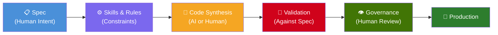

# SDD — Spec-Driven Development

**[Leia em Portugues / Read in Portuguese](docs/pt-br/README.md)**

> **Write the spec. The code follows.**

**Spec-Driven Development (SDD)** is a software development methodology where the **spec comes first** — before any line of code is written, manually or by AI. The spec defines what the software should do, what it receives, what it returns, and how it should behave. Everything else — code, tests, documentation — is derived from it.



---

## What is SDD?

SDD sits alongside TDD, BDD, and DDD as a development paradigm:

| Paradigm | Core Principle |
|----------|---------------|
| **TDD** — Test-Driven Development | Write the test first, then the code |
| **BDD** — Behavior-Driven Development | Write the behavior first, then the code |
| **DDD** — Domain-Driven Design | Model the domain first, then the code |
| **SDD** — Spec-Driven Development | Write the spec first, then everything else |

In SDD, the **spec is the single source of truth**. It is simultaneously the requirement, the test contract, and the documentation. It can never be outdated because the code is validated against it.

---

## Core Principles

1. **Spec-First** — No code exists without a spec. The spec defines intent, inputs, outputs, errors, and side-effects.
2. **Human Governance** — AI synthesizes code, but humans define constraints (skills/rules) and approve the result.
3. **Validation Against Contract** — Generated or written code is validated against the spec's test scenarios.
4. **Tool-Agnostic** — SDD works with any code synthesis tool: Cursor, Copilot, custom engines, CI/CD pipelines, or a human developer reading the spec.
5. **Evolvable** — Specs are versioned. When the spec changes, the code evolves to match.

---

## Documentation

| # | Document | Description |
|---|----------|-------------|
| 1 | [Overview](docs/en/01-overview.md) | The problem, the concept, principles and glossary |
| 2 | [The Spec](docs/en/02-the-spec.md) | Format, structure, anatomy and examples |
| 3 | [Skills & Rules](docs/en/03-skills-and-rules.md) | Architectural constraints that govern code synthesis |
| 4 | [Workflow](docs/en/04-workflow.md) | How a team adopts SDD, roles and processes |
| 5 | [Validation](docs/en/05-validation.md) | Testing against contracts, sandbox, approval criteria |
| 6 | [Implementations](docs/en/06-implementations.md) | Cursor + Rules, CI/CD pipelines, vState, custom engines |
| 7 | [Comparative Analysis](docs/en/07-comparative-analysis.md) | SDD vs TDD vs BDD, pros, cons and decision matrix |

---

## Quick Example

A spec in SDD is a Markdown file that anyone on the team can write:

```markdown
# POST /user

## Auth
None

## Description
Creates a new user in the system.

## Input
- email (string, required, email format)
- passkey (string, required, min 8 chars)

## Output (201)
- token (string, JWT)
- userData
  - id (uuid)
  - email (string)
  - created_at (datetime)

## Errors
- 409: Email already exists → USER_ALREADY_EXISTS
- 422: Invalid email → INVALID_EMAIL
- 422: Weak password → WEAK_PASSKEY

## Test Scenarios

### Happy Path
**Input:** { "email": "jon@doe.com", "passkey": "securePass123" }
**Expect:** status 201, body contains token and userData
**DB:** users table has record with email jon@doe.com

### Duplicate Email
**Seed:** insert user with email existing@email.com
**Input:** { "email": "existing@email.com", "passkey": "securePass123" }
**Expect:** status 409, body { "error": "USER_ALREADY_EXISTS" }
```

From this spec, code is synthesized (by AI or human), validated against the test scenarios, and reviewed by a human before reaching production.

---

## Implementations

SDD is a methodology, not a tool. It can be implemented with:

- **[vState](https://vstate.dogether.com.br/)** — A versioned state protocol that applies SDD principles
- **Cursor + Rules** — Using Cursor IDE with rules that reference specs
- **GitHub Actions + LLM** — CI/CD pipelines that generate code from specs
- **Any AI coding tool** — The spec is the universal input

---

> *"TDD says: write the test first. SDD says: write the spec first — the test, the doc, and the contract are all the same thing."*
