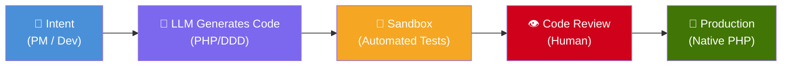

# SSAB — Self-Synthesizing Adaptive Backend

**[Leia em Portugues / Read in Portuguese](docs/pt-br/README.md)**

> **The backend that writes itself.**

SSAB is a backend architecture where production code is not manually written for each feature, but **generated Just-In-Time by an LLM**, validated against technical contracts (mocks/tests), and progressively promoted until it runs as **pure native PHP** — with zero AI latency in final production.

---

## Documentation Index

| # | Document | Description |
|---|----------|-------------|
| 1 | [Overview](docs/en/01-overview.md) | Concept, motivation, glossary and core principles |
| 2 | [Code Lifecycle](docs/en/02-code-lifecycle.md) | The Promotion Funnel: Cold → Staging → Hot |
| 3 | [Technical Architecture](docs/en/03-technical-architecture.md) | Components, data flow and infrastructure |
| 4 | [Contracts & Validation](docs/en/04-contracts-and-validation.md) | Specs, mocks, sandbox and autonomous TDD |
| 5 | [Feedback Loop](docs/en/05-feedback-loop.md) | Code review → AI → automatic correction |
| 6 | [Comparative Analysis](docs/en/06-comparative-analysis.md) | Pros, cons, risks and decision matrix |
| 7 | [Next Steps](docs/en/07-next-steps.md) | Roadmap, PoC and implementation phases |

---

## Core Principle

```mermaid
graph TB
    subgraph "Traditional Backend"
        T1["Dev writes code"] --> T2["Deploy"] --> T3["Production"]
    end

    subgraph "SSAB"
        S1["PM/Dev defines intent"] --> S2["AI generates DDD code"]
        S2 --> S3["Automated validation"]
        S3 --> S4["Human code review"]
        S4 --> S5["Promotion to production"]
        S5 --> S6["AI exits the flow"]
    end

    style T1 fill:#ccc,color:#333
    style T2 fill:#ccc,color:#333
    style T3 fill:#ccc,color:#333
    style S1 fill:#4A90D9,color:#fff
    style S2 fill:#7B68EE,color:#fff
    style S3 fill:#F5A623,color:#fff
    style S4 fill:#D0021B,color:#fff
    style S5 fill:#417505,color:#fff
    style S6 fill:#2D7D2D,color:#fff
```

> *"Code ceases to be a static artifact and becomes a dynamic response to business needs, validated by the precision of human engineering."*
