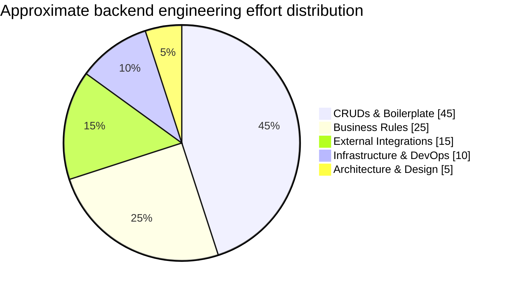
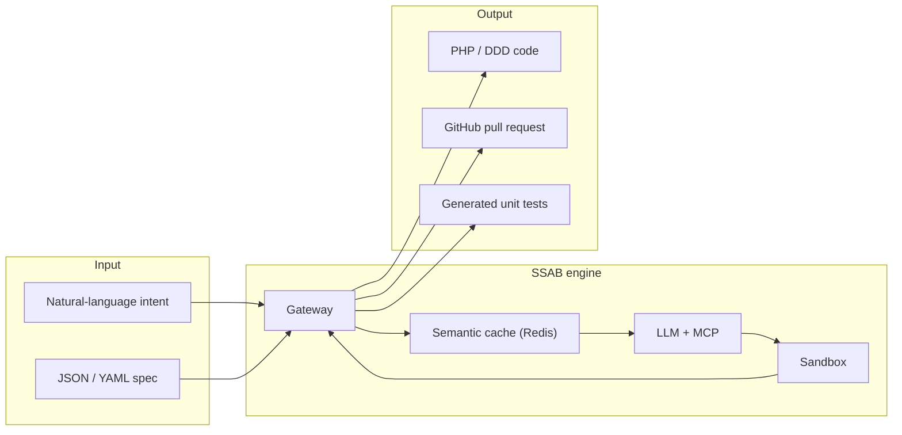
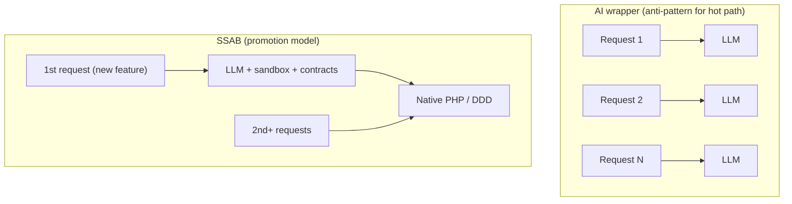
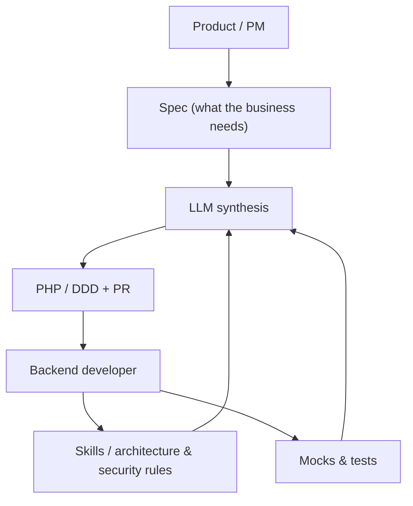

# 1. Overview

## 1.1 The Problem

Most backend work is repetitive. Studies and industry experience suggest that a large share of effort goes into boilerplate CRUDs and similar scaffolding—work that is tedious yet still demands senior engineers for correctness, security, and maintainability.

**SSAB targets the “CRUDs & Boilerplate” slice**—the roughly **45%** that can be formalized, contracted, and synthesized—so human effort shifts toward rules, integrations, and architecture.

## 1.2 The Concept

**SSAB** stands for **Self-Synthesizing Adaptive Backend**. It is a system where application behavior is not primarily hand-written line by line; instead, it is **generated just-in-time (JIT)** from structured intent and validated contracts, then **promoted** to first-class native code.

Five ideas capture the model:

1. **Code is not written manually** for each repetitive feature path; synthesis replaces copy-paste CRUD factories.
2. **Generation is JIT**—triggered when a new capability is needed and no native implementation exists yet.
3. **Everything is validated against contracts**—schemas, policies, and tests bound what the LLM may emit.
4. **The stack evolves** from a slower, AI-mediated path to **native PHP aligned with DDD** once quality gates pass.
5. **After promotion, AI steps out** of the request path for that feature type; runtime is deterministic PHP.

## 1.3 Motivation

### Why not call an LLM on every request?

Wrapping the live API in an LLM is tempting for flexibility, but it clashes with production realities:

| Concern | Typical AI-at-runtime | SSAB |
|--------|-------------------------|------|
| **Latency** | Often **2–10 s** per call | **~15 ms** after promotion (native PHP) |
| **Cost** | Grows **linearly** with every token on every request | AI runs **once per feature type** (cold path), then stops |
| **Determinism** | Non-deterministic answers, drift across versions | **Static PHP** after promotion; same inputs → same outputs |
| **Vendor lock-in** | Hard dependency on a provider’s API in the hot path | **Native code** in your repo; provider is a build-time tool |

**SSAB’s answer:** use AI **only until** the feature is expressed as reviewed, merged PHP. After that, traffic is served by your stack—not by the model.

## 1.4 Core Principles

| ID | Principle | Meaning |
|----|-------------|---------|
| **P1** | **Contract-first** | No synthesized code without a prior **contract** (spec, schema, policy). |
| **P2** | **Human-in-the-loop** | The model **never** promotes code alone; a **pull request** and human review are mandatory. |
| **P3** | **Progressive enhancement** | The system starts on a slower **AI-mediated** path and becomes **fast native** code organically. |
| **P4** | **Deterministic output** | After promotion, generated PHP is **static**; repeated builds from the same inputs yield the same artifact. |
| **P5** | **Evolvable architecture** | Review comments and operational signals **feed back** into skills, rules, and prompts. |

## 1.5 Glossary

| Term | Definition |
|------|------------|
| **SSAB** | Self-Synthesizing Adaptive Backend—the overall JIT synthesis and promotion system. |
| **JIT code** | Code produced on demand when a feature is first exercised, not pre-authored for every endpoint. |
| **Spec** | Machine-readable description (often JSON/YAML) of behavior, entities, and constraints. |
| **MCP** | Model Context Protocol; structured tools the LLM uses (e.g., schema introspection). |
| **Skill** | Packaged guidance, patterns, or procedures the engine attaches to generation tasks. |
| **Shadow code** | Generated PHP kept **off** the main lineage until validated; may receive partial traffic. |
| **Promotion funnel** | **Cold → Staging → Hot** maturity path from first synthesis to merged native code. |
| **Cold** | Phase where **AI generates** and validates in sandbox; no trusted native implementation yet. |
| **Staging** | Phase where **shadow** code is exercised under **partial traffic** and tests/monitoring. |
| **Hot** | Phase where **100%** of traffic hits **merged native** PHP; AI exits the request path. |
| **Gateway** | Edge component routing traffic, invoking cache, LLM, or native handlers. |
| **Feedback loop** | Webhooks and metrics that return human and runtime signals into the next synthesis. |
| **Semantic cache** | Redis-backed cache keyed by **intent + spec fingerprint**, not just URLs. |
| **DDD** | Domain-Driven Design; bounded contexts, aggregates, and explicit domain language in PHP. |

## 1.6 Roles in the Ecosystem

| Role | Primary question | Typical artifacts |
|------|------------------|-------------------|
| **PM** | **What** should the system do? | Business rules, user journeys, acceptance criteria → **Spec** |
| **Backend developer** | **Where** do boundaries, security, and quality live? | **Skills**, policies, **mocks**, test harnesses |
| **LLM** | **How** is the spec turned into code? | Services, repositories, controllers, tests (under contracts) |

**Career shift:** the backend engineer moves from being primarily a **line-by-line code writer** to a **platform engineer / architecture curator**—owning contracts, guardrails, and the promotion funnel while the engine handles repetitive synthesis.
