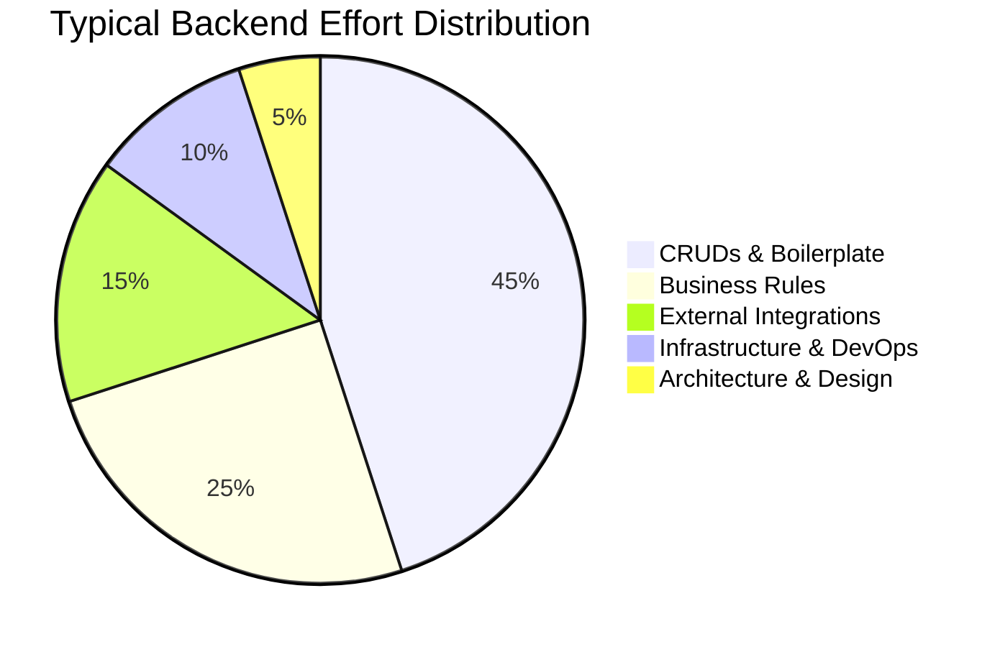
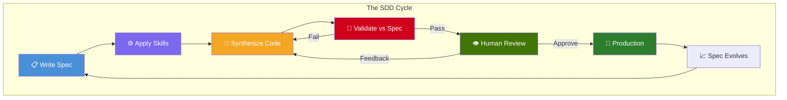
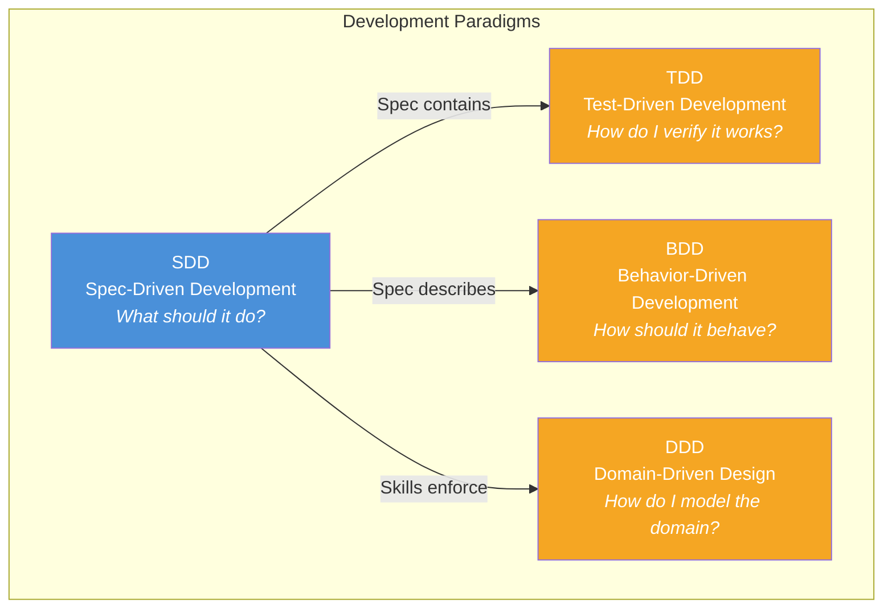
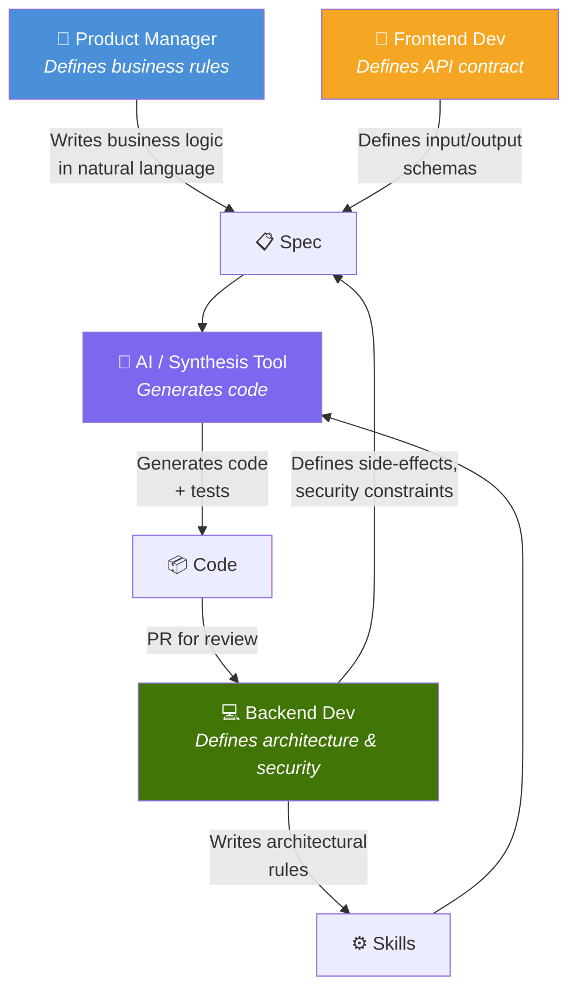

# 1. Overview

## 1.1 The Problem

Software development today faces a paradox: **most code is repetitive**, yet it requires highly qualified engineers to write it. CRUDs, validations, entity mappings, repositories — known patterns that consume weeks of work from entire teams.

Meanwhile, AI coding tools are powerful but chaotic. Without structure, developers get inconsistent code, no test coverage guarantee, and no traceability of what was requested versus what was generated.

SDD attacks the root cause: **there is no formal contract between intent and code**. TDD gives us tests first. BDD gives us behavior first. SDD gives us the **spec first** — and everything else derives from it.

---

## 1.2 The Concept

**Spec-Driven Development (SDD)** is a software development methodology where:

1. A **spec** is written before any code — defining inputs, outputs, errors, side-effects, and test scenarios
2. **Skills and rules** define architectural constraints that any code (AI or human) must follow
3. Code is **synthesized** (by AI, by a developer, or both) following the spec and skills
4. Code is **validated** against the spec's test scenarios
5. Code is **governed** — a human reviews and approves before production

---

## 1.3 SDD in the xDD Family

SDD is not a replacement for TDD, BDD, or DDD. It sits alongside them, addressing a different concern:

| Paradigm | Artifact | Drives |
|----------|----------|--------|
| **TDD** | Test | Code implementation |
| **BDD** | User story / Gherkin | Behavior verification |
| **DDD** | Domain model | Architecture and boundaries |
| **SDD** | Spec | Everything: code, tests, docs, validation |

SDD **encompasses** TDD: the spec contains test scenarios that become the validation contract. A team using SDD is inherently doing TDD — but with a richer, more complete source of truth.

---

## 1.4 Core Principles

### P1 — Spec-First

No code exists without a spec. The spec is written before any implementation begins. It defines:
- What the software receives (input)
- What the software returns (output)
- What can go wrong (errors)
- What changes in the system (side-effects)
- How to verify it works (test scenarios)

### P2 — Human Governance

AI is a powerful code synthesizer, but it doesn't make decisions. Humans define the constraints (skills/rules) and approve the output. Every piece of code passes through human review before production.

### P3 — Validation Against Contract

Code is not "done" when it compiles or when the developer says so. Code is done when it **passes all test scenarios defined in the spec**. The spec is the contract; the code is the implementation.

### P4 — Tool-Agnostic

SDD is a methodology, not a tool. It works with:
- A developer reading the spec and writing code manually
- Cursor with rules referencing the spec
- A CI/CD pipeline calling an LLM to generate code
- Any AI coding assistant

The spec is the universal input. The tool is interchangeable.

### P5 — Evolvable

Specs are versioned. When business rules change, the spec is updated. When the spec changes, the code evolves to match. The spec and the code are always in sync because the spec **governs** the code, not the other way around.

---

## 1.5 Glossary

| Term | Definition |
|------|-----------|
| **SDD** | Spec-Driven Development — the methodology |
| **Spec** | A Markdown file defining what a piece of software should do: inputs, outputs, errors, side-effects, and test scenarios |
| **Skill** | An architectural rule or constraint that code must follow (e.g., "always use repository pattern", "never use raw SQL") |
| **Rule** | Synonym for Skill — a constraint on how code is written |
| **Synthesis** | The process of generating code from a spec (by AI or human) |
| **Validation** | Running the code against the spec's test scenarios to verify conformance |
| **Governance** | Human oversight: reviewing, approving, and providing feedback on synthesized code |
| **Contract** | The spec as a binding agreement: the code MUST conform to what the spec defines |
| **Dataset** | Test data used to validate synthesized code against the spec |
| **Feedback Loop** | The process where human review comments improve future code synthesis |

---

## 1.6 Roles in SDD

| Role | Responsibility | Deliverable |
|------|---------------|-------------|
| **Product Manager** | Defines the **"What"** — business rules in natural language | Spec content (business logic section) |
| **Frontend Dev** | Defines the **"Interface"** — input/output schemas | Spec content (input/output section) |
| **Backend Dev** | Defines the **"How"** — architecture, security, constraints | Skills/Rules + review of generated code |
| **AI / Tool** | Executes the **"Synthesis"** — generates code following spec + skills | Code + tests (submitted as PR) |

> In SDD, the Backend Developer evolves from **code writer** to **architecture curator**. They spend less time writing boilerplate and more time designing constraints, reviewing code quality, and ensuring security.
