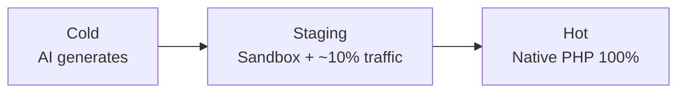
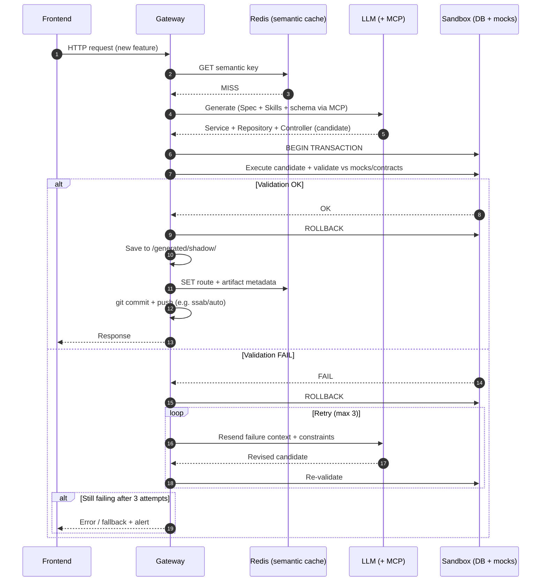
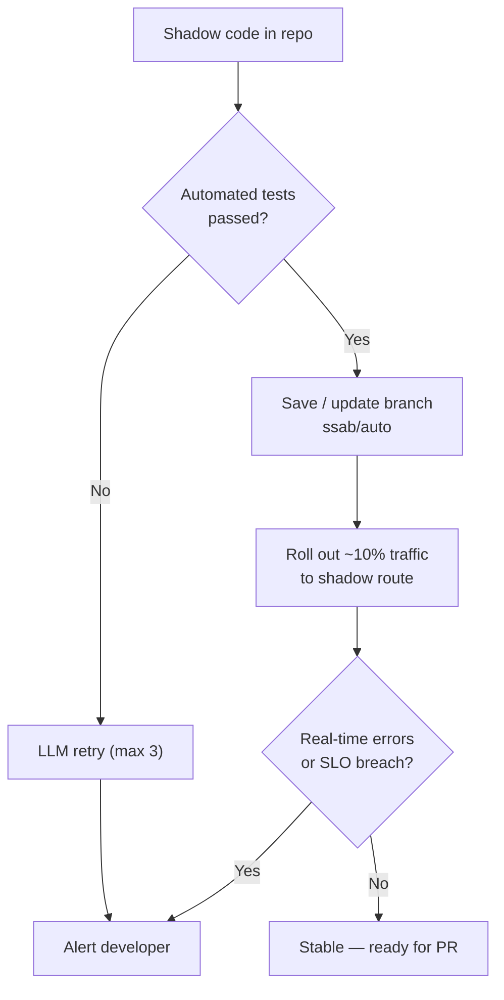
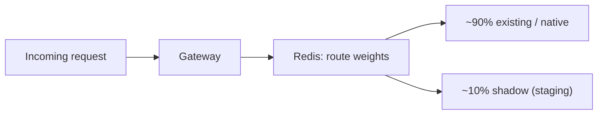
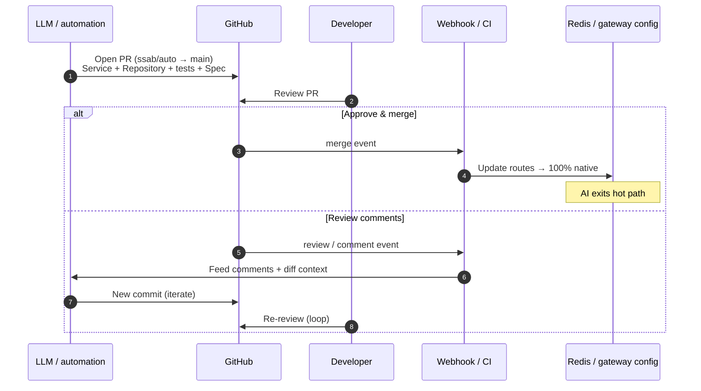
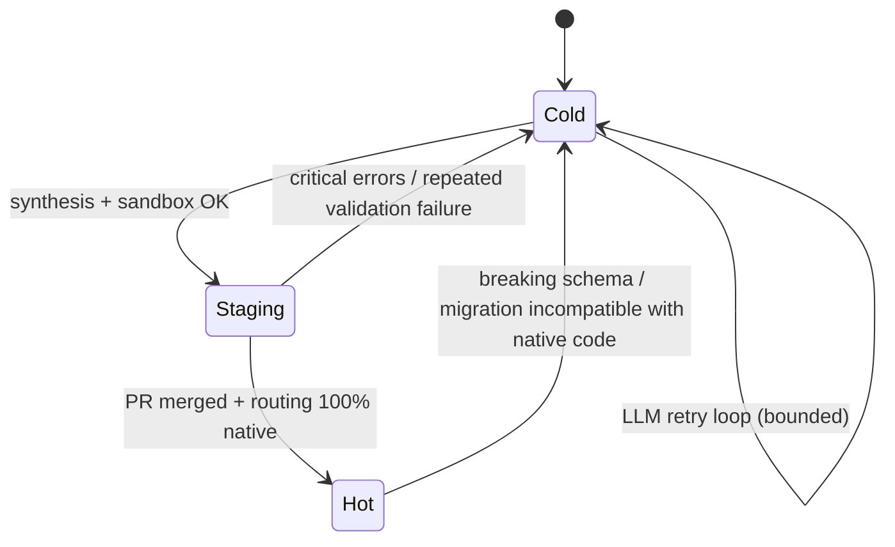
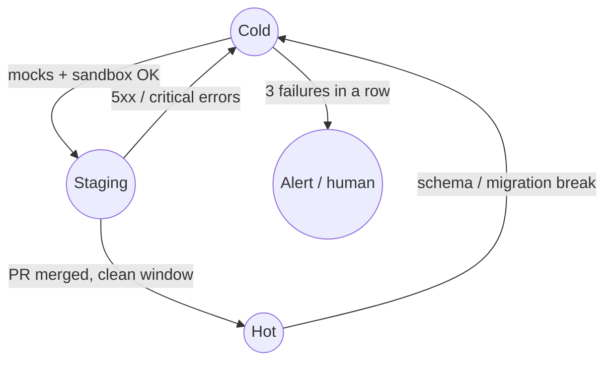

# 2. Code Lifecycle — The Promotion Funnel

Code in SSAB matures through a **three-phase funnel**: **Cold → Staging → Hot**. Each phase adds evidence that the synthesized PHP is correct, safe, and fast enough for full production traffic.



---

## 2.1 Phase A — Cold Start (Intent Ingestion)

**When it runs:** The first time an endpoint (or feature path) is invoked and **no native implementation** exists yet.

**Who prepared the ground:** A **PM** or **developer** who authored or approved the **Spec** that constrains generation.

**What happens:** The gateway misses semantic cache, invokes the LLM with **Skills** and **MCP**-mediated context (e.g., DB schema), synthesizes **Service + Repository + Controller**, validates in a **sandbox** (transactional, mocked side effects), then persists **shadow** artifacts and warms **Redis**.



**Expected latency (cold path):** roughly **3–15 seconds**, dominated by LLM and sandbox validation.

---

## 2.2 Phase B — Staging (Sandbox & Validation)

**Purpose:** Candidate code lives in an **intermediate** state: present in the repo as **shadow** code, exercised under controlled conditions before a human promotion PR.



### Percentage-based routing (conceptual)

Traffic splitting is driven by **gateway + Redis** (or equivalent config): most requests stay on the **existing native** path; a **canary slice** hits **shadow** implementations.



### Validation checklist (staging)

| Dimension | Gate |
|-----------|------|
| **Contract conformance** | Responses and persistence match OpenAPI / spec / DTO contracts. |
| **Side effects** | No unintended external calls; mocks and policies respected. |
| **Runtime errors** | **Zero 5xx** in a defined window (e.g., **1 hour**) on canary traffic. |
| **Performance** | **p95 latency &lt; 200 ms** (tune per domain). |
| **Security** | No `eval` / `exec`, no raw unparameterized SQL, secrets not logged. |

---

## 2.3 Phase C — Hot (Promotion to Native)

**Goal:** Move from **shadow** to **first-class** PHP on `main`, route **100%** of traffic to the native stack, and **remove the LLM from the request path** for that feature.



### PR contents (illustrative tree)

```text
PR: ssab/auto → main
├── spec/
│   └── feature-xyz.yaml          # authoritative spec snapshot
├── src/
│   ├── Domain/
│   │   └── ...                   # entities, value objects
│   ├── Application/
│   │   └── Service/
│   │       └── XyzService.php
│   └── Infrastructure/
│       └── Repository/
│           └── XyzRepository.php
├── tests/
│   └── Unit/
│       └── XyzServiceTest.php
└── generated/shadow/ ...         # cleared or relocated after merge (policy)
```

### States and demotion paths



---

## 2.4 State Transitions

### Promotion

| From | To | Typical trigger |
|------|-----|-----------------|
| **Cold** | **Staging** | Sandbox validation passes; artifacts stored; canary enabled. |
| **Staging** | **Hot** | **PR approved** and merged; monitoring shows **zero blocking errors**; Redis/gateway set to **100% native**. |

### Demotion / alerts

| From | To | Typical trigger |
|------|-----|-----------------|
| **Staging** | **Cold** | **5xx** or contract violations on canary; rollback canary weight. |
| **Hot** | **Cold** | **DB migration** or contract change invalidates native implementation. |
| **Cold** | **Alert** | **Three consecutive** synthesis/validation failures; human intervention. |



---

## 2.5 Expected Timelines

End-to-end timing is dominated by **monitoring windows** and **human review**, not by the seconds-long cold generation.

```mermaid
gantt
    title SSAB promotion funnel (illustrative timeline — axis in seconds)
    dateFormat X
    axisFormat %s s

    section Cold
    Generation & validation (5–15 s typical) :cold, 0, 15

    section Staging
    Canary monitoring (1–2 h) :staging, after cold, 7200

    section Hot
    Code review & merge (1–24 h) :hot, after staging, 86400
```



_Note:_ The Gantt axis uses **seconds** as abstract units: Cold ≈ **15 s**, Staging bar ≈ **2 h** (7200 s), Hot bar ≈ **24 h** (86400 s). Adjust in your internal docs if you prefer real datetime scales.

### Phase duration summary

| Phase | Duration (order of magnitude) | What drives it |
|-------|------------------------------|----------------|
| **Cold** | **5–15 s** (or up to ~15 s with retries) | LLM + MCP + sandbox |
| **Staging** | **1–2 h** monitoring | Error-free canary, SLO checks |
| **Hot** | **1–24 h** | Human PR review, CI, merge |
| **Total** | **~2–26 h** wall-clock | Often faster than “wait for sprint capacity” |

### Comparison with a traditional CRUD ticket

For a **simple CRUD** feature, a conventional team often spends **1–5 days** across refinement, implementation, review, and deployment—much of it on repetitive structure SSAB automates under contracts.

| Flow | Typical calendar time (simple CRUD) |
|------|--------------------------------------|
| **Traditional** | **1–5 days** |
| **SSAB funnel** | **~2–26 hours** (mostly review + observation, not typing boilerplate) |

The win is not “magic speed” but **relocating effort** from boilerplate to **curation**, **contracts**, and **review**—with a **deterministic** runtime after **Hot**.
