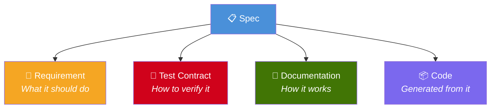
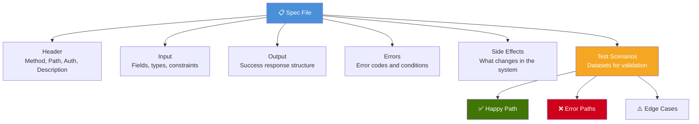
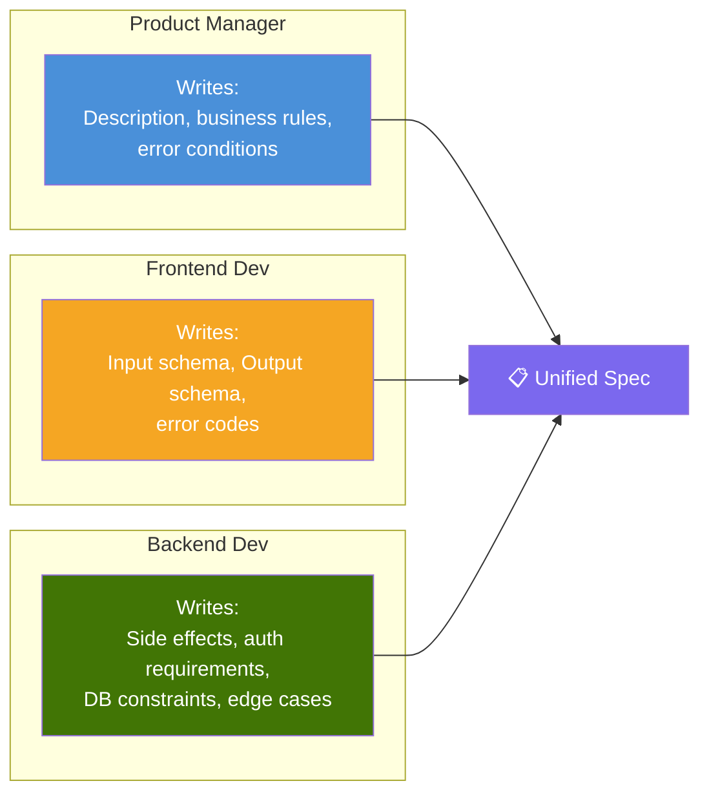
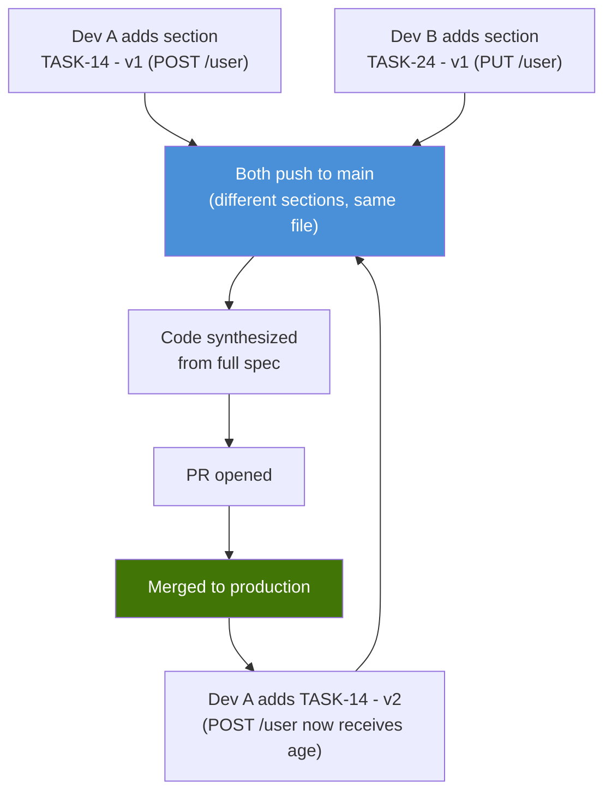

# 2. The Spec

The spec is the **central artifact** of SDD. It is simultaneously the requirement, the test contract, and the documentation. Everything flows from the spec.



---

## 2.1 Format

Specs are written in **Markdown**. Not JSON, not YAML — Markdown.

Why:
- Any person on the team can write and read it (PM, frontend dev, backend dev)
- It renders beautifully on GitHub, GitLab, and any editor
- It's versionable, diffable, and reviewable in PRs
- LLMs excel at understanding natural language in Markdown
- No schema to memorize, no syntax errors

---

## 2.2 Anatomy of a Spec

Every spec has these sections:



---

## 2.3 Full Example

### `specs/user/post-user.md`

```markdown
# POST /user

## Auth
None

## Description
Creates a new user in the system. Validates the email format,
ensures the password meets minimum requirements, hashes the
password with bcrypt, and returns a JWT token.

## Input
- email (string, required, email format)
- passkey (string, required, min 8 characters)
- name (string, optional)

## Output (201)
- token (string, JWT, expires in 24h)
- userData
  - id (uuid)
  - email (string)
  - name (string, nullable)
  - created_at (datetime)

## Errors
- 409: Email already exists → USER_ALREADY_EXISTS
- 422: Invalid email format → INVALID_EMAIL
- 422: Password too short (< 8 chars) → WEAK_PASSKEY

## Side Effects
- Create record in `users` table
- Hash passkey with bcrypt (cost 12) before saving
- Generate JWT token with RS256, expiration 24h

## Test Scenarios

### Happy Path — Create User
**Input:** { "email": "jon@doe.com", "passkey": "securePass123" }
**Expect:** status 201, body contains "token" and "userData"
**Expect:** userData.email equals "jon@doe.com"
**DB Assert:** users table has record where email = "jon@doe.com"

### Happy Path — With Optional Name
**Input:** { "email": "jane@doe.com", "passkey": "securePass123", "name": "Jane" }
**Expect:** status 201, userData.name equals "Jane"

### Error — Duplicate Email
**Seed:** insert user with email "existing@email.com"
**Input:** { "email": "existing@email.com", "passkey": "securePass123" }
**Expect:** status 409, body { "error": "USER_ALREADY_EXISTS" }

### Error — Invalid Email
**Input:** { "email": "not-an-email", "passkey": "securePass123" }
**Expect:** status 422, body { "error": "INVALID_EMAIL" }

### Error — Weak Password
**Input:** { "email": "new@email.com", "passkey": "123" }
**Expect:** status 422, body { "error": "WEAK_PASSKEY" }
```

---

## 2.4 Who Writes the Spec?

SDD democratizes feature definition. Different roles contribute different sections:



In practice, anyone can write a spec. The spec is reviewed in a PR just like code. The team converges on the final version through the normal review process.

---

## 2.5 Spec Organization

Specs live inside the project, organized by domain — **one file per domain**:

```
.sdd/
└── specs/
    ├── user.md        ← everything about /user endpoints
    ├── order.md       ← everything about /order endpoints
    └── auth.md        ← everything about /auth endpoints
```

### One File, Full History

Each spec file contains **all tasks and versions** for that domain. Tasks are sections within the file, versioned inline:

```markdown
# /user
Always use JWT for ALL methods, except POST

## TASK-14 - v1
Adds POST /user
(... endpoint details ...)

## TASK-24 - v1
Adds PUT /user
(... endpoint details ...)

## TASK-14 - v2
POST /user now receives age field
(... change details ...)
```



**Why one file instead of multiple task files:**

- **Full context in one place** — open `user.md` and see the entire history of the domain
- **Zero extra process** — no consolidation step, no file deletion, no merge ceremony
- **Natural versioning** — tasks evolve with `v1`, `v2`, etc. Git blame shows who added what
- **Shared domain rules** — global rules at the top (e.g., "always use JWT") are inherited by all tasks automatically
- **Simple merge conflicts** — when two devs edit different sections of the same file, the merge conflict is trivial to resolve

---

## 2.6 Spec Versioning

Specs evolve with the product. When a business rule changes, the spec is updated:

```mermaid
stateDiagram-v2
    [*] --> v1: PM creates spec
    v1 --> Live: Code synthesized + validated + approved
    Live --> v2: PM updates business rule
    v2 --> Live: Code re-synthesized with new spec
    Live --> v3: New edge case discovered in production
    v3 --> Live: Test scenario added, code updated

    note right of v2: Example: discount changes\nfrom 10% to 15%
    note right of v3: Example: null email\nbug found in prod
```

The spec is the **single source of truth**. If the code doesn't match the spec, the code is wrong — not the spec. This inverts the traditional model where documentation chases code.

---

## 2.7 Spec as Natural Language

The spec doesn't need to be rigidly structured. For simpler endpoints, a more natural format works:

```markdown
# GET /me

{JWT}

Connect to the database and fetch the user's name, age, and id.
Use the user id to query the orders table, joining id (user) = user_id (order).
Filter orders: only orders with status "processed" should appear.

Return:
{ name, age, orders: [{ name, date, status, description }] }
```

The conventions are minimal:
- `{JWT}` means the endpoint requires JWT authentication
- `[GET]` prefix defines the HTTP method
- The rest is natural language that the synthesis tool interprets

This makes specs accessible to **anyone** — including Product Managers with zero technical knowledge.
