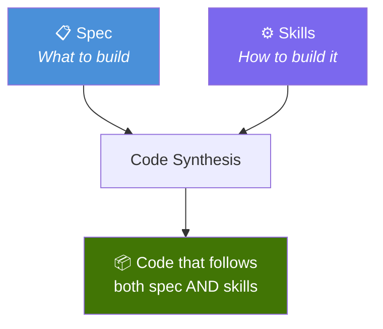
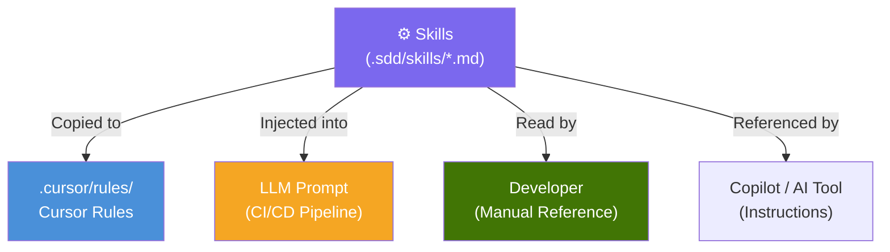
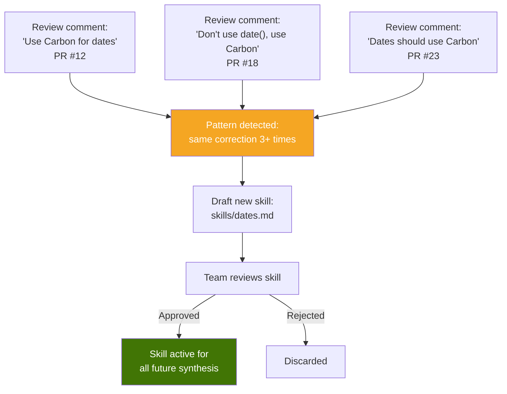
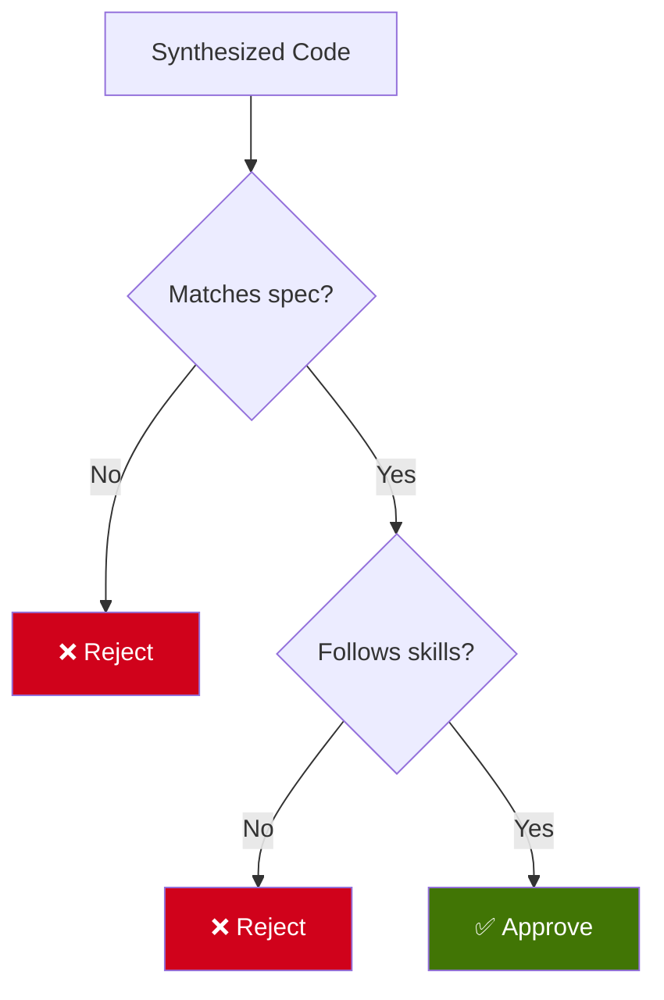

# 3. Skills & Rules

## 3.1 What Are Skills?

Skills are **architectural constraints** that govern how code is synthesized. They define the patterns, conventions, and prohibitions that every piece of code must follow — whether written by AI or by a human.



If the spec answers **"What should the software do?"**, skills answer **"How should the software be built?"**

---

## 3.2 Skills vs Specs

| Aspect | Spec | Skill |
|--------|------|-------|
| **Scope** | One endpoint or feature | Entire project |
| **Who writes** | PM, Frontend Dev, Backend Dev | Backend Dev, Tech Lead |
| **Changes when** | Business rule changes | Architecture decision changes |
| **Example** | "POST /user returns JWT" | "Always use repository pattern" |
| **Frequency** | One per feature | Few per project (5-15 typical) |

---

## 3.3 Skill Format

Skills are Markdown files in `.sdd/skills/`. They use natural language — the same format consumed by AI tools like Cursor, Copilot, or custom LLM pipelines.

### Example: `skills/go-ddd.md`

```markdown
# Skill: Go DDD Structure

## Architecture
Every endpoint MUST follow this structure:
1. **Handler** (interfaces layer) — receives HTTP request, validates input, delegates to service
2. **Service** (application layer) — contains business logic, calls repository
3. **Repository** (infrastructure layer) — the ONLY layer that touches the database

## File Organization
- Handlers go in `internal/<domain>/handler.go`
- Services go in `internal/<domain>/service.go`
- Repositories go in `internal/<domain>/repository.go`
- Entities go in `internal/<domain>/entity.go`

## Dependency Injection
- Never instantiate dependencies directly inside a function
- All dependencies must be injected via constructor (New* functions)
- The service receives the repository as an interface, not a concrete type

## Naming
- Use Go conventions: exported names are PascalCase, unexported are camelCase
- Interfaces do NOT have "I" prefix (use `UserRepository`, not `IUserRepository`)
- Constructor functions are `NewUserService`, `NewUserRepository`
```

### Example: `skills/security.md`

```markdown
# Skill: Security Rules

## Database
- NEVER use raw SQL string concatenation
- ALWAYS use parameterized queries / prepared statements
- NEVER log SQL queries containing user data

## Authentication
- Passwords MUST be hashed with bcrypt, cost 12 minimum
- JWT tokens MUST use RS256 algorithm
- JWT expiration MUST NOT exceed 24 hours
- NEVER store plain-text passwords anywhere

## Input
- ALWAYS validate and sanitize all user input
- NEVER trust input from the client
- Email fields MUST be validated with proper regex

## Prohibited
- NEVER use eval(), exec(), or system() equivalents
- NEVER expose stack traces in production error responses
- NEVER hardcode credentials — use environment variables
```

### Example: `skills/error-handling.md`

```markdown
# Skill: Error Handling

## Response Format
All error responses MUST follow this structure:
{ "error": "ERROR_CODE", "message": "Human-readable description" }

## HTTP Status Codes
- 400: Bad Request (malformed input)
- 401: Unauthorized (missing or invalid auth)
- 403: Forbidden (valid auth but insufficient permissions)
- 404: Not Found
- 409: Conflict (duplicate resource)
- 422: Unprocessable Entity (valid format but invalid data)
- 500: Internal Server Error (never expose details)

## Logging
- Log ALL errors with context (request ID, user ID, endpoint)
- Log 5xx errors at ERROR level
- Log 4xx errors at WARN level
- NEVER log sensitive data (passwords, tokens, PII)
```

---

## 3.4 How Skills Are Consumed

Skills are consumed differently depending on the synthesis tool:



| Tool | How Skills Are Used |
|------|-------------------|
| **Cursor** | Skills become `.cursor/rules/` files. Cursor follows them automatically. |
| **CI/CD + LLM** | Skills are injected into the system prompt when calling the LLM. |
| **Manual development** | Developer reads skills as a coding standards document. |
| **Copilot** | Skills are referenced in `.github/copilot-instructions.md`. |

The key insight: **skills are portable**. Write them once, use them everywhere. They're not tied to any specific tool.

---

## 3.5 Skills Organization

```
.sdd/
└── skills/
    ├── go-ddd.md              ← architecture pattern
    ├── security.md            ← security constraints
    ├── error-handling.md      ← error conventions
    ├── naming.md              ← naming conventions
    ├── testing.md             ← test patterns
    └── database.md            ← database conventions
```

A typical project has **5-15 skills**. Too few and the code is inconsistent. Too many and they become contradictory or impossible to follow.

---

## 3.6 Skill Evolution

Skills evolve over time. When a code review repeatedly corrects the same pattern, it signals a missing skill:



This creates a **virtuous cycle**: code reviews don't just fix individual PRs — they improve the system permanently. Every correction is a potential new skill.

---

## 3.7 Skills Are Not Optional

In SDD, skills are not "nice to have" guidelines. They are **mandatory constraints**. Code that violates a skill should fail validation, just like code that violates the spec.



A piece of code that returns the correct output but uses raw SQL concatenation is **not valid** in SDD if a security skill prohibits it.
