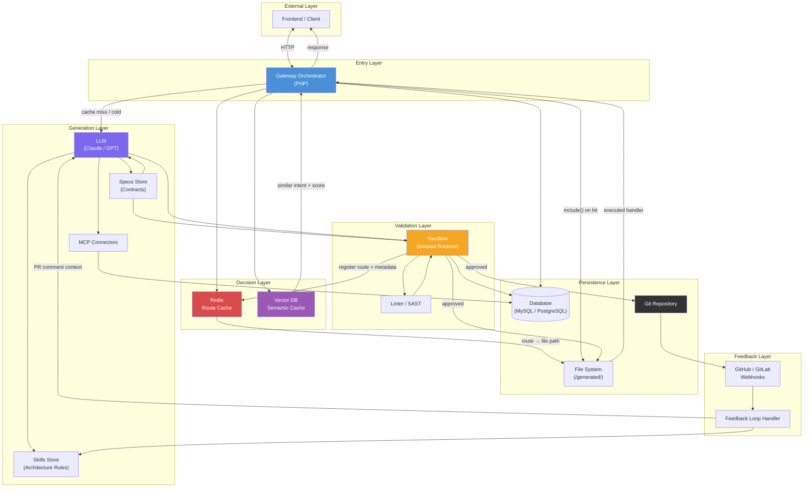
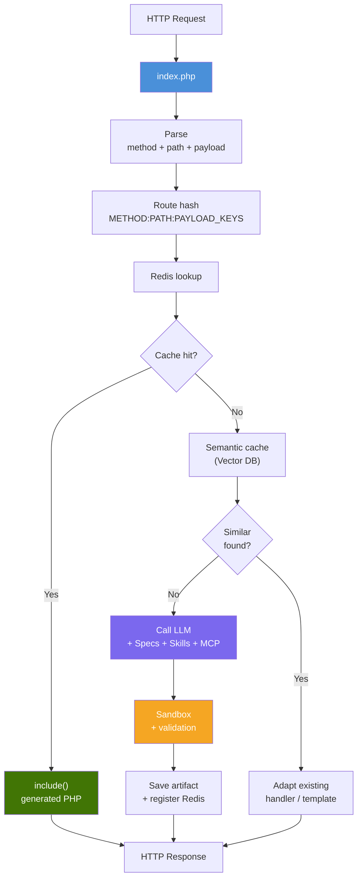
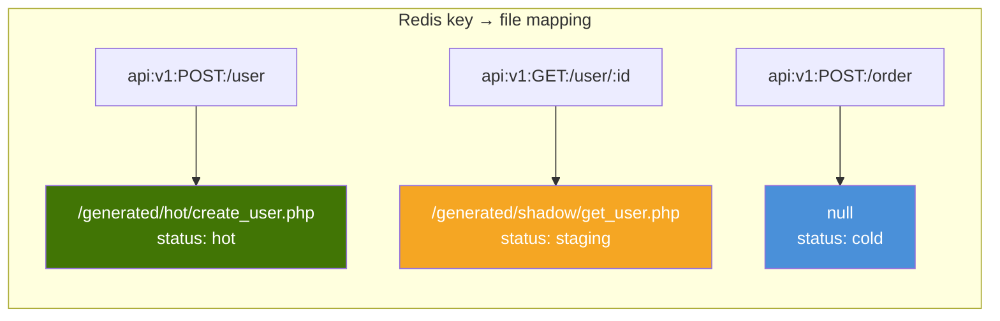
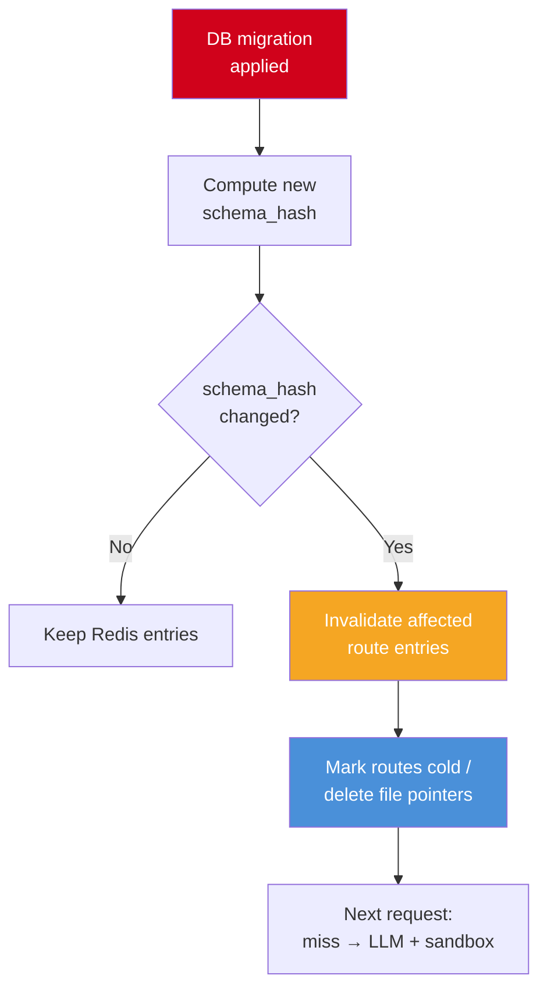
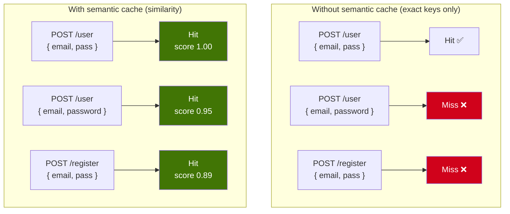
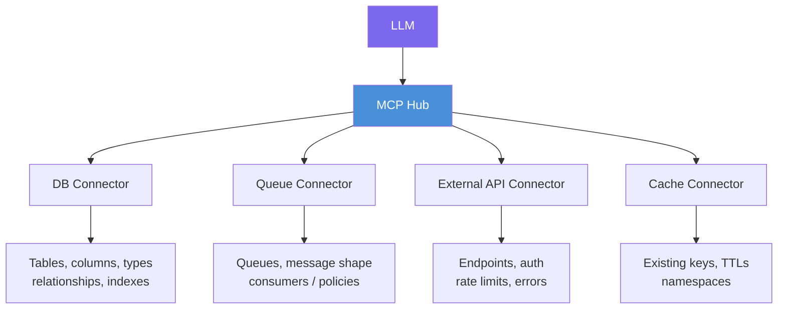
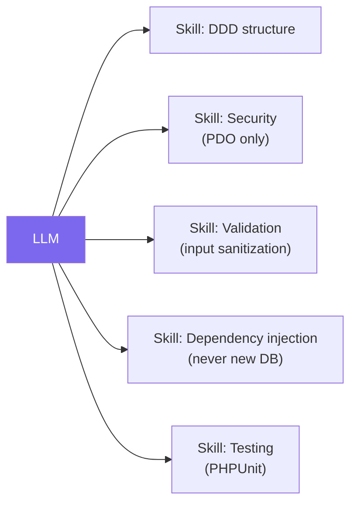
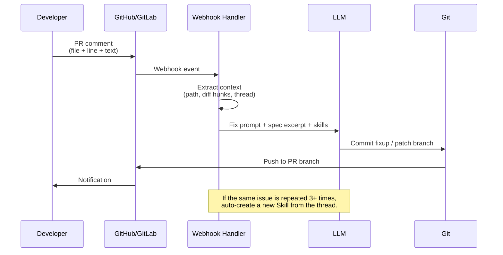
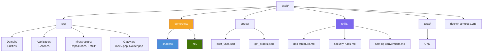
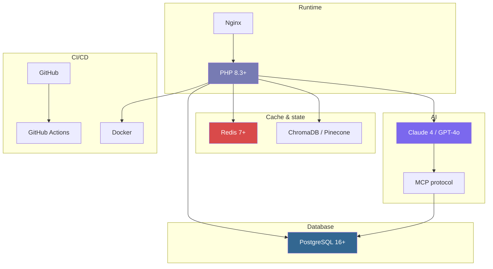

# 3. Technical Architecture

## 3.1 High-Level View

The SSAB stack is organized in layers. Traffic flows from the client through the gateway, decision caches, and—when needed—generation and validation before touching persisted artifacts or closing the feedback loop.



**Reading the graph:** the **Decision Layer** chooses between native PHP (`include`), semantic adaptation, or full LLM synthesis. The **Generation Layer** is only on the slow path but is constrained by **Specs** and **Skills**, grounded by **MCP** against real infrastructure. **Validation** gates promotion into **Persistence**; **Feedback** can steer the model and even mint new **Skills** after repeated human signals.

---

## 3.2 Main Components

### 3.2.1 Gateway Orchestrator (PHP)

The gateway is the **single entry point**: every HTTP request is normalized, hashed for routing, and resolved against caches before any generated code runs.



**Routing decision table**

| Scenario | Action | Typical latency |
|----------|--------|-----------------|
| Redis hit **and** generated file exists | `include()` native handler | ~15ms |
| Redis hit **and** semantically similar route/handler | Adapt / patch from nearest neighbor | ~1–3s |
| Redis empty / cold (no trustworthy mapping) | Full LLM synthesis + sandbox | ~5–15s |

---

### 3.2.2 Route Cache (Redis)

Redis is the **fast brain** for routing: it maps a canonical route identity to a concrete PHP file, rollout flags, and freshness metadata (including schema alignment).



**Example JSON document** (logical shape stored or derived from Redis fields):

```json
{
  "key": "api:v1:POST:/user",
  "file": "/generated/hot/create_user.php",
  "status": "hot",
  "version": 3,
  "schema_hash": "a1b2c3d4e5",
  "rollout_pct": 100,
  "created_at": "2026-03-20T14:30:00Z",
  "promoted_at": "2026-03-20T16:45:00Z",
  "error_count_24h": 0
}
```

**Cache invalidation when the database schema changes**

`schema_hash` fingerprints the **live DB schema** relevant to a route. When a migration runs, the hash shifts; any route whose cached code assumed the old schema must return to **cold** until regenerated.



---

### 3.2.3 Semantic Cache (Vector DB)

The vector store complements Redis: it matches **intent and payload shape** under similarity, not exact string equality of keys.



**When it helps:** renamed JSON fields, near-duplicate endpoints, and evolving clients that keep the same business intent with slightly different shapes—without paying full LLM cost every time.

---

### 3.2.4 MCP Connectors

**Model Context Protocol** connectors are the bridge between the LLM and real infrastructure. They let the model **read** environment truth (schemas, queues, external APIs, cache layout) instead of guessing.



**Example: DB Connector payload** exposing a `users` table to the model:

```json
{
  "table": "users",
  "columns": [
    { "name": "id", "type": "uuid", "primary": true },
    { "name": "email", "type": "varchar(255)", "unique": true, "nullable": false },
    { "name": "password_hash", "type": "varchar(255)", "nullable": false },
    { "name": "created_at", "type": "timestamp", "default": "CURRENT_TIMESTAMP" }
  ],
  "indexes": ["idx_users_email"],
  "relations": [
    { "table": "orders", "type": "hasMany", "foreign_key": "user_id" }
  ]
}
```

---

### 3.2.5 Skills Store (Architecture Rules)

Skills are **non-negotiable rules** the LLM must follow when emitting PHP: structure, security, validation, DI, and testing expectations.



**Example skill file** (`skills/ddd-structure.md`):

```markdown
## Rule: Mandatory DDD layout

All generated code MUST follow:

1. **Controller** — Accept the request, validate input, delegate to the service.
2. **Service** — Business logic; orchestrates repositories and domain rules.
3. **Repository** — The only layer that talks to the database.

Forbidden:

- NEVER use `eval()`, `exec()`, `system()`, or shell escapes.
- NEVER concatenate user input into SQL — use prepared statements only.
- NEVER read `$_GET` / `$_POST` directly — use an injected Request object.
- NEVER instantiate `PDO` inside handlers — inject the DB connection from the container.
```

---

### 3.2.6 Feedback Loop Handler

A service listens to **PR review comments** on GitHub/GitLab, packages file/line/comment context, and drives corrective generations. Repeated patterns can be promoted into **new Skills**.



---

## 3.3 Directory Structure



**Text tree**

```
ssab/
├── src/
│   ├── Domain/
│   │   └── Entities/
│   ├── Application/
│   │   └── Services/
│   ├── Infrastructure/
│   │   ├── Repositories/
│   │   └── MCP/
│   └── Gateway/
│       ├── index.php
│       └── Router.php
├── generated/
│   ├── shadow/
│   └── hot/
├── specs/
│   ├── post_user.json
│   └── get_orders.json
├── skills/
│   ├── ddd-structure.md
│   ├── security-rules.md
│   └── naming-conventions.md
├── tests/
│   └── Unit/
└── docker-compose.yml
```

---

## 3.4 Technology Stack



| Component | Technology | Justification |
|-----------|------------|---------------|
| Gateway / runtime | PHP 8.3+ | Native `include()` for hot paths, mature ecosystem, fast iteration |
| Web server | Nginx | Reverse proxy, static offload, upstream to PHP-FPM |
| Route cache | Redis 7+ | Sub-millisecond lookups, TTLs, atomic metadata updates |
| Semantic cache | ChromaDB or Pinecone | Embedding search for near-duplicate intents and payloads |
| LLM | Claude 4 / GPT-4o | Strong structured codegen with tool/MCP use |
| Infra grounding | MCP | Standardized, least-privilege context to DB, queues, HTTP, cache |
| Primary database | PostgreSQL 16+ | ACID, constraints, migrations, great PHP driver story |
| Version control & review | GitHub / GitLab | PRs, webhooks, audit trail for generated code |
| Automation | GitHub Actions | Lint, tests, sandbox image builds, promotion gates |
| Isolation | Docker | Ephemeral sandbox containers, reproducible dev/prod parity |
