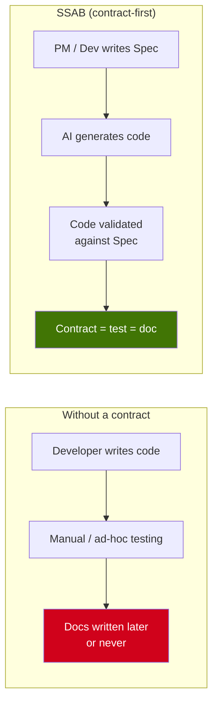
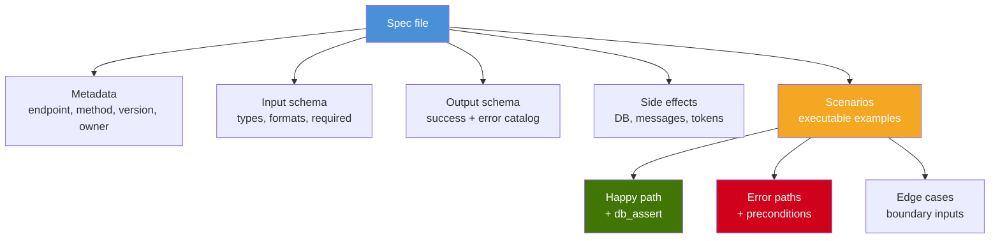
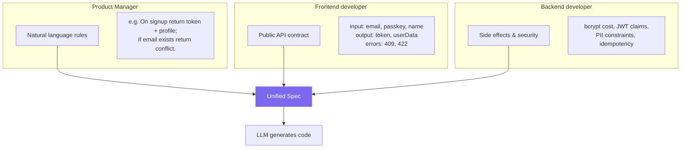
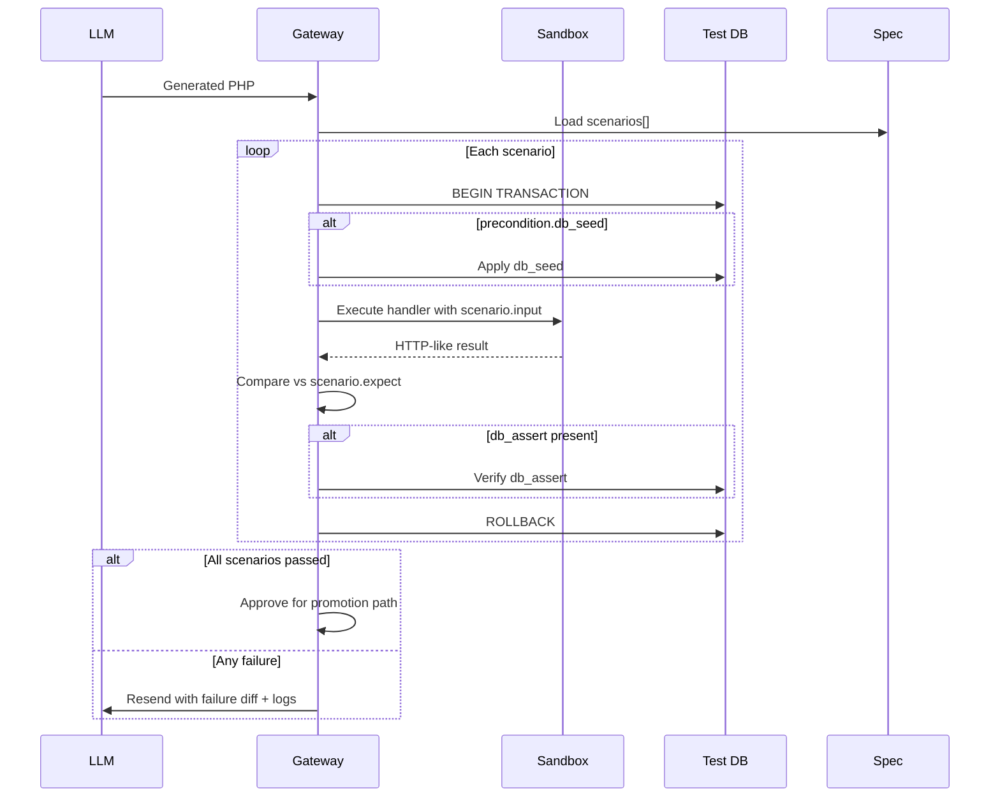
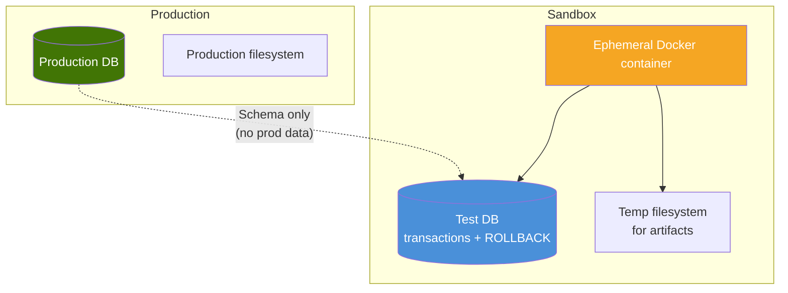
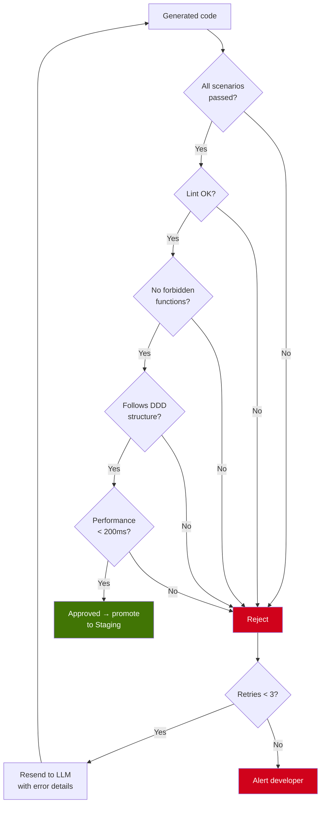
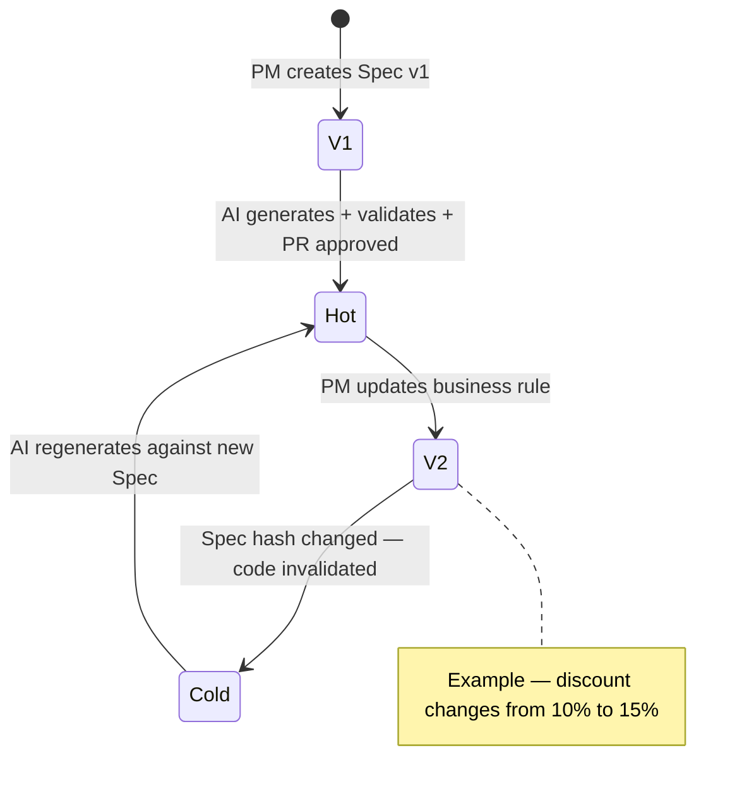
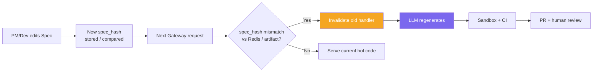

# 4. Contracts & Validation

## 4.1 Philosophy: Contract-First

No code is generated without a prior **contract**. The **Spec** is the single source of truth for what an endpoint must do. The executable checks against that Spec are the **tests**—and in SSAB, those tests **are** the living documentation.



---

## 4.2 Spec Structure

Each endpoint has a JSON (or YAML) specification under `specs/`. The Spec binds **input**, **output**, **side effects**, and **scenarios** that the sandbox will replay.

### Full example: `specs/post_user.json`

```json
{
  "endpoint": "/user",
  "method": "POST",
  "version": "1.0",
  "description": "Create a new user account",
  "owner": "product-team",

  "input": {
    "content_type": "application/json",
    "schema": {
      "email": { "type": "string", "format": "email", "required": true },
      "passkey": { "type": "string", "min_length": 8, "required": true },
      "name": { "type": "string", "required": false }
    }
  },

  "output": {
    "success": {
      "status": 201,
      "schema": {
        "token": { "type": "string", "format": "jwt" },
        "userData": {
          "type": "object",
          "properties": {
            "id": { "type": "string", "format": "uuid" },
            "email": { "type": "string" },
            "created_at": { "type": "string", "format": "datetime" }
          }
        }
      }
    },
    "errors": [
      { "condition": "Duplicate email", "status": 409, "body": { "error": "USER_ALREADY_EXISTS" } },
      { "condition": "Invalid email", "status": 422, "body": { "error": "INVALID_EMAIL" } },
      { "condition": "Weak passkey", "status": 422, "body": { "error": "WEAK_PASSKEY" } }
    ]
  },

  "side_effects": [
    "Insert a row into table `users`",
    "Hash passkey with bcrypt before persistence",
    "Issue a JWT with 24h expiry"
  ],

  "scenarios": [
    {
      "name": "Happy path — user created",
      "input": { "email": "jon@doe.com", "passkey": "securePass123" },
      "expect": {
        "status": 201,
        "body_contains": ["token", "userData"],
        "body_match": { "userData.email": "jon@doe.com" }
      },
      "db_assert": {
        "table": "users",
        "where": { "email": "jon@doe.com" },
        "exists": true
      }
    },
    {
      "name": "Error — duplicate email",
      "precondition": {
        "db_seed": {
          "table": "users",
          "data": { "email": "existing@email.com", "password_hash": "xxx" }
        }
      },
      "input": { "email": "existing@email.com", "passkey": "securePass123" },
      "expect": {
        "status": 409,
        "body_match": { "error": "USER_ALREADY_EXISTS" }
      }
    },
    {
      "name": "Error — invalid email",
      "input": { "email": "not-an-email", "passkey": "securePass123" },
      "expect": {
        "status": 422,
        "body_match": { "error": "INVALID_EMAIL" }
      }
    },
    {
      "name": "Error — weak passkey",
      "input": { "email": "new@email.com", "passkey": "123" },
      "expect": {
        "status": 422,
        "body_match": { "error": "WEAK_PASSKEY" }
      }
    }
  ]
}
```

### Anatomy of a Spec



---

## 4.3 Who Writes the Contracts?

SSAB **democratizes feature definition**: product, frontend, and backend perspectives converge into one machine-checkable Spec before any codegen runs.



| Role | Defines | Example |
|------|---------|---------|
| **PM** | Business rules in prose | “First purchase gets 20% off until date X.” |
| **Frontend dev** | Request/response shapes clients rely on | `{ email, passkey }` → `{ token, userData }` |
| **Backend dev** | Side effects, security, data integrity | “Bcrypt cost 12; no plaintext secrets in logs.” |

---

## 4.4 The Validation Process (Sandbox)

Generated code does **not** land in production immediately. It runs inside an **isolated sandbox** against every **scenario** in the Spec: seed, execute, assert, then roll back.



### Sandbox isolation



**Guarantees**

- Generated validation **never reads or writes real customer data**.
- Each scenario is wrapped in a **transaction** that ends in **ROLLBACK** (or equivalent isolation).
- The sandbox **container is destroyed** after the run.
- Dangerous PHP surfaces are blocked (e.g. **`disable_functions`** for `exec`, `shell_exec`, `system`, etc., plus policy in the image).

---

## 4.5 Approval Criteria

Promotion to staging (and later **hot**) requires passing **all** gates. Failures loop back to the LLM with structured diagnostics until a retry budget is exhausted.



| # | Criterion | What “pass” means | Automatic? |
|---|-----------|-------------------|------------|
| 1 | **Functional conformance** | Responses match `scenario.expect` for every scenario | Yes |
| 2 | **Correct side effects** | `db_assert` and declared side effects hold | Yes |
| 3 | **Static analysis (PHPStan)** | Configured level passes with no new baseline violations | Yes |
| 4 | **Security** | No forbidden calls; parameterized SQL; secret/PII policies | Yes |
| 5 | **DDD structure** | Controller / Service / Repository boundaries respected | Yes |
| 6 | **Performance** | Scenario execution under **200ms** (tunable per project) | Yes |
| 7 | **Human code review** | Maintainer approves the PR / change | **No** |

---

## 4.6 Spec Versioning

Specs evolve with the product. When a business rule changes, the Spec is edited; the system detects drift and **invalidates** synthesized code so regeneration stays honest.



**End-to-end flow**



This keeps production behavior aligned with the **latest** Spec: backend engineers are not the bottleneck for every wording or rule tweak—the **contract** drives regeneration, validation, and review.
