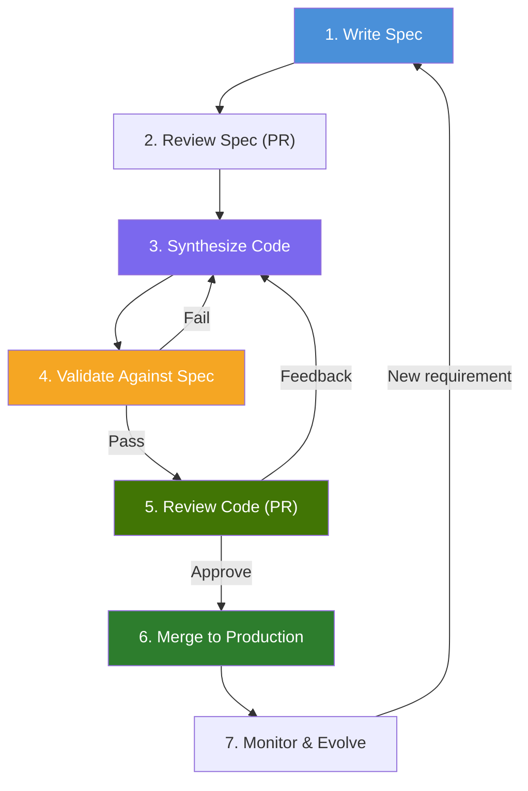
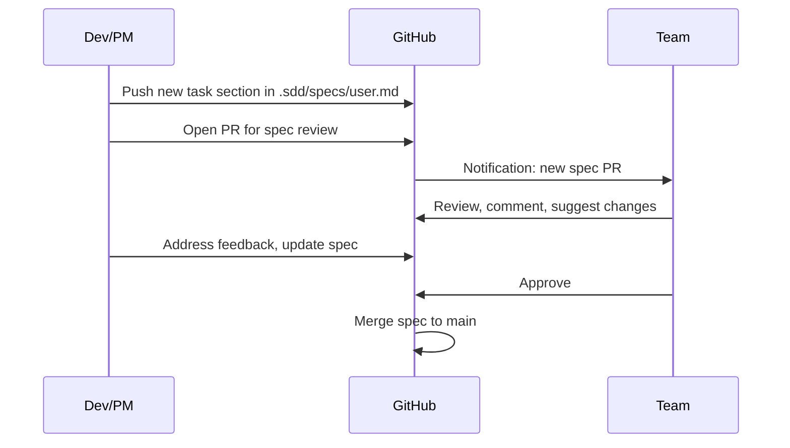
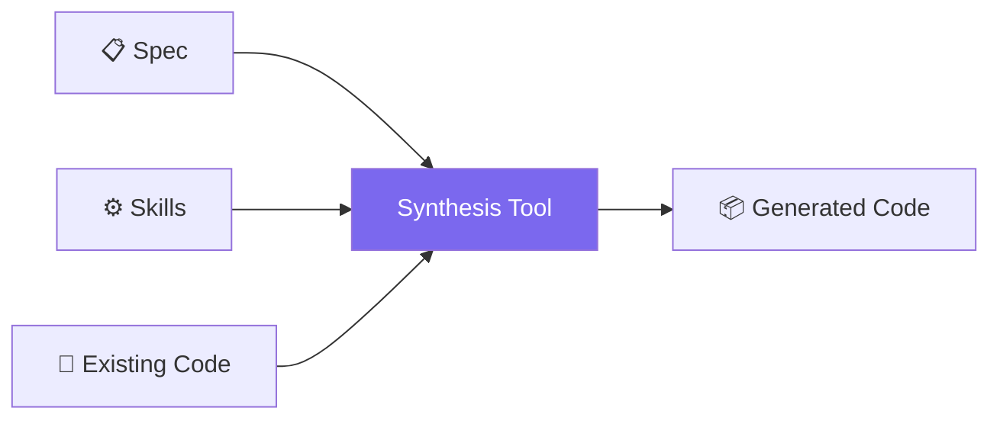
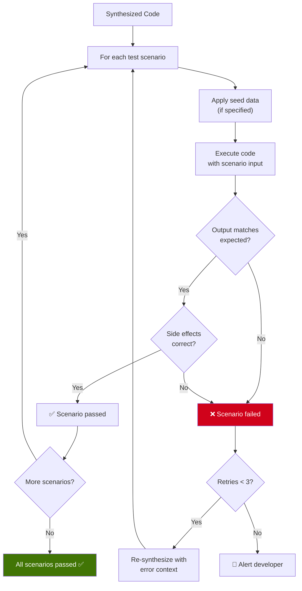
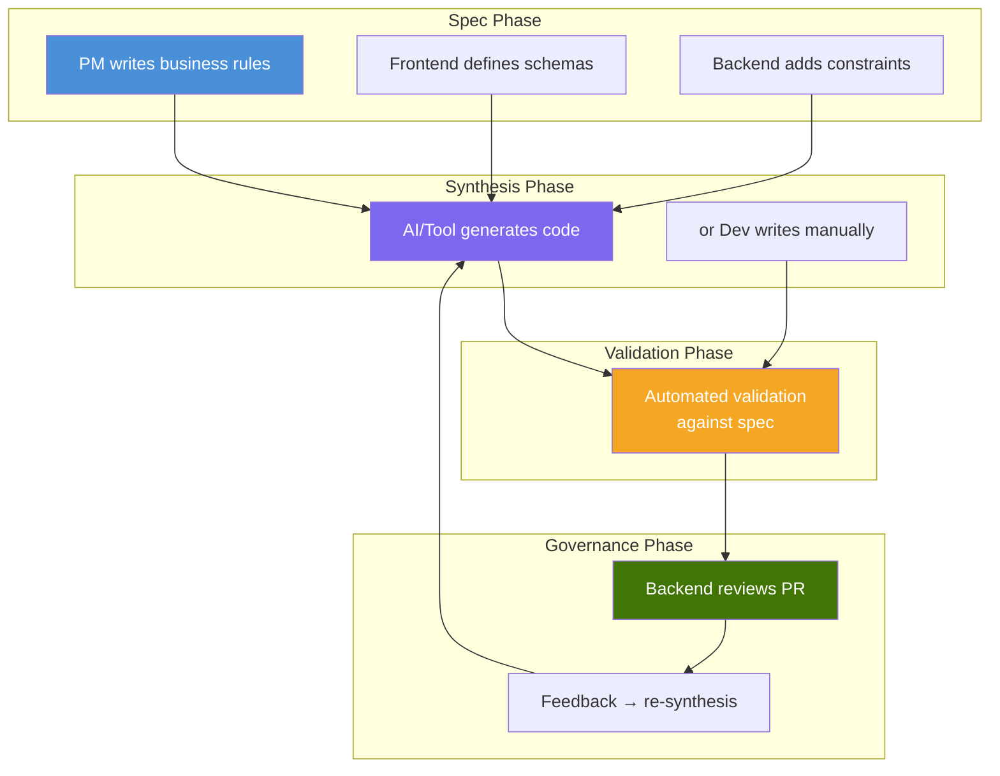
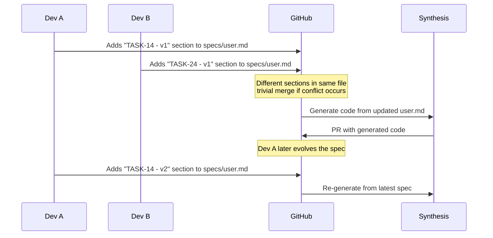

# 4. Workflow

## 4.1 The SDD Development Cycle



---

## 4.2 Step by Step

### Step 1 — Write the Spec

**Who:** PM, Frontend Dev, Backend Dev, or anyone on the team.

**What:** Add a new task section to the domain spec file in `.sdd/specs/<domain>.md` defining:
- What the endpoint should do
- What it receives and returns
- What errors are possible
- What test scenarios to validate

**How:** Open the editor (or GitHub's browser editor), write the spec, commit and push.

### Step 2 — Review the Spec

**Who:** The team (via Pull Request).

**What:** The spec is reviewed like any other code change. Team members verify:
- Are the business rules correct?
- Are edge cases covered?
- Is the input/output schema what the frontend expects?
- Are security requirements specified?



### Step 3 — Synthesize Code

**Who:** AI tool (Cursor, CI/CD pipeline, or custom engine) or a human developer.

**What:** Code is generated following:
- The spec (what to build)
- The skills (how to build it)
- The existing codebase (context)



**With Cursor:** The developer opens Cursor, references the spec, and asks Cursor to generate the code. Cursor follows the project's rules (which mirror the SDD skills).

**With CI/CD:** A GitHub Action detects the new spec, calls an LLM with the spec + skills as context, and generates the code automatically.

**Manually:** The developer reads the spec and writes the code by hand, following the skills.

### Step 4 — Validate Against Spec

**Who:** Automated pipeline or manual testing.

**What:** The synthesized code is executed against the spec's test scenarios:



### Step 5 — Review Code

**Who:** Backend Dev or Tech Lead.

**What:** The synthesized code is reviewed in a PR, just like any human-written code:
- Does it follow the skills/architecture?
- Is the logic correct?
- Are there security concerns?
- Is the code readable and maintainable?

If the reviewer leaves feedback, the code is re-synthesized with the feedback as additional context.

### Step 6 — Merge to Production

**Who:** Reviewer approves, CI/CD deploys.

**What:** Standard merge and deploy. The code is now in production, indistinguishable from human-written code.

### Step 7 — Monitor & Evolve

**Who:** Team.

**What:**
- If a bug is found in production, the failing scenario is added to the spec
- If a new requirement emerges, a new spec (or spec update) is created
- If a code review correction repeats across PRs, a new skill is created

---

## 4.3 Roles and Responsibilities



---

## 4.4 Concurrency — Multiple Specs at Once

When multiple developers add tasks to the same domain spec, they each add a **separate section** in the same file. If two developers edit different sections, the merge conflict is trivial — just like editing different functions in the same code file:



Each task is a section (`## TASK-14 - v1`), not a separate file. The spec file grows naturally with the domain, preserving full history and shared context (e.g., domain-level auth rules at the top).

---

## 4.5 Project Structure

```
my-project/
├── cmd/                        ← app entrypoint (human-managed)
├── internal/                   ← application code (synthesized + human)
│   ├── user/
│   │   ├── handler.go
│   │   ├── service.go
│   │   ├── repository.go
│   │   └── entity.go
│   └── order/
│       ├── handler.go
│       ├── service.go
│       └── ...
├── .sdd/                       ← SDD configuration
│   ├── specs/                  ← specs (the source of truth)
│   │   ├── user.md             ← all /user endpoints and tasks
│   │   └── order.md            ← all /order endpoints and tasks
│   ├── skills/                 ← architectural rules
│   │   ├── go-ddd.md
│   │   ├── security.md
│   │   └── error-handling.md
│   └── config.yaml             ← project configuration
├── tests/                      ← tests (generated from spec scenarios)
├── go.mod
└── .github/
    └── workflows/              ← CI/CD (optional automation)
```

### What SDD can modify vs what it can't

| Path | SDD can modify? | Reason |
|------|----------------|--------|
| `internal/` | Yes | Synthesized code lives here |
| `tests/` | Yes | Tests generated from spec scenarios |
| `.sdd/specs/` | Never | Human input, source of truth |
| `.sdd/skills/` | Suggest only | Can propose new skills via PR |
| `.sdd/config.yaml` | Never | Project configuration |
| `cmd/` | Never | App entrypoint, human-managed |
| `.github/` | Never | Pipeline definitions, human-managed |
