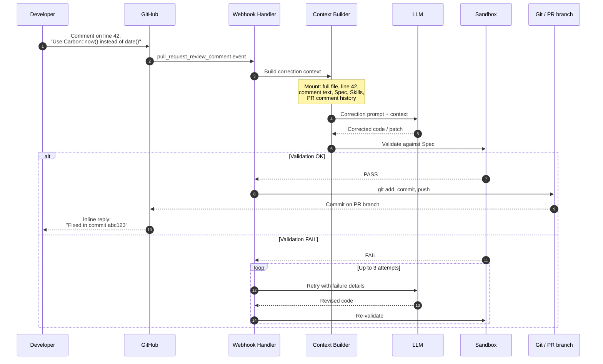
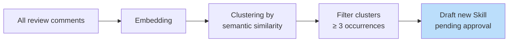
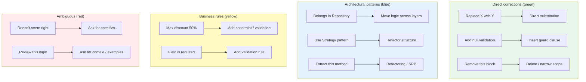
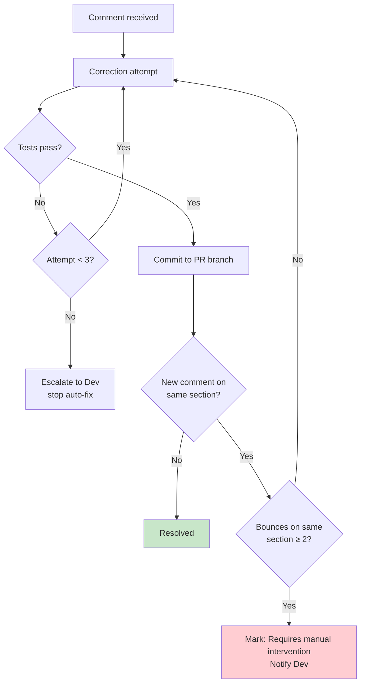
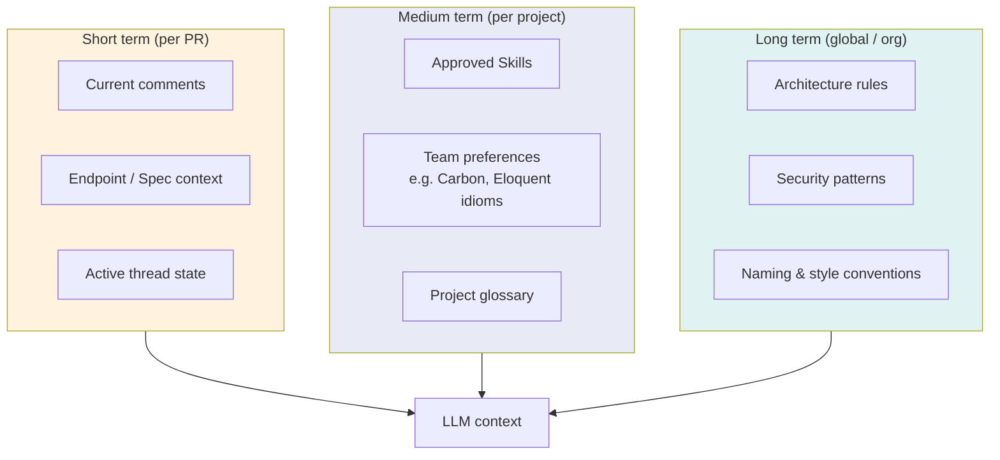
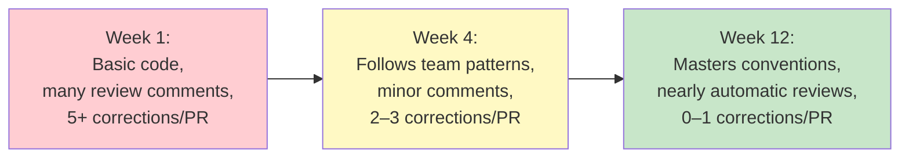

# 5. Feedback Loop — The Learning Cycle

## 5.1 Overview

The Feedback Loop transforms SSAB from a simple code generator into a system that **evolves**. Human code review comments feed back into the LLM, which corrects code and learns recurring patterns. Over time, the same conventions appear less often in review because they become encoded as **Skills** and prompt context.

```mermaid
flowchart TB
    subgraph Correction["Correction cycle (short loop)"]
        A1[AI generates code] --> A2[Opens PR]
        A2 --> A3[Developer reviews]
        A3 --> A4[Comments on PR]
        A4 --> A5[Webhook captures event]
        A5 --> A6[AI processes feedback]
        A6 --> A7[Fixes code]
        A7 --> A8[New commit on branch]
        A8 --> A3
    end

    subgraph Learning["Learning cycle (long loop)"]
        A4 --> B1[Comments stream]
        B1 --> B2[Pattern analysis]
        B2 --> B3[New Skill drafted]
        B3 --> B4[Pending approval]
        B4 --> B5[Skill activated]
        B5 --> A1
    end

    style A6 fill:#e8f5e9
    style B3 fill:#e3f2fd
```



---

## 5.2 The Correction Cycle (Short Loop)

The short loop happens **within a single pull request**: the developer comments, the AI proposes a fix, and the developer re-evaluates. Validation and retries keep changes aligned with the **Spec** before anything is committed.

### Sequence: from comment to fix



### Example correction prompt structure

The following is a **representative** structure (field names and ordering may vary by implementation):

```text
ROLE: You are correcting PHP backend code for an SSAB-generated endpoint.

GOAL: Apply the review feedback while preserving Spec compliance and DDD structure.

CONTEXT:
- Repository / service / file path: {path}
- Full current file: ```php ... ```
- Commented line(s): {start}-{end}
- Review comment (verbatim): "{comment_text}"
- Original Spec (JSON): {spec_json}
- Active Skills (summaries): {skills_bullets}
- Prior PR comments on this file (thread): {thread_history}

CONSTRAINTS:
- Output only the changed file or unified diff as instructed.
- Respect existing namespaces, imports, and test contracts.
- Prefer Carbon for datetimes if team Skill says so.

VALIDATION HINTS:
- Expected HTTP status / body shape from Spec: {expectation_summary}
```

---

## 5.3 The Learning Cycle (Long Loop)

The long loop analyzes **recurring patterns** across many PRs. When the same semantic issue appears often enough, SSAB drafts a **new Skill** for human approval before it influences future generations.

### From scattered comments to an approved Skill

```mermaid
flowchart TD
    C1["PR #12: Use Carbon"] --> DB[(Feedback DB)]
    C2["PR #15: Use Carbon for dates"] --> DB
    C3["PR #18: Don't use date(), use Carbon"] --> DB
    DB --> PA[Pattern Analyzer]
    PA --> Q{Same pattern<br/>≥ 3 times?}
    Q -->|Yes| GS[Generate new Skill<br/>status: pending]
    Q -->|No| WAIT[Keep accumulating]
    GS --> N1[Notify Dev:<br/>"New skill suggested. Approve?"]
    N1 --> A{Dev approves?}
    A -->|Yes| ACT[Skill active for<br/>all future generations]
    A -->|No| DISC[Discarded / archived]

    style ACT fill:#c8e6c9
    style DISC fill:#ffcdd2
```

### How the pattern analyzer works



---

## 5.4 Types of Processable Feedback



| Type | AI action | Confidence |
|------|-----------|------------|
| Direct correction | Apply targeted edit (replace, guard, delete) | High |
| Architectural pattern | Refactor across layers / patterns / extraction | Medium |
| Business rule | Add validation, invariants, domain constraints | High–Medium |
| Ambiguous | Clarifying questions; avoid speculative rewrites | N/A |

---

## 5.5 Protection Against Infinite Loops

A real risk is a **correction ping-pong**: the AI fixes, the developer disagrees, the AI “fixes” again in the wrong direction, and the thread never converges.



### Protection rules

| Rule | Limit |
|------|--------|
| Max correction attempts per comment | 3 |
| Max bounces on the same code section | 2 |
| Max auto-commits per PR | 10 |
| Max total auto-correction time per PR | 1 hour |

---

## 5.6 Persistent Memory

The Feedback Loop feeds a **persistent knowledge base** that spans a single PR, a whole project, and (optionally) organization-wide standards.



### Quality evolution over time



---

*This document describes intended SSAB behavior. Exact thresholds, storage, and orchestration depend on your deployment and governance policies.*
