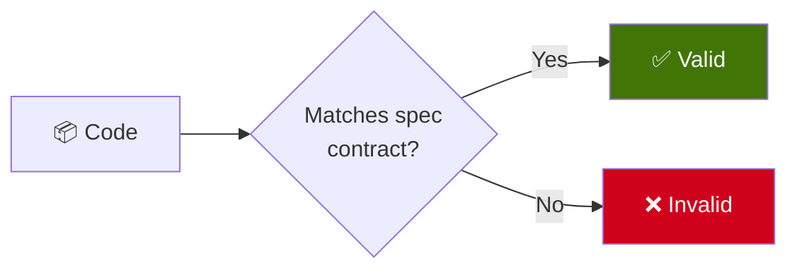
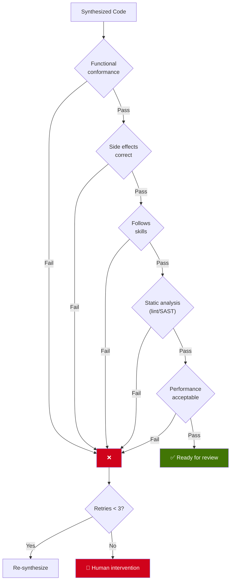
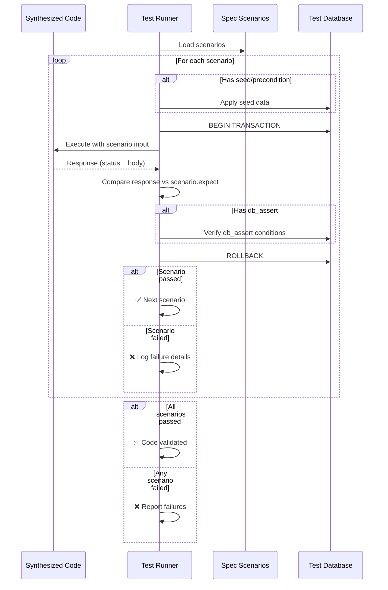
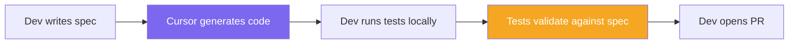
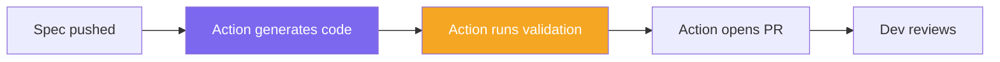
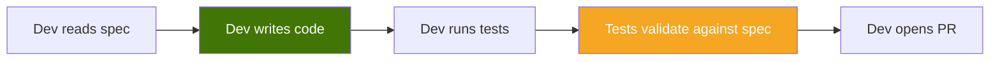
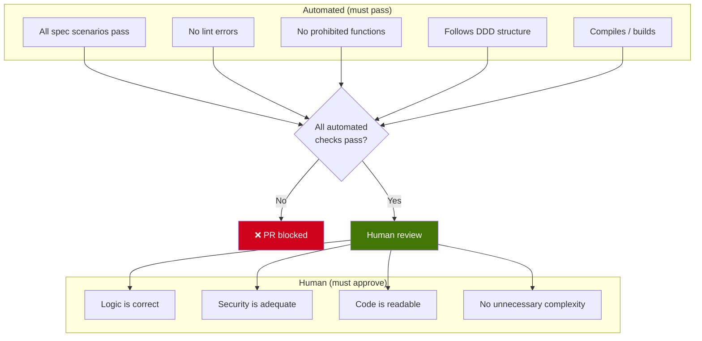
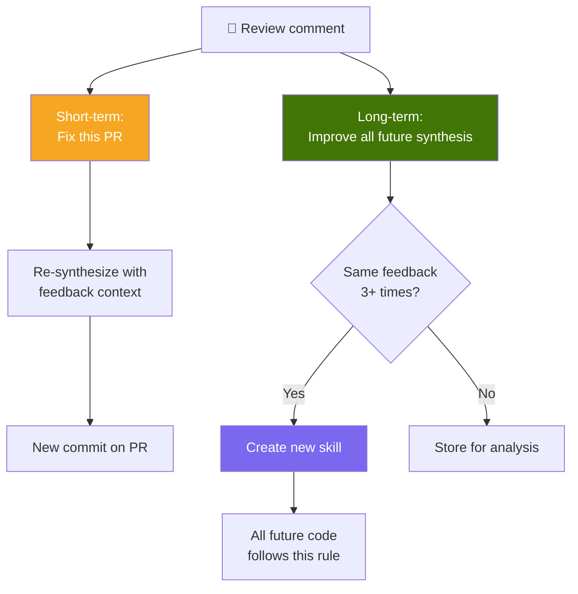

# 5. Validation

## 5.1 The Contract

In SDD, the spec is a **contract**. Code is not "done" when it compiles — it's done when it **passes all test scenarios defined in the spec**.

This is the fundamental difference from traditional development: the acceptance criteria are **formalized and executable**, not implicit or verbal.

---

## 5.2 What Gets Validated

| # | Check | Method | Automated? |
|---|-------|--------|-----------|
| 1 | **Functional conformance** | Execute code with spec input, compare output | Yes |
| 2 | **Side effects** | Verify database/state changes match spec | Yes |
| 3 | **Skill compliance** | Verify code follows architectural rules | Yes (lint + structure check) |
| 4 | **Static analysis** | Run linter, SAST, type checker | Yes |
| 5 | **Performance** | Execution time within acceptable range | Yes |
| 6 | **Human review** | Developer reviews code quality, logic, security | No |

---

## 5.3 Validation Process

### Key Guarantees

- **Isolation**: Each scenario runs in a database transaction that is rolled back afterward. Tests never pollute each other.
- **Seed data**: Scenarios can define preconditions (e.g., "a user with this email already exists") that are set up before execution.
- **DB assertions**: Beyond checking the response, validation can verify that the correct database changes were made.
- **Deterministic**: Same spec + same code = same result, every time.

---

## 5.4 Validation in Different Contexts

### With Cursor (Local Development)

The developer synthesizes code locally with Cursor, then runs the validation:

### With CI/CD (Automated Pipeline)

A GitHub Action generates code and validates automatically:

### Manual Development

A developer writes code by hand and validates against the spec:

In all three cases, the **validation step is the same**: run the spec's test scenarios against the code. The synthesis method is irrelevant — what matters is that the code conforms to the contract.

---

## 5.5 Approval Criteria

For code to be promoted from "synthesized" to "production-ready", it must pass:

---

## 5.6 The Feedback Loop

When a human reviewer provides feedback, it creates value at two levels:

This means every code review comment has **permanent value**. It doesn't just fix one PR — it potentially prevents the same mistake in every future synthesis.
