# 6. Comparative Analysis

## 6.1 SSAB vs Traditional Backend

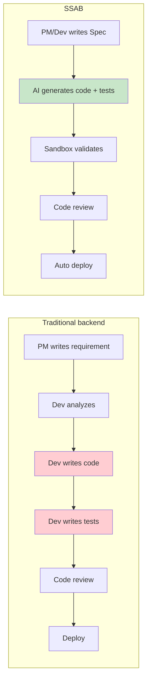

**Legend:** Red = human steps SSAB aims to remove or greatly reduce; green = AI-assisted generation with contract-first validation.

| Dimension | Traditional | SSAB |
|-----------|-------------|------|
| Who writes code | Developer | AI (from Spec + Skills), reviewed by human |
| Who writes tests | Developer | AI + Spec-driven expectations; human reviews |
| Who defines rules | Docs, conventions, review | Spec, Skills, org rules; enforced in sandbox |
| Time for 1 CRUD | Often 0.5–2+ days (calendar) | Often hours (mostly async generation + review) |
| Production latency | Native app performance | Native PHP after promotion (no per-request LLM) |
| Determinism | High (hand-written) | High in production path; generation is stochastic |
| Documentation | Often drifts from code | Executable Spec/tests reduce drift |
| Team scalability | Linear with headcount | Higher throughput per reviewer/architect |

---

## 6.2 SSAB vs AI Wrappers

“AI wrappers” call an LLM **on every request**. SSAB uses the LLM to **materialize code once**, then serves traffic with ordinary PHP.

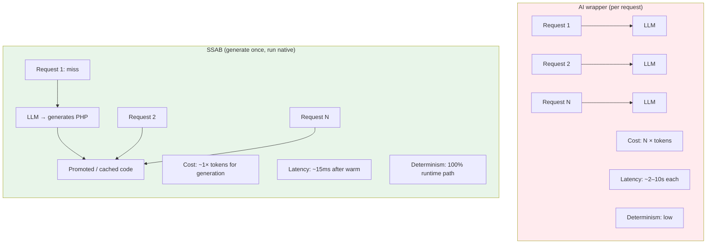

| Dimension | AI wrapper | SSAB (after promotion) |
|-----------|------------|-------------------------|
| Cost per request | ~$0.01–$0.10 (typical ranges vary) | ~$0.00 (no LLM on hot path) |
| Total cost @ 1M requests | ~$10k–$100k (illustrative) | ~$5–$50 + amortized generation |
| Latency | Seconds per call | Milliseconds (native include) |
| Availability | Tied to model + API | Same as your PHP stack |
| Determinism | Low | High (runtime) |
| Vendor lock-in | Strong per request | Weaker at runtime; generation still model-dependent |

---

## 6.3 Positives (Advantages)

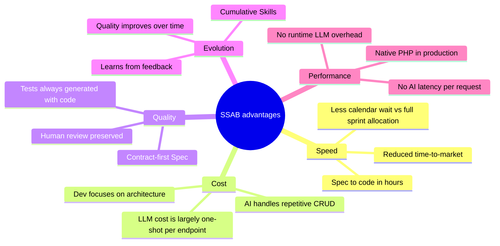

### 1. Delivery speed

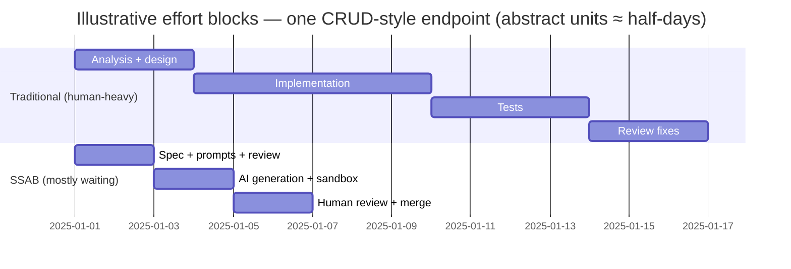

*Units are abstract “work blocks,” not hours — the point is **where human attention** sits.*

### 2. Reduced repetitive work

Developers stop hand-writing the hundredth similar CRUD and spend time on **architecture, security, Skills, and review** — the parts that compound.

### 3. Executable documentation

When behavior is encoded in **Specs and automated checks**, documentation is far less likely to rot than prose-only wikis.

### 4. Organic evolution

Each substantive review comment can become **prompt context**, a **Skill**, or a **pattern** — so the system improves with normal engineering workflow.

### 5. Final performance

Promoted code is **ordinary PHP**. Throughput and latency match a hand-written service on the same runtime.

---

## 6.4 Negatives (Risks & Challenges)

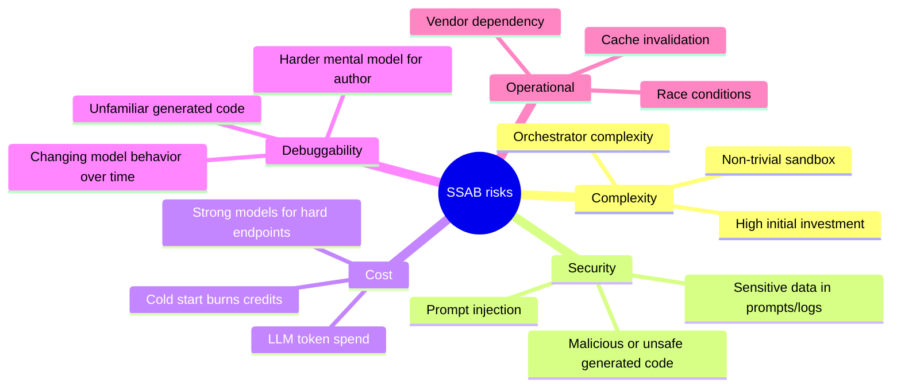

### 1. Initial complexity

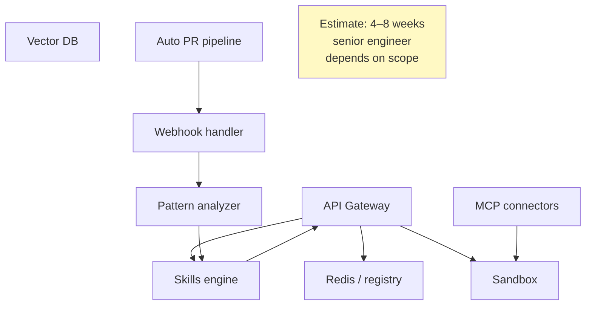

### 2. Security — prompt injection (illustrative)

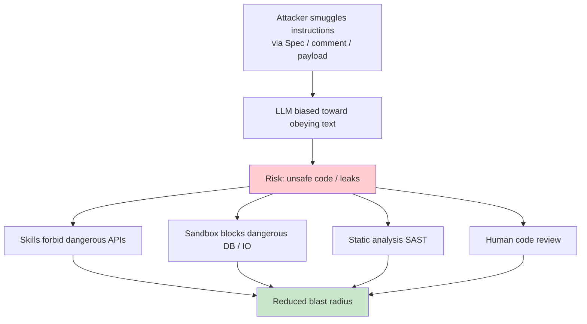

### 3. API cost (illustrative curve)

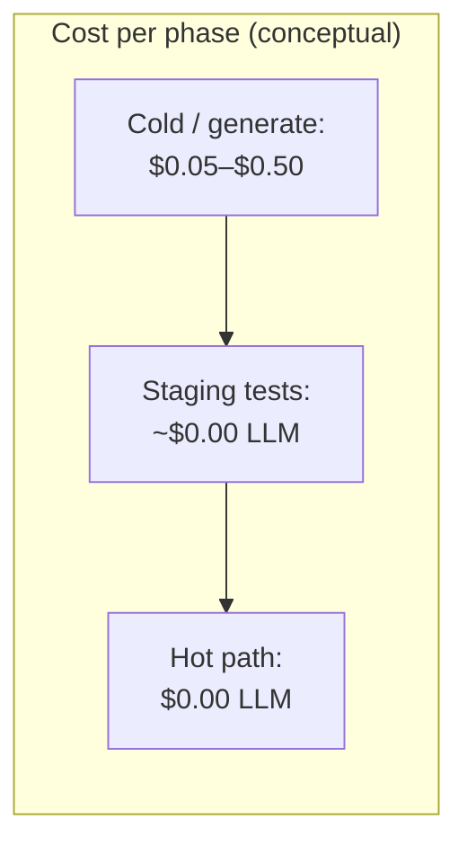

| Endpoint type | Indicative generation cost (USD) |
|---------------|-----------------------------------|
| Simple CRUD | ~$0.20–$0.40 |
| With integrations | ~$0.40–$0.70 |
| Complex rules | ~$0.70–$1.20 |
| **~100 endpoints (mix)** | **~$40–$90 total (rough order-of-magnitude)** |

Compare to **one month of developer salary** for perspective — SSAB shifts spend from **time** to **compute**, but does not remove **review and architecture**.

### 4. Debuggability

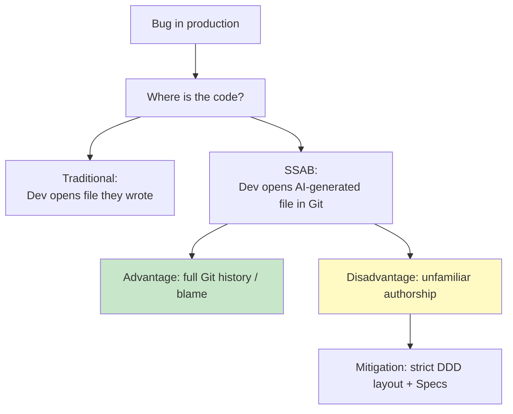

### 5. Race conditions

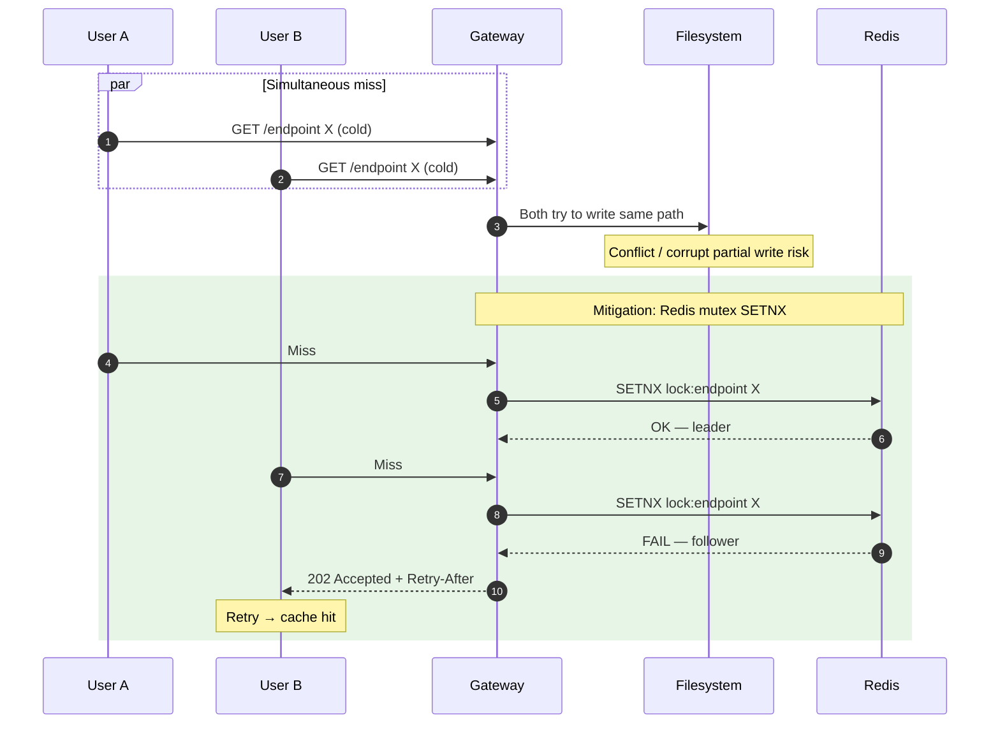

---

## 6.5 Decision Matrix: When to Use?

```mermaid
quadrantChart
    title SSAB suitability (complexity vs frequency)
    x-axis Low complexity --> High complexity
    y-axis Low frequency --> High frequency
    quadrant-1 High complexity, high frequency: strong design + maybe hybrid
    quadrant-2 Low complexity, high frequency: ideal for SSAB
    quadrant-3 Low complexity, low frequency: optional / lower ROI
    quadrant-4 High complexity, low frequency: prefer manual / specialist
    CRUD Simple: [0.2, 0.8]
    Authentication: [0.3, 0.9]
    Filtered Listings: [0.3, 0.7]
    API Integrations: [0.4, 0.5]
    Financial Rules: [0.7, 0.4]
    Complex Reports: [0.6, 0.3]
    ML Pipelines: [0.9, 0.2]
    HFT Trading: [0.9, 0.1]
```

| Scenario | Viability | Justification |
|----------|-----------|---------------|
| Simple CRUD, high traffic | Green | Clear Spec, high repetition, great ROI |
| Auth/session flows | Green–Yellow | Testable, but security review is critical |
| Financial / compliance rules | Yellow | Needs very strong Spec + sandbox + audit |
| Complex reporting | Yellow–Red | Ambiguous requirements, heavy validation |
| ML training/serving | Red | Wrong tool; not Spec-first PHP CRUD |
| Sub-millisecond trading | Red | Custom stacks, not gateway-generated CRUD |

---

## 6.6 Visual Summary

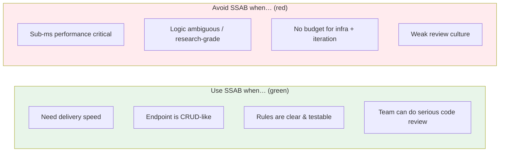

---

*Figures use illustrative numbers for discussion. Calibrate costs and timelines with your vendor pricing and team benchmarks.*
