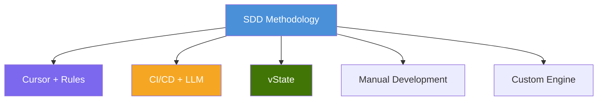
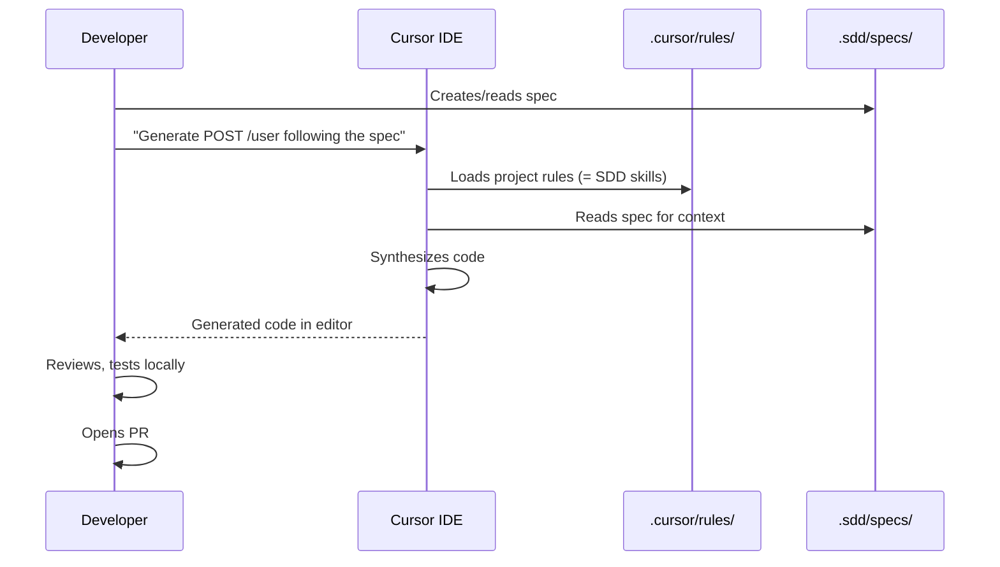
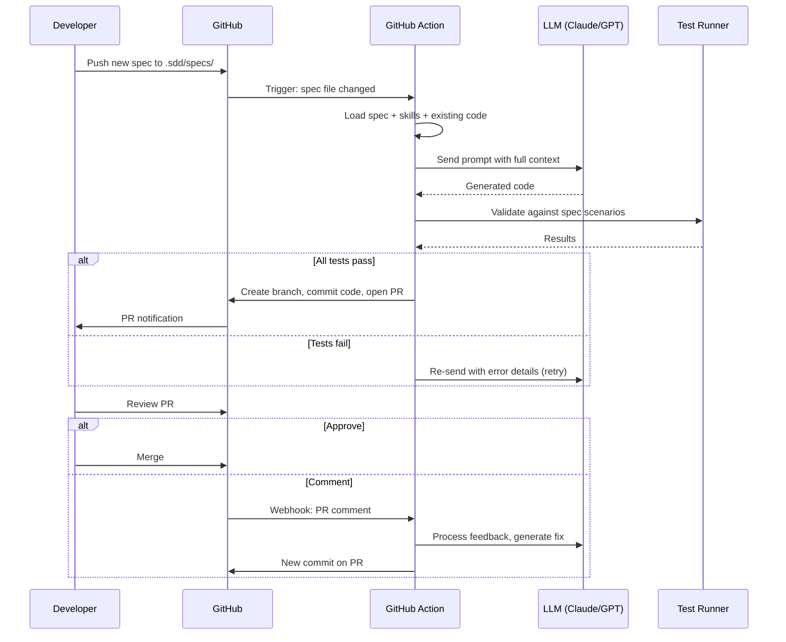
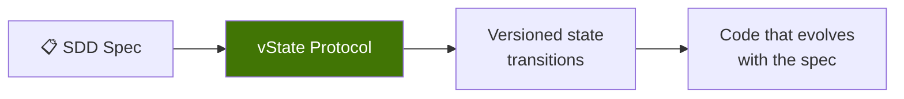
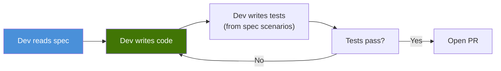
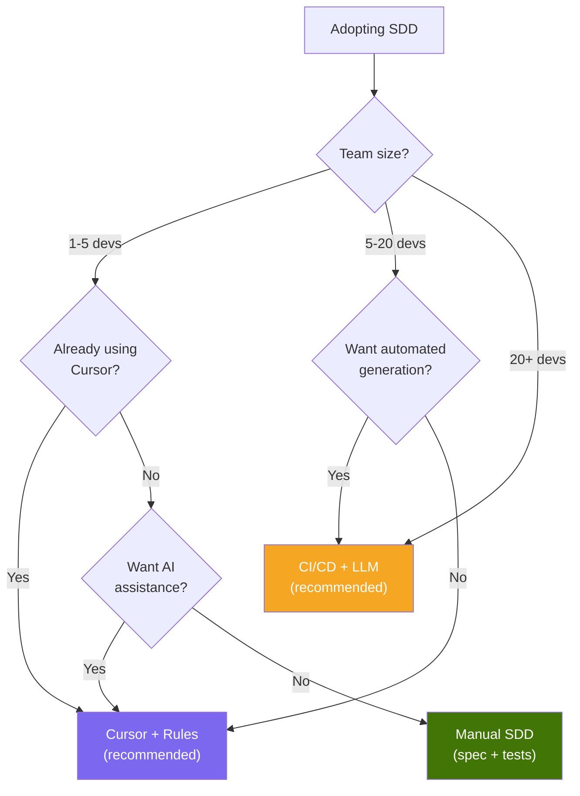

# 6. Implementations

SDD is a methodology, not a tool. It can be implemented with different tools depending on the team's size, needs, and existing infrastructure.



---

## 6.1 Cursor + Rules (Recommended for Most Teams)

The simplest and most practical implementation. SDD skills become Cursor rules, and the developer uses Cursor to synthesize code with the spec as context.



### Setup

1. Write your SDD skills in `.sdd/skills/`
2. Copy or symlink them to `.cursor/rules/`
3. Write specs in `.sdd/specs/`
4. When developing, reference the spec in Cursor chat
5. Cursor generates code following the rules

### When to Use

- Solo developers or small teams (2-10)
- Teams already using Cursor
- When you want SDD benefits without infrastructure overhead
- Starting with SDD for the first time

### Pros and Cons

| Pros | Cons |
|------|------|
| Zero infrastructure cost | Developer must manually reference specs |
| Immediate setup (minutes) | No automated validation pipeline |
| Developer stays in control | No automatic PR generation |
| Leverages existing tooling | Depends on Cursor specifically |

---

## 6.2 CI/CD + LLM Pipeline

A more automated approach where GitHub Actions (or similar) detect new specs and trigger code synthesis via an LLM API.



### Setup

1. Configure LLM API key in GitHub Secrets
2. Create GitHub Action workflows:
   - `sdd-generate.yml` — triggers on spec changes
   - `sdd-review.yml` — triggers on PR comments
   - `sdd-validate.yml` — runs on every PR
3. Write specs and skills as usual

### Example GitHub Action

```yaml
name: SDD Generate
on:
  push:
    paths:
      - '.sdd/specs/**'

jobs:
  generate:
    runs-on: ubuntu-latest
    steps:
      - uses: actions/checkout@v4

      - name: Detect changed specs
        id: specs
        run: |
          echo "files=$(git diff --name-only HEAD~1 -- .sdd/specs/)" >> $GITHUB_OUTPUT

      - name: Generate code from spec
        env:
          LLM_API_KEY: ${{ secrets.LLM_API_KEY }}
        run: |
          # Read spec + skills, call LLM, save generated code
          # Validate against spec scenarios
          # If valid, commit and create PR

      - name: Create PR
        env:
          GH_TOKEN: ${{ secrets.GITHUB_TOKEN }}
        run: |
          gh pr create --title "[SDD] Generated code for ${{ steps.specs.outputs.files }}" \
                       --body "Auto-generated from spec. Please review."
```

### When to Use

- Medium to large teams (10+)
- When you want fully automated code generation
- When PMs need to trigger code generation without using an IDE
- When you want automated validation in CI

### Pros and Cons

| Pros | Cons |
|------|------|
| Fully automated synthesis | Infrastructure setup required |
| PMs can trigger generation | LLM API costs |
| Automated validation | More complex pipeline to maintain |
| Consistent output | Debugging pipeline issues |

---

## 6.3 vState

[vState](https://vstate.dogether.com.br/) is a versioned state protocol that applies SDD principles to state management and code evolution.



vState uses the core SDD concepts:
- Specs define the expected state and transitions
- Code is generated/evolved based on versioned specs
- Validation ensures the code matches the spec at every version

### When to Use

- When state management and versioning are central to the application
- When you need formal state transition tracking
- When you want SDD applied beyond just API endpoints

---

## 6.4 Manual Development (SDD Without AI)

SDD works even without AI. A developer reads the spec and writes code by hand. The spec still provides:

- Clear requirements (no ambiguity)
- Built-in test scenarios (no missing tests)
- Living documentation (never outdated)



### When to Use

- Teams not ready for AI tooling
- Highly regulated environments where AI-generated code is not allowed
- Complex business logic where manual implementation is preferred
- As a stepping stone before adopting AI-assisted SDD

---

## 6.5 Choosing an Implementation



| Implementation | Setup Time | Ongoing Cost | Automation Level | Best For |
|---------------|-----------|-------------|-----------------|---------|
| **Cursor + Rules** | Minutes | Cursor subscription | Low (dev-driven) | Small teams, getting started |
| **CI/CD + LLM** | Days-weeks | LLM API costs | High (automated) | Medium-large teams, scale |
| **vState** | Hours | Varies | Medium | State-heavy applications |
| **Manual** | Minutes | None | None | Regulated, complex logic |
