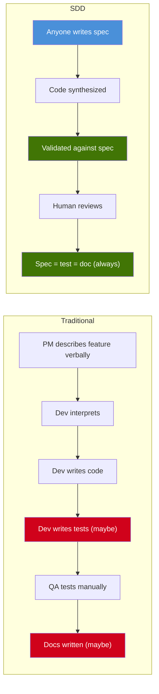
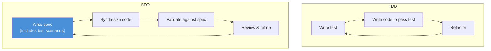
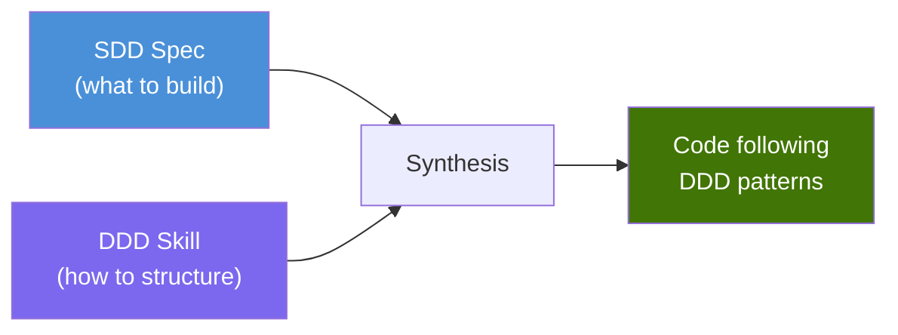
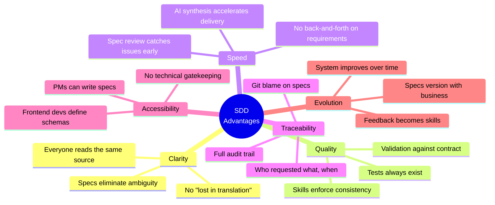
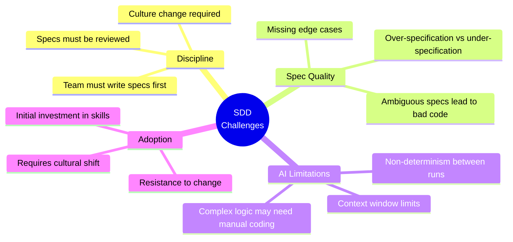
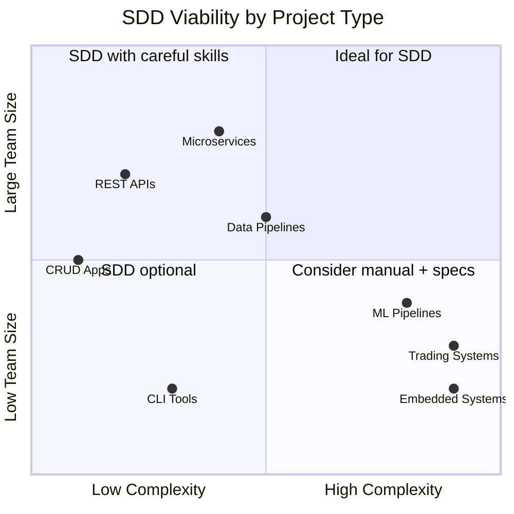
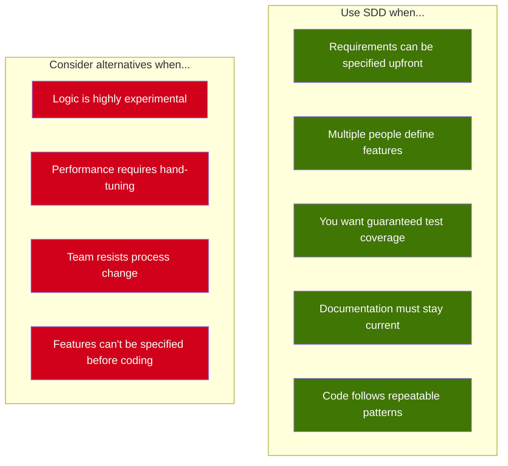

# 7. Comparative Analysis

## 7.1 SDD vs Traditional Development



| Aspect | Traditional | SDD |
|--------|------------|-----|
| **Requirements** | Verbal, Jira tickets, meetings | Spec file in the repo |
| **Tests** | Written after code (or never) | Defined before code (in the spec) |
| **Documentation** | Separate doc (usually outdated) | The spec IS the documentation |
| **Consistency** | Depends on the developer | Enforced by skills |
| **Traceability** | "Who decided this?" → check Slack history | "Who decided this?" → check spec git blame |
| **Onboarding** | "Read the code" | "Read the specs" |

---

## 7.2 SDD vs TDD

SDD and TDD are complementary, not competing. SDD **encompasses** TDD:



| Aspect | TDD | SDD |
|--------|-----|-----|
| **First artifact** | Unit test | Spec (contains tests + more) |
| **Scope of first artifact** | Single function/method | Entire feature/endpoint |
| **Who writes it** | Developer | Anyone (PM, dev, frontend) |
| **Documentation value** | Low (tests are technical) | High (specs are readable) |
| **Drives** | Code implementation | Code, tests, docs, validation |

**Key difference:** In TDD, the test is purely technical — only developers read it. In SDD, the spec is readable by everyone on the team. A PM can look at a spec and verify that the business rule is correctly defined.

---

## 7.3 SDD vs BDD

BDD (Behavior-Driven Development) uses Gherkin syntax to describe behavior:

```gherkin
Given a user with email "existing@email.com" exists
When I POST /user with email "existing@email.com"
Then I should receive status 409
And the response should contain "USER_ALREADY_EXISTS"
```

SDD achieves the same with less ceremony:

```markdown
### Error — Duplicate Email
**Seed:** insert user with email "existing@email.com"
**Input:** { "email": "existing@email.com", "passkey": "securePass123" }
**Expect:** status 409, body { "error": "USER_ALREADY_EXISTS" }
```

| Aspect | BDD | SDD |
|--------|-----|-----|
| **Format** | Gherkin (Given/When/Then) | Markdown (natural language) |
| **Tooling required** | Cucumber, SpecFlow, etc. | None (Markdown is universal) |
| **Learning curve** | Gherkin syntax | None (it's just Markdown) |
| **Scope** | Behavior scenarios | Full feature definition (input, output, errors, side-effects, tests) |
| **Who reads it** | QA, Developers | Everyone |

---

## 7.4 SDD vs DDD

DDD (Domain-Driven Design) focuses on modeling the domain. SDD doesn't replace DDD — it uses DDD through skills:



A team can use SDD with DDD skills: the spec defines what the endpoint does, and the DDD skill ensures the code follows domain-driven patterns (entities, services, repositories).

---

## 7.5 Advantages of SDD



### 1. Specs Eliminate Ambiguity

In traditional development, requirements live in Jira tickets, Slack messages, meeting notes, and people's heads. In SDD, the requirement is a file in the repository — versioned, reviewable, and executable.

### 2. Tests Always Exist

In SDD, you cannot have code without tests. The spec defines test scenarios before code exists. This is stronger than TDD because the test scenarios are part of the requirement, not an afterthought.

### 3. Living Documentation

The spec is always up to date because the code is validated against it. If the spec changes, the code must change. If the code doesn't match the spec, validation fails. Documentation can never be outdated.

### 4. Accessible to Non-Engineers

A Product Manager can write "When the user registers, return a token. If the email exists, return an error." That's a valid spec. No technical knowledge required to define what the software should do.

### 5. Progressive Adoption

SDD doesn't require a big-bang adoption. A team can start by:
1. Writing specs for new features only
2. Using skills as coding standards documentation
3. Gradually adding validation automation

---

## 7.6 Risks and Challenges



### 1. Discipline Required

SDD only works if the team commits to writing specs **before** code. If developers skip the spec and write code directly, the methodology breaks down. This is a cultural challenge, not a technical one.

### 2. Spec Quality Matters

A bad spec produces bad code. If the spec is ambiguous, incomplete, or incorrect, the synthesized code will be too. Spec review (Step 2 in the workflow) is critical.

### 3. AI is Not Magic

AI code synthesis works well for well-defined patterns (CRUDs, validations, integrations). Complex business logic, performance-critical code, or novel algorithms may still require manual development. SDD accommodates this — the developer can always write code by hand following the spec.

### 4. Initial Investment

Writing the first set of skills takes time. The team needs to codify their architectural decisions, security rules, and conventions. This is a one-time investment that pays off over the life of the project.

---

## 7.7 Decision Matrix: When to Use SDD



| Scenario | SDD Viability | Notes |
|----------|-------------|-------|
| **REST APIs** | ✅ High | Ideal use case — well-defined input/output |
| **Microservices** | ✅ High | Each service has clear specs |
| **CRUD Applications** | ✅ High | Repetitive patterns, perfect for synthesis |
| **Data Pipelines** | ✅ High | Clear input/output transformations |
| **Complex Business Rules** | ⚠️ Medium | Specs need to be very detailed |
| **Trading / HFT Systems** | ❌ Low | Performance-critical, needs hand-tuned code |
| **ML Pipelines** | ❌ Low | Experimental, hard to specify upfront |
| **Embedded Systems** | ❌ Low | Hardware-specific, hard to synthesize |

---

## 7.8 Summary



> *"TDD says: write the test first. BDD says: write the behavior first. DDD says: model the domain first. SDD says: write the spec first — and let everything else follow."*
