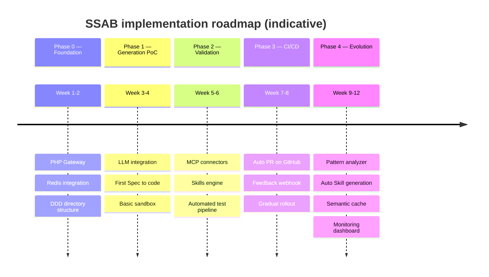
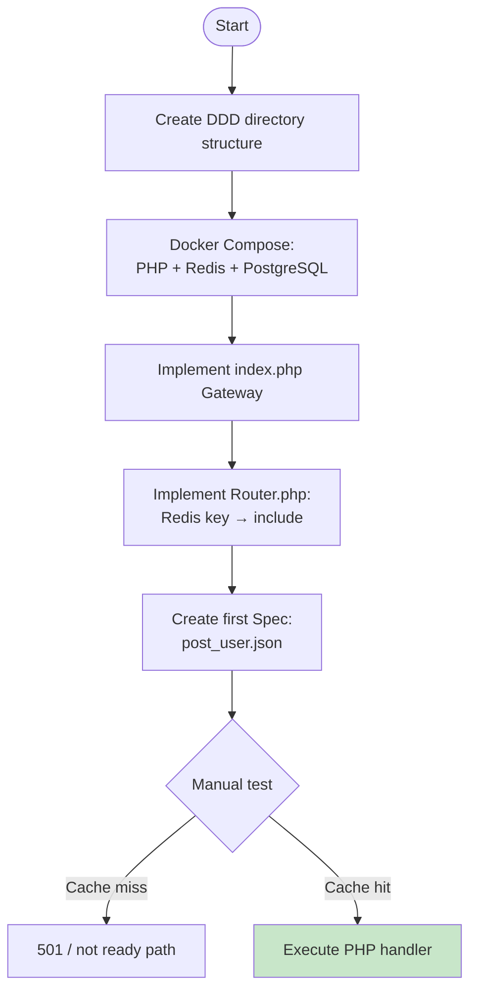
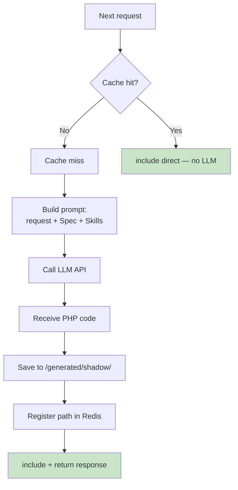
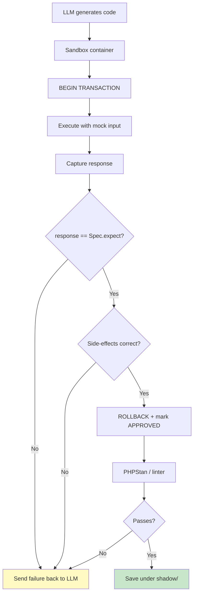
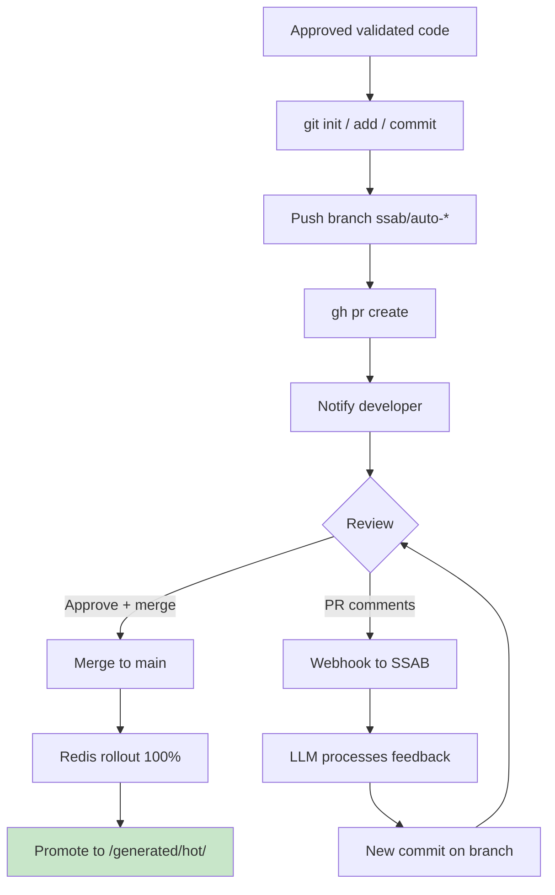
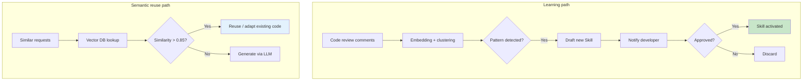
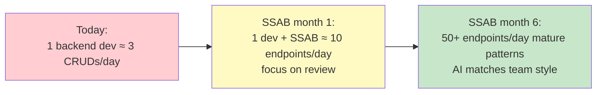
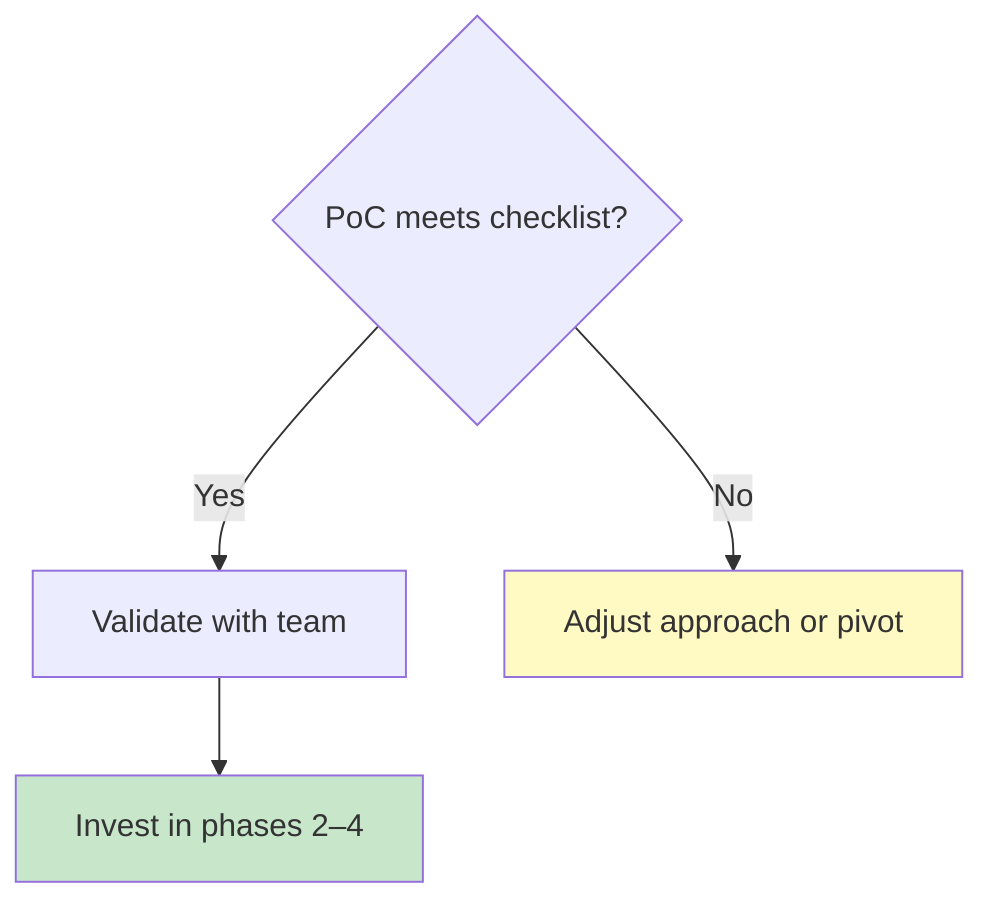

# 7. Next Steps — Implementation Roadmap

## 7.1 Project Phases

---

## 7.2 Phase 0 — Foundation (Weeks 1–2)

**Goal:** Application skeleton — a Gateway that receives HTTP requests and resolves endpoints via **Redis** before executing generated PHP.

### Deliverables

| Deliverable | Description |
|-------------|-------------|
| Repo layout | DDD-friendly folders for domain, application, infrastructure |
| `docker-compose` | PHP, Redis, PostgreSQL (or chosen DB) running locally |
| Gateway | Parses request, looks up Redis registry |
| Router | On hit, `include()` safe path; on miss, explicit fallback |
| First Spec | `post_user.json` (or equivalent) for experiments |

### Success criteria

- Redis stores a mapping from **route key → file path** (or versioned artifact reference).
- **Miss** and **hit** behaviors are deterministic and logged.
- One happy-path include works end-to-end on a stub file.

---

## 7.3 Phase 1 — Generation PoC (Weeks 3–4)

**Goal:** Connect the LLM to the Gateway and complete the first **Spec → PHP** pipeline.

### Deliverables

| Deliverable | Description |
|-------------|-------------|
| Prompt builder | Stable templates + versioning |
| Artifact writer | Writes shadow files atomically where possible |
| Registry write | Atomic Redis update after successful write |
| Metrics | Timings for first vs second request |

### Success criteria

- **First request:** generation + persist + execute **under ~15s** (environment-dependent).
- **Second request:** **under ~50ms** served from disk/include (no LLM).

---

## 7.4 Phase 2 — Validation (Weeks 5–6)

**Goal:** **Sandbox**, **MCP** connectors, and an automated test gate before shadow code is trusted.

### Deliverables

| Deliverable | Description |
|-------------|-------------|
| Sandbox image | Isolated DB / filesystem / network policy |
| Spec runner | Applies mocks, compares outputs |
| MCP layer | Connectors for internal docs, schemas, etc. |
| CI job | Lint + tests on every generation PR |

### Success criteria

- No promotion without **Spec expectation match** (or explicit waiver policy).
- Linter failures block registration in Redis.

---

## 7.5 Phase 3 — Automated CI/CD (Weeks 7–8)

**Goal:** GitHub automation for **auto PRs** and the **feedback loop** from review comments.

### Deliverables

| Deliverable | Description |
|-------------|-------------|
| Bot identity | PAT / GitHub App with least privilege |
| Branch policy | Naming, protection rules, required checks |
| Webhook service | Verifies signatures, idempotency |
| Rollout | Percentage flags or versioned Redis keys |

### Success criteria

- Every merged endpoint has **traceability** from Spec → PR → hot artifact.
- Comment-driven fixes produce **auditable** commits with caps (see Feedback Loop doc).

---

## 7.6 Phase 4 — Evolution (Weeks 9–12)

**Goal:** The system becomes more **autonomous**: learns from feedback, proposes Skills, and reuses similar implementations.

### Deliverables

| Deliverable | Description |
|-------------|-------------|
| Pattern analyzer | Clustering + thresholds + human approval |
| Skill proposals | Draft YAML/JSON with diff preview |
| Semantic cache | Vector index of prompts / Specs / artifacts |
| Dashboard | Generation volume, failures, cost, latency |

### Success criteria

- Measurable **drop** in repeated review themes over several weeks.
- Safe defaults: **no auto-activate** Skills without explicit approval.

---

## 7.7 Long-Term Vision

*Rates are illustrative and depend on Spec quality, review bandwidth, and endpoint complexity.*

---

## 7.8 PoC Checklist (Minimum Viable)

- [ ] Gateway receives request and queries Redis.
- [ ] Cache miss triggers an LLM call.
- [ ] LLM generates PHP following the agreed DDD layout.
- [ ] Code is saved to disk and registered in Redis.
- [ ] Cache hit executes `include()` with **no** LLM.
- [ ] Spec with mocks validates code before persistence.
- [ ] Latency demo: **~10s** first request, **~15ms** second (typical local/staging).

> “The best way to predict the future is to build it.” — **Alan Kay**

---

*Week ranges assume one focused team and clear scope; adjust for compliance, multi-region rollout, and organizational approval gates.*
