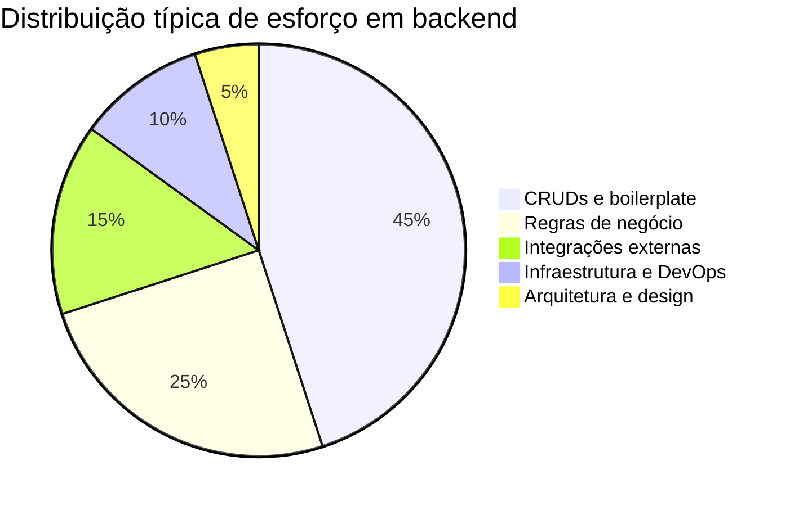
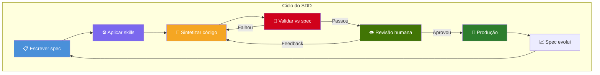
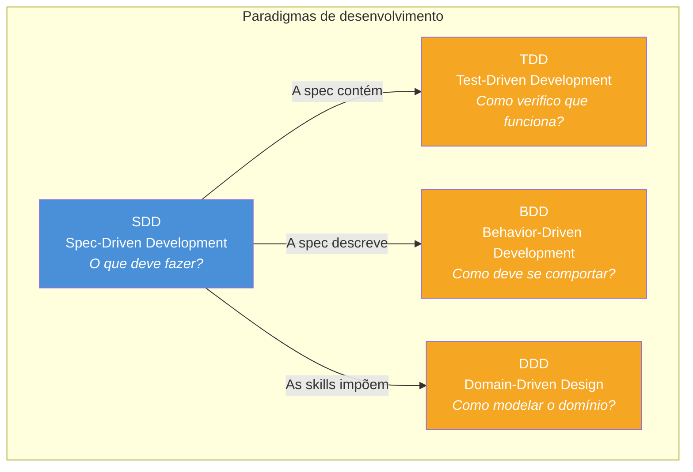
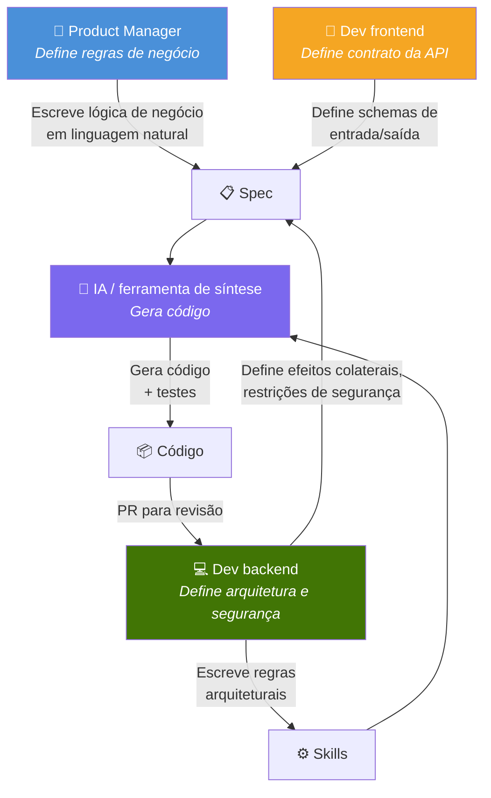

# 1. Visão geral

## 1.1 O problema

O desenvolvimento de software hoje vive um paradoxo: **a maior parte do código é repetitiva**, mas exige engenheiros altamente qualificados para escrevê-la. CRUDs, validações, mapeamentos de entidade, repositórios — padrões conhecidos que consomem semanas de trabalho de times inteiros.

Enquanto isso, ferramentas de código com IA são poderosas, porém caóticas. Sem estrutura, desenvolvedores recebem código inconsistente, sem garantia de cobertura de testes e sem rastreabilidade entre o que foi pedido e o que foi gerado.

O SDD ataca a causa raiz: **não há contrato formal entre intenção e código**. O TDD nos dá testes primeiro. O BDD nos dá comportamento primeiro. O SDD nos dá a **spec primeiro** — e todo o resto deriva dela.

---

## 1.2 O conceito

**Spec-Driven Development (SDD)** é uma metodologia de desenvolvimento de software em que:

1. Uma **spec** é escrita antes de qualquer código — definindo entradas, saídas, erros, efeitos colaterais e cenários de teste
2. **Skills e regras** definem restrições arquiteturais que qualquer código (IA ou humano) deve seguir
3. O código é **sintetizado** (por IA, por um desenvolvedor ou ambos) seguindo a spec e as skills
4. O código é **validado** contra os cenários de teste da spec
5. O código é **governado** — um humano revisa e aprova antes da produção

---

## 1.3 O SDD na família xDD

O SDD não substitui TDD, BDD nem DDD. Convive com eles, tratando de outra preocupação:

| Paradigma | Artefato | O que impulsiona |
|-----------|----------|------------------|
| **TDD** | Teste | Implementação do código |
| **BDD** | História de usuário / Gherkin | Verificação de comportamento |
| **DDD** | Modelo de domínio | Arquitetura e limites |
| **SDD** | Spec | Tudo: código, testes, docs, validação |

O SDD **engloba** o TDD: a spec contém cenários de teste que viram o contrato de validação. Um time que usa SDD está, por natureza, fazendo TDD — mas com uma fonte da verdade mais rica e completa.

---

## 1.4 Princípios centrais

### P1 — Spec primeiro

Não existe código sem spec. A spec é escrita antes de qualquer implementação. Ela define:
- O que o software recebe (entrada)
- O que o software devolve (saída)
- O que pode dar errado (erros)
- O que muda no sistema (efeitos colaterais)
- Como verificar que funciona (cenários de teste)

### P2 — Governança humana

A IA é um sintetizador de código poderoso, mas não toma decisões. Humanos definem as restrições (skills/regras) e aprovam o resultado. Todo código passa por revisão humana antes da produção.

### P3 — Validação contra o contrato

O código não está “pronto” quando compila ou quando o desenvolvedor diz que está. Está pronto quando **passa em todos os cenários de teste definidos na spec**. A spec é o contrato; o código é a implementação.

### P4 — Independente de ferramenta

O SDD é metodologia, não ferramenta. Funciona com:
- Um desenvolvedor lendo a spec e escrevendo código à mão
- Cursor com regras que referenciam a spec
- Um pipeline de CI/CD chamando um LLM para gerar código
- Qualquer assistente de código com IA

A spec é a entrada universal. A ferramenta é intercambiável.

### P5 — Evolúvel

As specs são versionadas. Quando as regras de negócio mudam, a spec é atualizada. Quando a spec muda, o código evolui para acompanhar. Spec e código ficam alinhados porque a spec **governa** o código, e não o contrário.

---

## 1.5 Glossário

| Termo | Definição |
|-------|-----------|
| **SDD** | Spec-Driven Development — a metodologia |
| **Spec** | Arquivo Markdown que define o que um trecho de software deve fazer: entradas, saídas, erros, efeitos colaterais e cenários de teste |
| **Skill** | Regra ou restrição arquitetural que o código deve seguir (ex.: “sempre usar repository pattern”, “nunca usar SQL cru”) |
| **Regra** | Sinônimo de skill — restrição sobre como o código é escrito |
| **Síntese** | Processo de gerar código a partir de uma spec (por IA ou humano) |
| **Validação** | Executar o código contra os cenários de teste da spec para verificar conformidade |
| **Governança** | Supervisão humana: revisar, aprovar e dar feedback sobre o código sintetizado |
| **Contrato** | A spec como acordo vinculante: o código DEVE obedecer ao que a spec define |
| **Dataset** | Dados de teste usados para validar o código sintetizado contra a spec |
| **Ciclo de feedback** | Processo em que comentários da revisão humana melhoram sínteses futuras |

---

## 1.6 Papéis no SDD

| Papel | Responsabilidade | Entrega |
|-------|------------------|---------|
| **Product Manager** | Define o **“o quê”** — regras de negócio em linguagem natural | Conteúdo da spec (seção de lógica de negócio) |
| **Dev frontend** | Define a **“interface”** — schemas de entrada/saída | Conteúdo da spec (seções de entrada/saída) |
| **Dev backend** | Define o **“como”** — arquitetura, segurança, restrições | Skills/regras + revisão do código gerado |
| **IA / ferramenta** | Executa a **“síntese”** — gera código seguindo spec + skills | Código + testes (submetidos em PR) |

> No SDD, o desenvolvedor backend deixa de ser só **escritor de código** e vira **curador de arquitetura**. Ele gasta menos tempo com boilerplate e mais tempo desenhando restrições, revisando qualidade e garantindo segurança.
