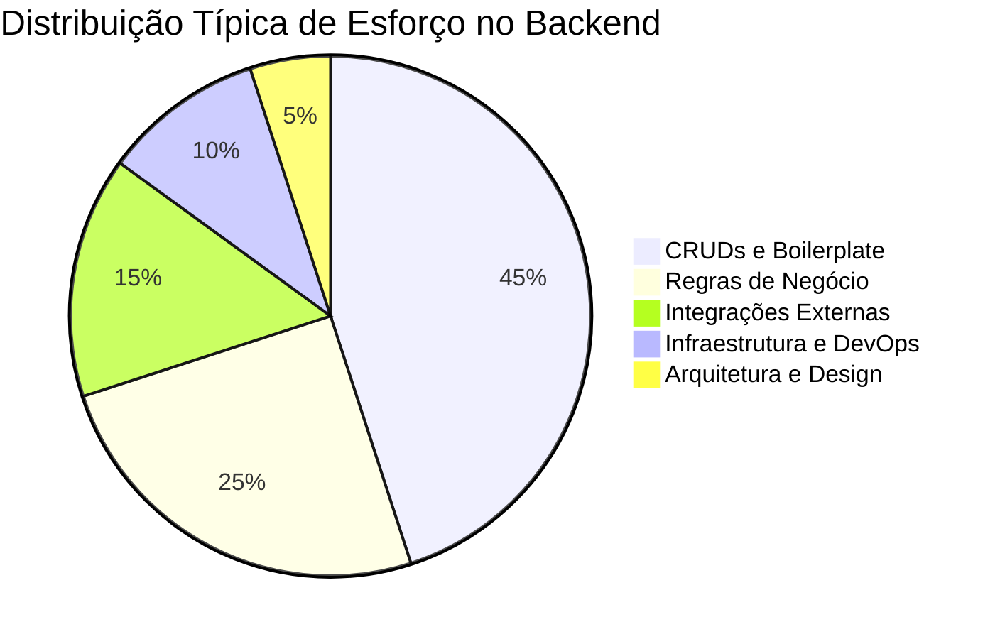
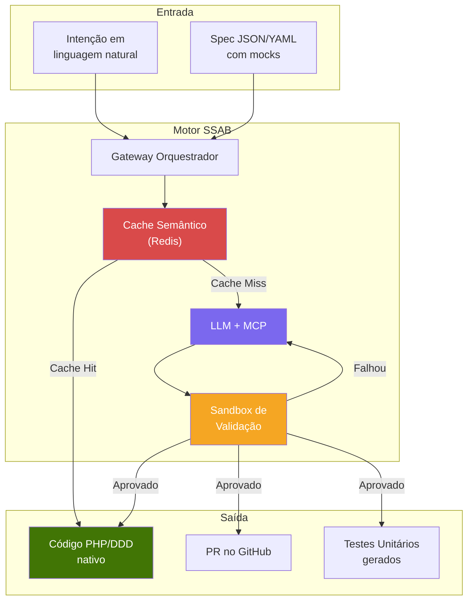
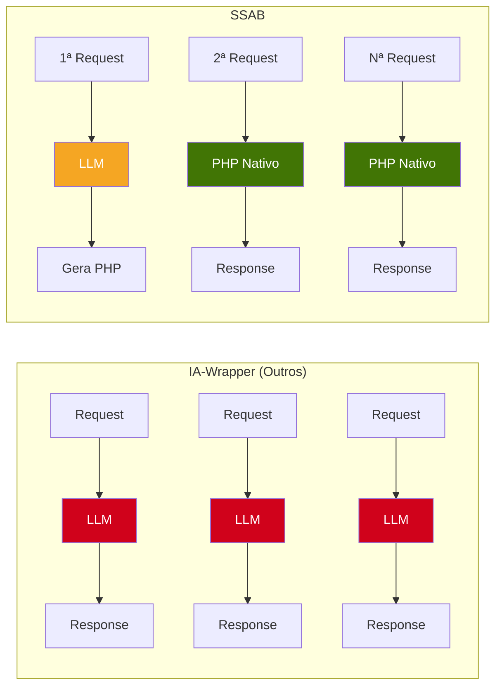
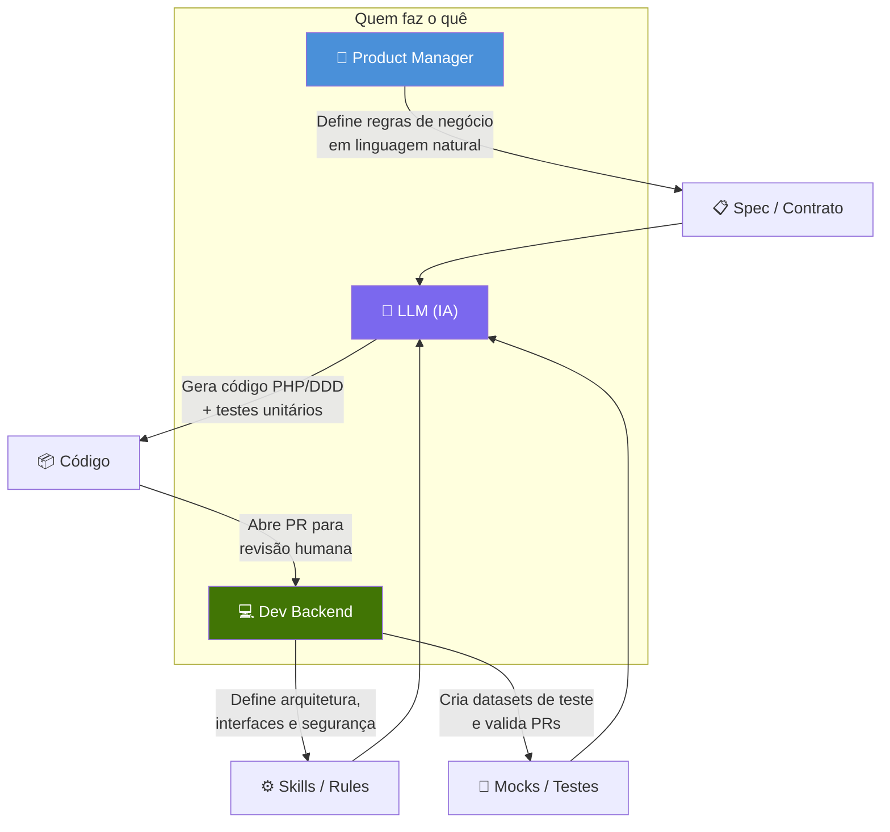

# 1. Visão Geral

## 1.1 O Problema

O desenvolvimento de backend moderno sofre de um paradoxo: **a maior parte do código escrito é repetitiva**, mas exige engenheiros altamente qualificados para escrevê-la. CRUDs, validações, mapeamentos de entidade, repositórios — são padrões conhecidos que consomem semanas de trabalho de times inteiros.

O SSAB ataca diretamente os **45% de boilerplate** e parte significativa das integrações, liberando o dev para focar no que realmente importa: arquitetura, segurança e regras de negócio complexas.

---

## 1.2 O Conceito

O **Self-Synthesizing Adaptive Backend** é um modelo de infraestrutura onde:

1. O **código de produção** não é escrito manualmente para cada funcionalidade
2. É **gerado Just-In-Time** por uma LLM baseada em intenções (prompts de produto)
3. É **validado por contratos técnicos** (mocks, testes, specs)
4. **Evolui** de execução lenta (IA) para execução nativa de alta performance (PHP/DDD) de forma automática
5. A **IA sai do fluxo** após a promoção — o código final é PHP nativo puro

---

## 1.3 Motivação

### Por que não usar a IA diretamente em runtime?

Sistemas que usam LLM como "motor de execução" em cada request sofrem de:

| Problema | Impacto |
|----------|---------|
| **Latência** | 2-10s por request vs 15ms nativo |
| **Custo por token** | Escala linearmente com tráfego |
| **Não-determinismo** | Mesma entrada pode gerar comportamentos diferentes |
| **Vendor lock-in** | Backend para se a API da LLM cair |

O SSAB resolve todos esses problemas: a IA é usada **apenas uma vez** por tipo de funcionalidade. Depois disso, é PHP nativo.

---

## 1.4 Princípios Fundamentais

### P1 — Contract-First (Contrato Primeiro)

Nenhum código é gerado sem um contrato prévio. O Dev/PM **obrigatoriamente** define inputs esperados, outputs desejados e side-effects antes da IA tocar em qualquer linha de código.

### P2 — Human-in-the-Loop (Humano no Circuito)

A IA **nunca** promove código para produção sozinha. Todo código gerado passa por code review humano via Pull Request.

### P3 — Progressive Enhancement (Melhoria Progressiva)

O sistema começa lento (IA) e se torna rápido (nativo) organicamente. A performance **melhora** com o uso.

### P4 — Deterministic Output (Saída Determinística)

O código gerado é PHP estático. Uma vez promovido, a mesma entrada **sempre** produz a mesma saída. O não-determinismo da LLM fica confinado à fase de geração.

### P5 — Evolvable Architecture (Arquitetura Evolutiva)

Comentários de code review retroalimentam a IA. O sistema **aprende** com as correções humanas e melhora a qualidade do código gerado ao longo do tempo.

---

## 1.5 Glossário

| Termo | Definição |
|-------|-----------|
| **SSAB** | Self-Synthesizing Adaptive Backend — a arquitetura proposta |
| **JIT Code** | Código gerado Just-In-Time pela LLM na primeira chamada |
| **Spec** | Arquivo JSON/YAML com input, output esperado e side-effects |
| **MCP** | Model Context Protocol — protocolo que permite à LLM "enxergar" a infraestrutura |
| **Skill** | Regra de arquitetura/negócio que a LLM deve seguir obrigatoriamente |
| **Shadow Code** | Código gerado pela IA que ainda não foi aprovado para produção |
| **Funil de Promoção** | Caminho que o código percorre: Cold → Staging → Hot |
| **Cold** | Estado inicial — IA gera código pela primeira vez |
| **Staging** | Estado intermediário — código em sandbox com tráfego parcial |
| **Hot** | Estado final — código nativo em produção com 100% do tráfego |
| **Gateway** | Ponto de entrada PHP que orquestra o fluxo |
| **Feedback Loop** | Ciclo onde comentários humanos retroalimentam a IA |
| **Cache Semântico** | Redis + Vector DB que identifica intenções já resolvidas |
| **DDD** | Domain-Driven Design — padrão arquitetural que a IA deve seguir |

---

## 1.6 Papéis no Ecossistema

| Papel | Responsabilidade Principal | Entregável |
|-------|---------------------------|------------|
| **PM / Produto** | Definir o **"O Quê"** (regra de negócio) | Spec em linguagem natural ou JSON |
| **Dev Backend** | Definir o **"Onde"** (arquitetura e segurança) | Interfaces, Skills, revisão de PR |
| **LLM (IA)** | Definir o **"Como"** (código) | PR com Service, Repository e testes |

> O Dev Backend evolui de **escritor de código** para **Engenheiro de Plataforma / Curador de Arquitetura**.
