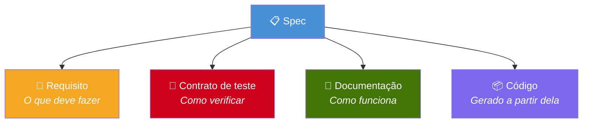
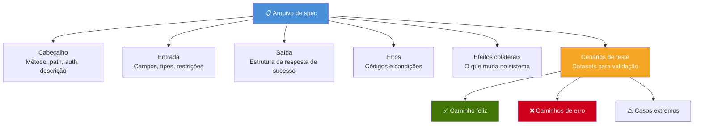
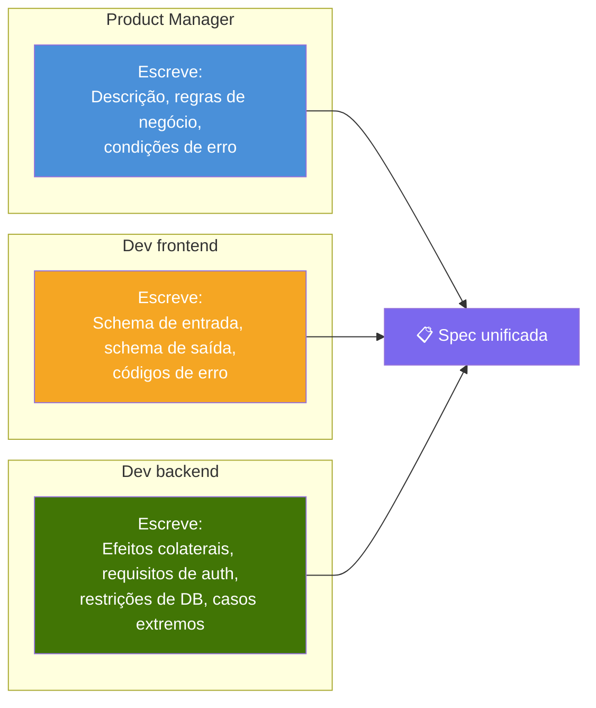
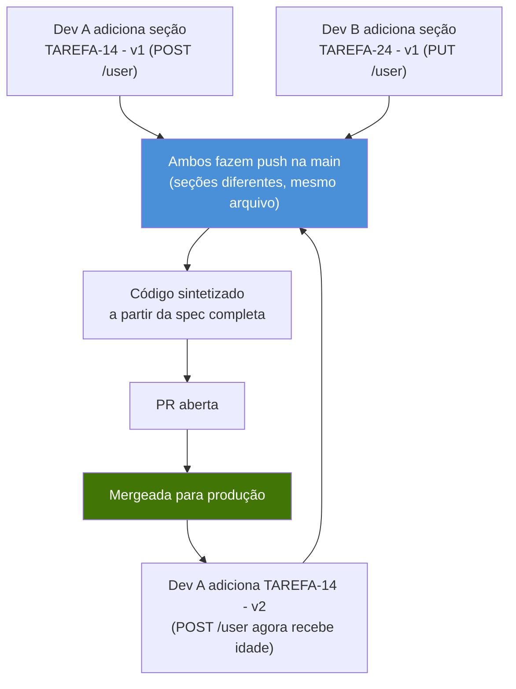

# 2. A spec

A spec é o **artefato central** do SDD. Ao mesmo tempo é requisito, contrato de teste e documentação. Tudo flui a partir da spec.



---

## 2.1 Formato

As specs são escritas em **Markdown**. Não JSON, não YAML — Markdown.

Por quê:
- Qualquer pessoa do time consegue escrever e ler (PM, frontend, backend)
- Renderiza bem no GitHub, GitLab e em qualquer editor
- É versionável, comparável em diff e revisável em PRs
- LLMs lidam muito bem com linguagem natural em Markdown
- Não há schema para decorar nem erro de sintaxe rígido

---

## 2.2 Anatomia de uma spec

Toda spec tem estas seções:



---

## 2.3 Exemplo completo

### `specs/user/post-user.md`

```markdown
# POST /user

## Auth
None

## Description
Creates a new user in the system. Validates the email format,
ensures the password meets minimum requirements, hashes the
password with bcrypt, and returns a JWT token.

## Input
- email (string, required, email format)
- passkey (string, required, min 8 characters)
- name (string, optional)

## Output (201)
- token (string, JWT, expires in 24h)
- userData
  - id (uuid)
  - email (string)
  - name (string, nullable)
  - created_at (datetime)

## Errors
- 409: Email already exists → USER_ALREADY_EXISTS
- 422: Invalid email format → INVALID_EMAIL
- 422: Password too short (< 8 chars) → WEAK_PASSKEY

## Side Effects
- Create record in `users` table
- Hash passkey with bcrypt (cost 12) before saving
- Generate JWT token with RS256, expiration 24h

## Test Scenarios

### Happy Path — Create User
**Input:** { "email": "jon@doe.com", "passkey": "securePass123" }
**Expect:** status 201, body contains "token" and "userData"
**Expect:** userData.email equals "jon@doe.com"
**DB Assert:** users table has record where email = "jon@doe.com"

### Happy Path — With Optional Name
**Input:** { "email": "jane@doe.com", "passkey": "securePass123", "name": "Jane" }
**Expect:** status 201, userData.name equals "Jane"

### Error — Duplicate Email
**Seed:** insert user with email "existing@email.com"
**Input:** { "email": "existing@email.com", "passkey": "securePass123" }
**Expect:** status 409, body { "error": "USER_ALREADY_EXISTS" }

### Error — Invalid Email
**Input:** { "email": "not-an-email", "passkey": "securePass123" }
**Expect:** status 422, body { "error": "INVALID_EMAIL" }

### Error — Weak Password
**Input:** { "email": "new@email.com", "passkey": "123" }
**Expect:** status 422, body { "error": "WEAK_PASSKEY" }
```

---

## 2.4 Quem escreve a spec?

O SDD democratiza a definição de feature. Cada papel contribui com seções diferentes:



Na prática, qualquer pessoa pode escrever uma spec. Ela é revisada em PR como código. O time converge na versão final pelo processo normal de revisão.

---

## 2.5 Organização das Specs

As specs ficam dentro do projeto, organizadas por domínio — **um arquivo por domínio**:

```
.sdd/
└── specs/
    ├── user.md        ← tudo sobre os endpoints /user
    ├── order.md       ← tudo sobre os endpoints /order
    └── auth.md        ← tudo sobre os endpoints /auth
```

### Um Arquivo, Histórico Completo

Cada arquivo de spec contém **todas as tarefas e versões** daquele domínio. Tarefas são seções dentro do arquivo, versionadas inline:

```markdown
# /user
Sempre use JWT para TODOS os métodos, exceto POST

## TAREFA-14 - v1
Adiciona POST /user
(... detalhes do endpoint ...)

## TAREFA-24 - v1
Adiciona PUT /user
(... detalhes do endpoint ...)

## TAREFA-14 - v2
POST /user agora recebe idade
(... detalhes da mudança ...)
```



**Por que um único arquivo em vez de múltiplos arquivos de task:**

- **Contexto completo em um lugar** — abra `user.md` e veja toda a evolução do domínio
- **Zero processo extra** — sem etapa de consolidação, sem deletar arquivos, sem cerimônia de merge
- **Versionamento natural** — tarefas evoluem com `v1`, `v2`, etc. O git blame mostra quem adicionou o quê
- **Regras de domínio compartilhadas** — regras globais no topo (ex: "sempre use JWT") são herdadas por todas as tarefas automaticamente
- **Conflitos de merge simples** — quando dois devs editam seções diferentes do mesmo arquivo, o conflito é trivial de resolver

---

## 2.6 Versionamento da spec

As specs evoluem com o produto. Quando uma regra de negócio muda, a spec é atualizada:

```mermaid
stateDiagram-v2
    [*] --> v1: PM cria spec
    v1 --> Live: Código sintetizado + validado + aprovado
    Live --> v2: PM atualiza regra de negócio
    v2 --> Live: Código re-sintetizado com nova spec
    Live --> v3: Novo caso extremo descoberto em produção
    v3 --> Live: Cenário de teste adicionado, código atualizado

    note right of v2: Ex.: desconto muda\nde 10% para 15%
    note right of v3: Ex.: bug de email\nnull em prod
```

A spec é a **única fonte da verdade**. Se o código não bate com a spec, o código está errado — não a spec. Isso inverte o modelo tradicional em que a documentação corre atrás do código.

---

## 2.7 Spec em linguagem natural

A spec não precisa ser rigidamente estruturada. Para endpoints mais simples, um formato mais natural funciona:

```markdown
# GET /me

{JWT}

Connect to the database and fetch the user's name, age, and id.
Use the user id to query the orders table, joining id (user) = user_id (order).
Filter orders: only orders with status "processed" should appear.

Return:
{ name, age, orders: [{ name, date, status, description }] }
```

As convenções são mínimas:
- `{JWT}` significa que o endpoint exige autenticação JWT
- O prefixo `[GET]` define o método HTTP
- O restante é linguagem natural que a ferramenta de síntese interpreta

Isso torna as specs acessíveis a **qualquer pessoa** — inclusive PMs sem conhecimento técnico profundo.
