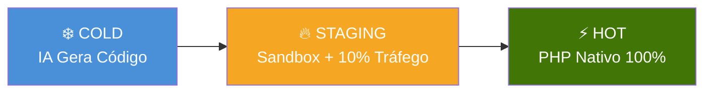
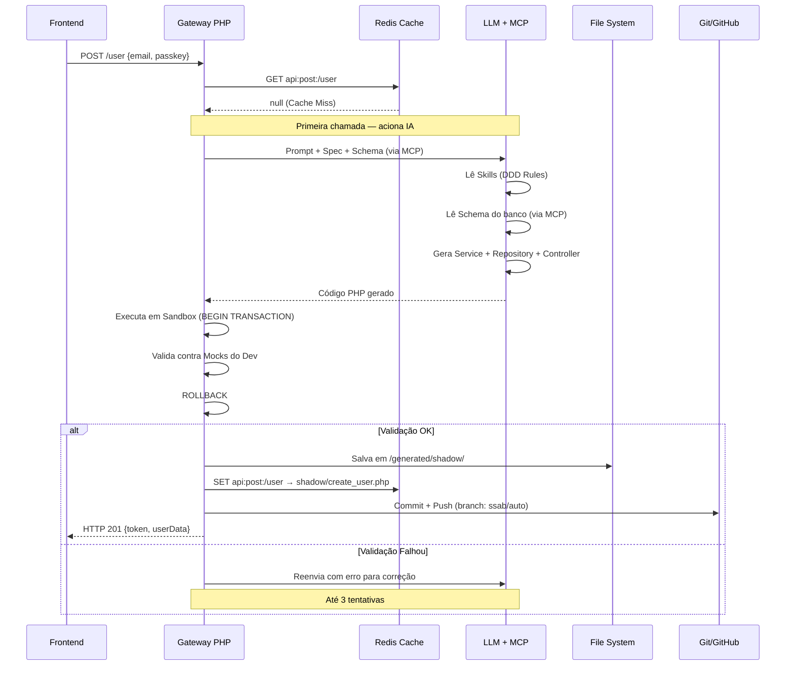
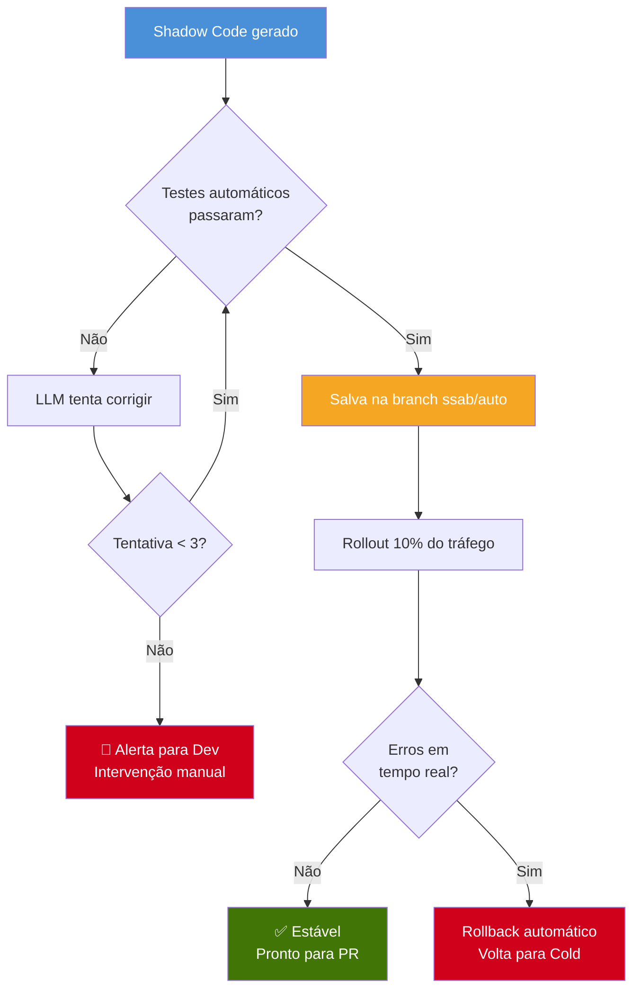
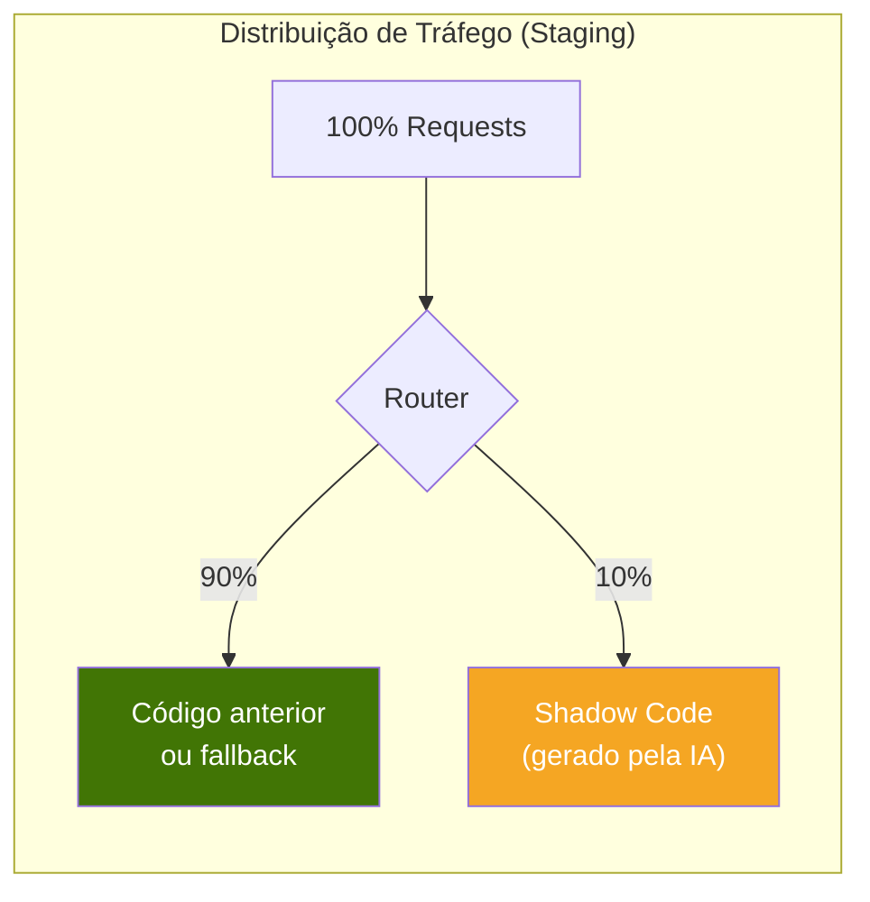
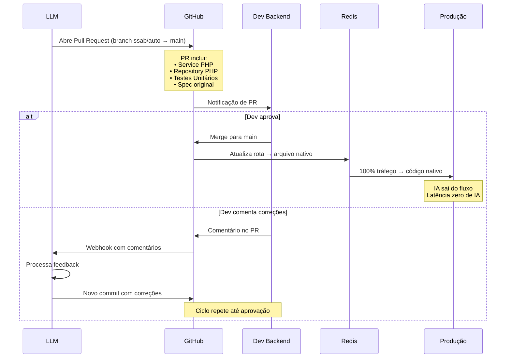
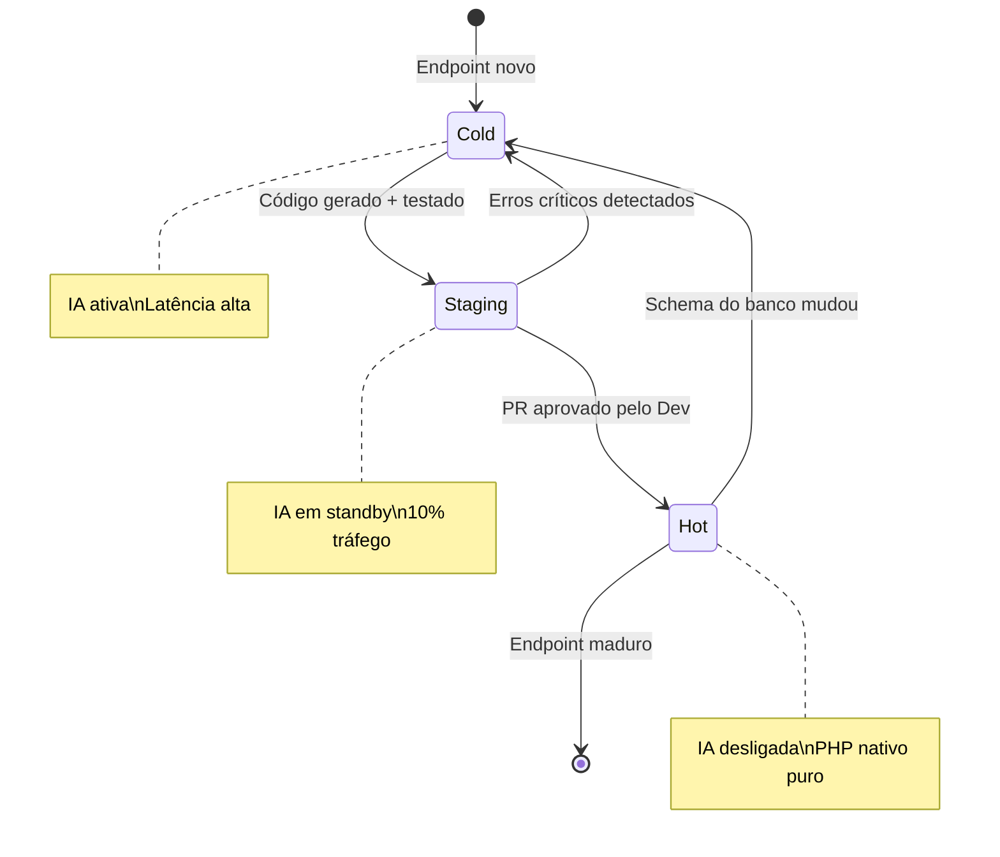
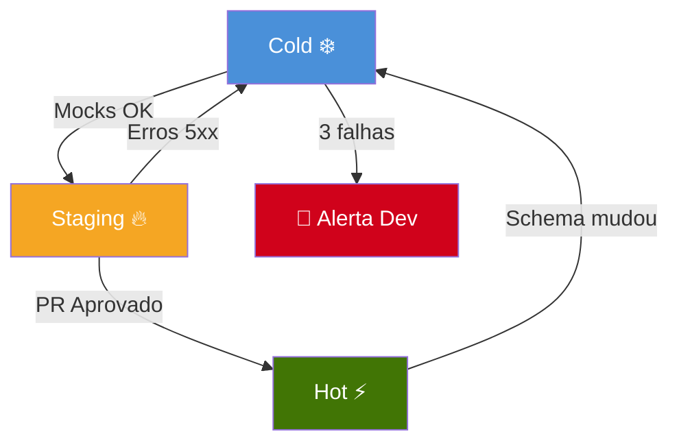

# 2. Ciclo de Vida do Código — O Funil de Promoção

O código no SSAB não nasce pronto. Ele **amadurece** através de um funil de três fases, saindo de uma execução lenta (IA) para execução nativa de alta performance (PHP puro).



---

## 2.1 Fase A — Cold Start (Ingestão de Intenção)

A fase fria é acionada quando um endpoint é chamado **pela primeira vez** e não existe código nativo para atendê-lo.

### Atores
- **PM** (Produto) ou **Dev** — quem definiu a Spec/Contrato previamente

### Fluxo



### O que acontece nesta fase

1. O **Gateway** recebe a request e consulta o Redis
2. **Cache Miss** — não existe código para este endpoint
3. O Gateway monta um prompt contendo:
   - A request original (método, path, payload)
   - A **Spec** definida pelo Dev/PM (input esperado, output desejado)
   - O **Schema do banco** (via MCP)
   - As **Skills** (regras DDD obrigatórias)
4. A LLM gera o código PHP completo seguindo DDD
5. O código é **testado em sandbox** contra os mocks
6. Se aprovado, é salvo como **Shadow Code**

### Latência esperada
- **3 a 15 segundos** (inclui chamada à LLM + sandbox)
- O frontend deve estar preparado com timeout adequado ou indicador de carregamento

---

## 2.2 Fase B — Staging (Sandbox e Validação)

O código gerado entra em um estado intermediário: existe fisicamente, mas ainda não é considerado "de produção".

### Fluxo



### Mecanismo de Rollout Gradual

O Redis controla a distribuição de tráfego usando uma estratégia de **percentage-based routing**:



### Validações nesta fase

| Verificação | Método | Critério de Aprovação |
|-------------|--------|----------------------|
| Conformidade de contrato | Comparação JSON output vs Spec | Output **idêntico** ao esperado |
| Side-effects | Inspeção de banco em sandbox | Registros criados/alterados conforme Spec |
| Erros de runtime | Monitoramento do tráfego de 10% | Zero erros 5xx em 1 hora |
| Performance | Medição de latência p95 | < 200ms por request |
| Segurança | Análise estática (linter) | Sem `eval()`, `exec()`, SQL raw |

---

## 2.3 Fase C — Hot (Promoção para Nativo)

O código sobreviveu à sandbox, ao tráfego real parcial e está pronto para ser promovido.

### Fluxo



### O que o PR contém

```
📦 PR #42 — [SSAB] POST /user - Criação de Usuário
│
├── src/Domain/Entities/User.php
├── src/Application/Services/CreateUserService.php
├── src/Infrastructure/Repositories/UserRepository.php
├── tests/Unit/CreateUserServiceTest.php
├── specs/post_user.json (referência)
│
└── 📝 Descrição automática:
    "Gerado pelo SSAB em 2026-03-20.
     Validado contra 3 cenários de teste.
     Rollout de 10% estável por 2 horas.
     0 erros registrados."
```

### Após a aprovação



---

## 2.4 Transições de Estado

### Promoção (caminho feliz)

| De | Para | Gatilho |
|----|------|---------|
| **Cold** | **Staging** | Código passa em todos os mocks |
| **Staging** | **Hot** | PR aprovado pelo Dev + zero erros em tráfego real |

### Demoção (caminho de falha)

| De | Para | Gatilho |
|----|------|---------|
| **Staging** | **Cold** | Erros 5xx detectados no tráfego de 10% |
| **Hot** | **Cold** | Migração de banco de dados invalida o código |
| **Cold** | **Alerta** | IA falha 3x consecutivas em gerar código válido |



---

## 2.5 Tempos Esperados por Fase

```mermaid
gantt
    title Tempo de Vida Típico de um Endpoint
    dateFormat X
    axisFormat %s

    section Cold
    LLM gera código        :a1, 0, 10
    Sandbox valida          :a2, 10, 15

    section Staging
    Rollout 10%             :a3, 15, 75
    Monitoramento           :a4, 75, 135

    section Hot
    PR Review               :a5, 135, 195
    Merge + 100% tráfego    :a6, 195, 200
```



| Fase | Duração Estimada | Dependência |
|------|-----------------|-------------|
| **Cold** | 5-15 segundos | Latência da LLM |
| **Staging** | 1-2 horas | Tempo de monitoramento |
| **Hot** | 1-24 horas | Velocidade do code review humano |
| **Total** | ~2-26 horas | Do "post-it" ao código nativo em produção |

> Comparação: no fluxo tradicional, um CRUD simples leva de **1 a 5 dias** entre spec, desenvolvimento, code review e deploy.
