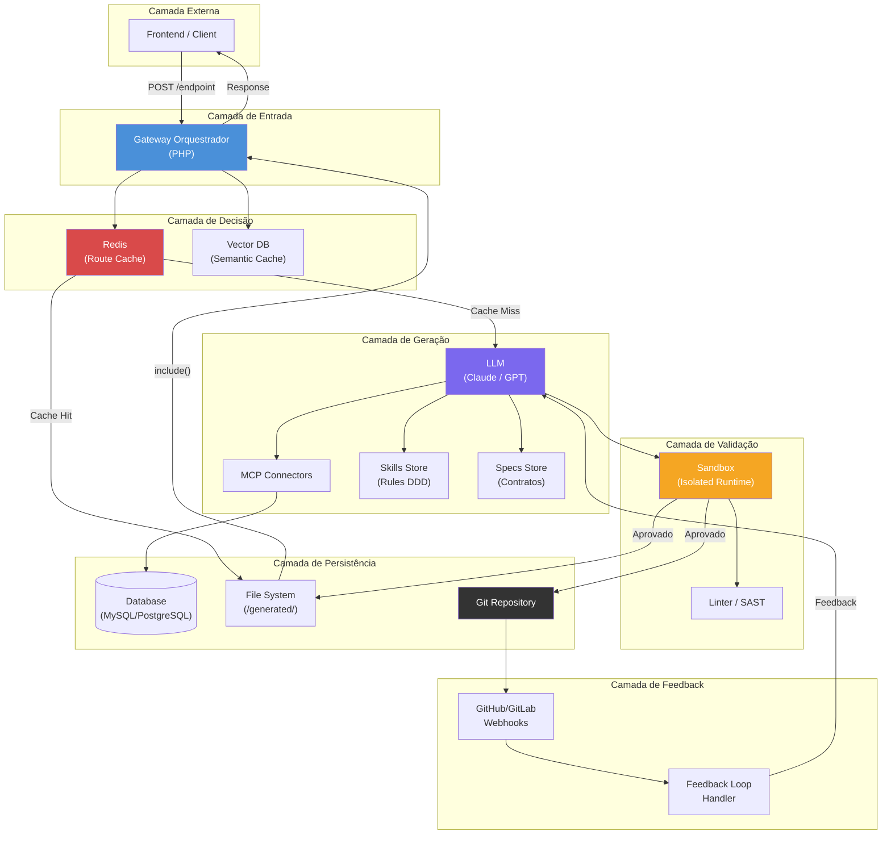
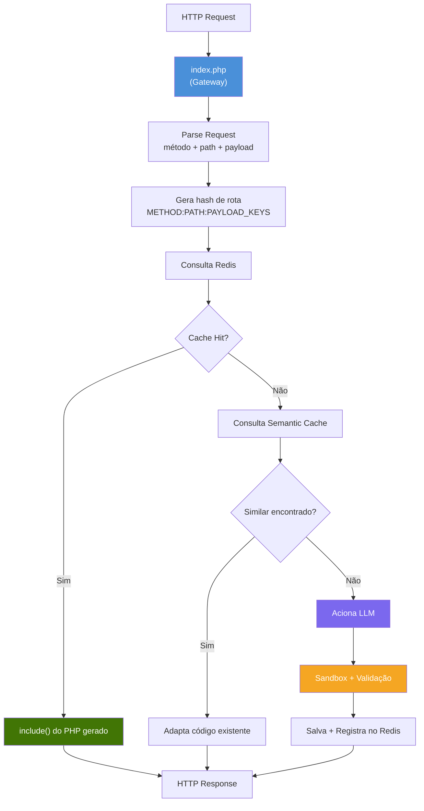
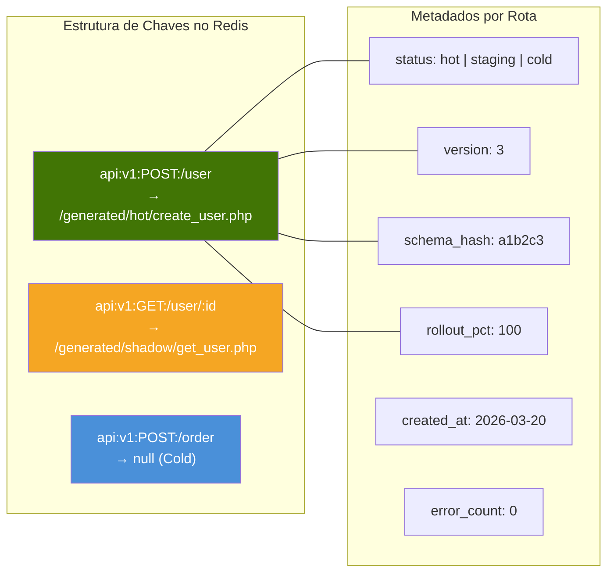
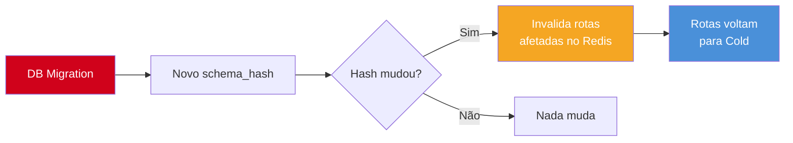
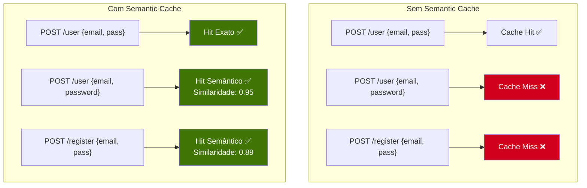
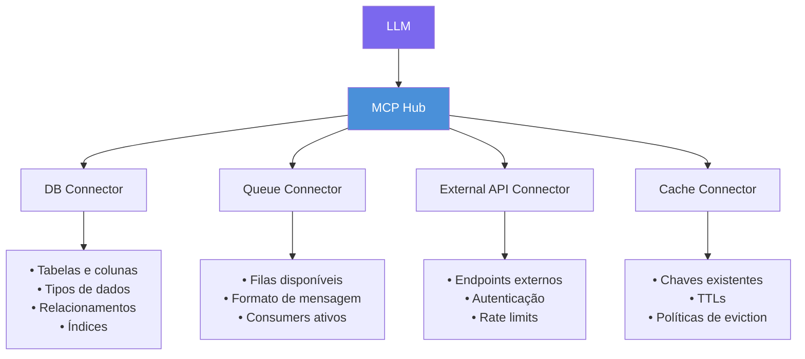
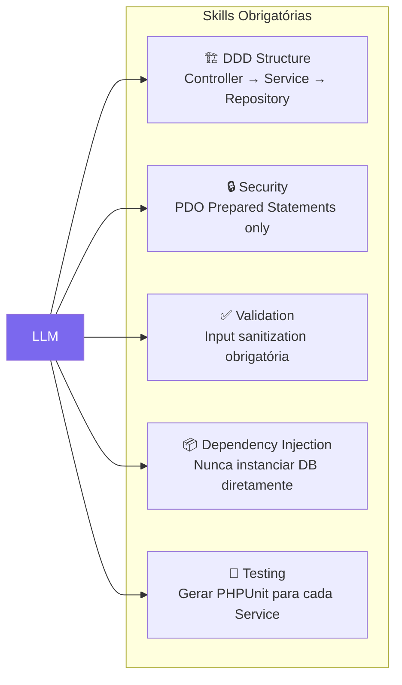
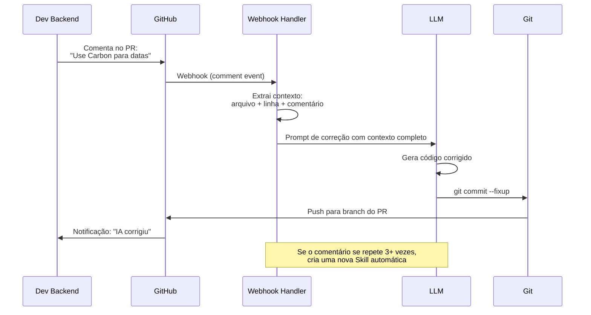
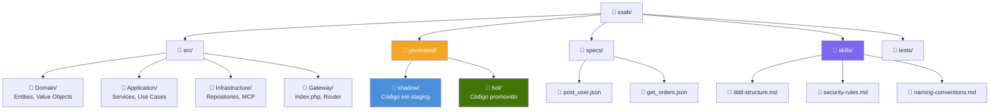
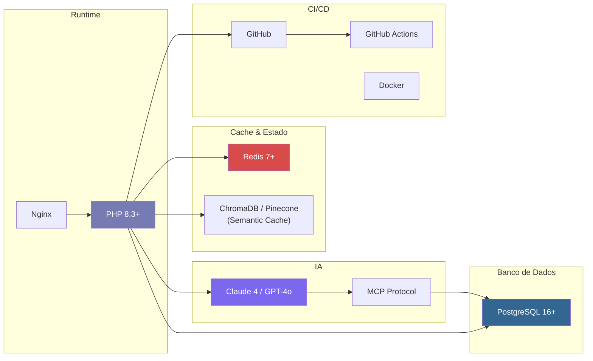

# 3. Arquitetura Técnica

## 3.1 Visão de Alto Nível



---

## 3.2 Componentes Principais

### 3.2.1 Gateway Orquestrador (PHP)

O ponto de entrada único do sistema. Toda request HTTP passa por ele.



**Responsabilidades:**
- Receber **todas** as requests HTTP
- Gerar o hash de roteamento (`METHOD:PATH:PAYLOAD_STRUCTURE`)
- Consultar Redis para decisão de roteamento
- Executar `include()` do código nativo quando disponível
- Acionar a LLM quando necessário
- Retornar a response ao client

**Decisão de roteamento:**

| Cenário | Ação | Latência |
|---------|------|----------|
| Redis tem rota → arquivo PHP existe | `include()` direto | ~15ms |
| Redis tem rota → Semantic Cache similar | Adapta código existente | ~1-3s |
| Redis vazio → nenhum código existe | Aciona LLM completa | ~5-15s |

---

### 3.2.2 Cache de Roteamento (Redis)

O Redis é o **cérebro de decisão rápida** do sistema. Ele mantém um mapa de rotas para arquivos PHP gerados.



**Estrutura de dados no Redis (por rota):**

```json
{
  "key": "api:v1:POST:/user",
  "file": "/generated/hot/create_user_v3.php",
  "status": "hot",
  "version": 3,
  "schema_hash": "a1b2c3d4e5",
  "rollout_pct": 100,
  "created_at": "2026-03-20T14:30:00Z",
  "promoted_at": "2026-03-20T16:45:00Z",
  "error_count_24h": 0
}
```

**Invalidação de Cache:**

O `schema_hash` é um hash do schema do banco de dados. Quando uma migração altera o schema, o hash muda e **todas as rotas são invalidadas**, forçando a IA a regenerar o código com o schema atualizado.



---

### 3.2.3 Semantic Cache (Vector DB)

Complementa o Redis com busca por **similaridade semântica**, não por igualdade exata.



**Quando é útil:**
- Quando o frontend muda levemente a estrutura do payload
- Quando endpoints diferentes representam a mesma intenção
- Para evitar chamadas desnecessárias à LLM

---

### 3.2.4 MCP Connectors

Os **Model Context Protocol Connectors** são a ponte entre a LLM e a infraestrutura real. Eles permitem que a IA "enxergue" o ambiente sem que o Dev precise descrever tudo manualmente.



**Exemplo — DB Connector expõe para a LLM:**

```json
{
  "table": "users",
  "columns": [
    {"name": "id", "type": "uuid", "primary": true},
    {"name": "email", "type": "varchar(255)", "unique": true, "nullable": false},
    {"name": "password_hash", "type": "varchar(255)", "nullable": false},
    {"name": "created_at", "type": "timestamp", "default": "CURRENT_TIMESTAMP"}
  ],
  "indexes": ["idx_users_email"],
  "relations": [
    {"table": "orders", "type": "hasMany", "foreign_key": "user_id"}
  ]
}
```

Isso evita que a IA **alucine** nomes de colunas ou tente criar campos inexistentes.

---

### 3.2.5 Skills Store (Regras de Arquitetura)

As Skills são regras que a LLM **obrigatoriamente** segue ao gerar código. Elas garantem consistência arquitetural.



**Exemplo de Skill (`skills/ddd-structure.md`):**

```markdown
## Regra: Estrutura DDD Obrigatória

Todo código gerado DEVE seguir esta estrutura:

1. **Controller**: Recebe a request, valida input, delega para o Service
2. **Service**: Contém a lógica de negócio, chama o Repository
3. **Repository**: Única camada que toca o banco de dados

Proibições:
- NUNCA use eval(), exec(), system()
- NUNCA concatene strings em queries SQL
- NUNCA acesse $_POST ou $_GET diretamente — use o objeto Request injetado
- NUNCA instancie PDO — use o $db injetado pelo container
```

---

### 3.2.6 Feedback Loop Handler

Serviço que observa comentários em PRs do GitHub/GitLab e retroalimenta a LLM.



---

## 3.3 Estrutura de Diretórios



```
ssab/
├── src/
│   ├── Domain/
│   │   └── Entities/           # Entidades do domínio
│   ├── Application/
│   │   └── Services/           # Lógica de negócio
│   ├── Infrastructure/
│   │   ├── Repositories/       # Acesso ao banco
│   │   └── MCP/                # Connectors MCP
│   └── Gateway/
│       ├── index.php           # Ponto de entrada único
│       └── Router.php          # Orquestrador de decisão
├── generated/
│   ├── shadow/                 # Código em staging (10% tráfego)
│   └── hot/                    # Código promovido (100% tráfego)
├── specs/
│   ├── post_user.json          # Contrato: criar usuário
│   └── get_orders.json         # Contrato: listar pedidos
├── skills/
│   ├── ddd-structure.md        # Regra: estrutura DDD
│   ├── security-rules.md       # Regra: segurança
│   └── naming-conventions.md   # Regra: nomenclatura
├── tests/
│   └── Unit/                   # Testes unitários (gerados pela IA)
└── docker-compose.yml          # Redis, DB, PHP
```

---

## 3.4 Stack Tecnológica



| Componente | Tecnologia | Justificativa |
|-----------|-----------|---------------|
| **Gateway** | PHP 8.3+ | Runtime dinâmico, `include()` nativo, sem compilação |
| **Web Server** | Nginx | Reverse proxy + roteamento para `index.php` |
| **Route Cache** | Redis 7+ | Decisão de roteamento em <1ms |
| **Semantic Cache** | ChromaDB ou Pinecone | Busca por similaridade de intenções |
| **LLM** | Claude 4 / GPT-4o | Geração de código PHP de alta qualidade |
| **Infraestrutura** | MCP Protocol | Conexão IA ↔ infraestrutura |
| **Banco de Dados** | PostgreSQL 16+ | Robustez e suporte a transações |
| **Versionamento** | GitHub | PRs automáticos + webhooks |
| **CI/CD** | GitHub Actions | Validação automatizada de PRs |
| **Containers** | Docker | Isolamento da sandbox |
