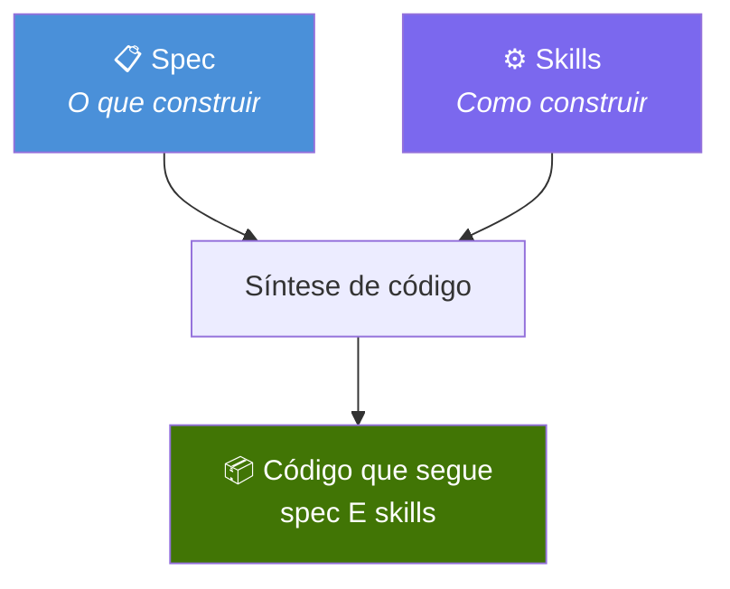
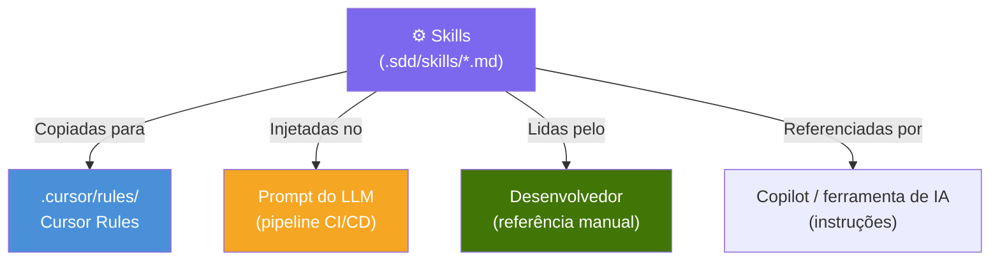
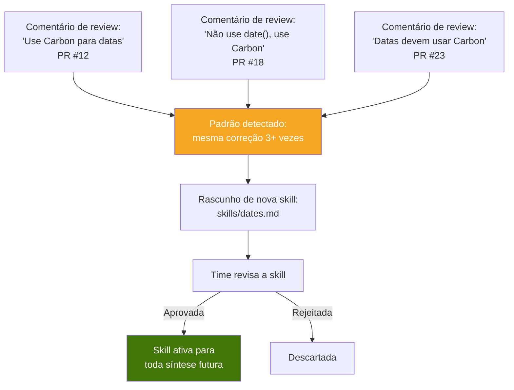
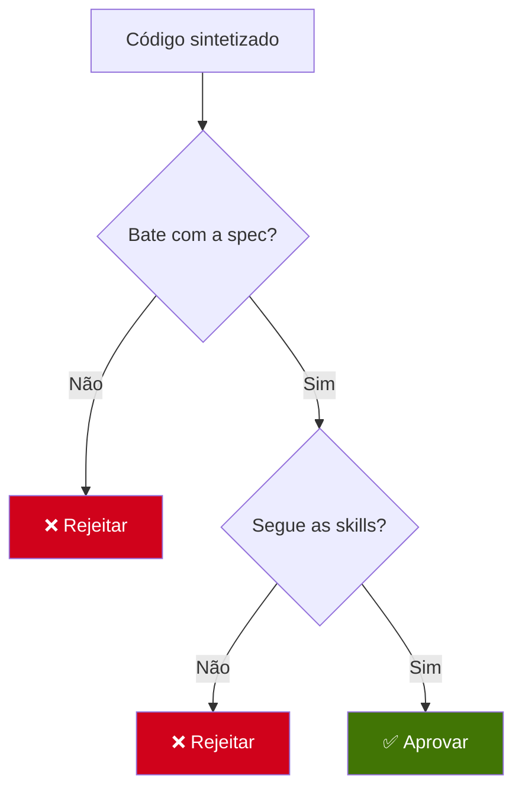

# 3. Skills e regras

## 3.1 O que são skills?

Skills são **restrições arquiteturais** que governam como o código é sintetizado. Definem padrões, convenções e proibições que todo trecho de código deve seguir — seja escrito por IA ou por humano.



Se a spec responde **“O que o software deve fazer?”**, as skills respondem **“Como o software deve ser construído?”**

---

## 3.2 Skills vs specs

| Aspecto | Spec | Skill |
|---------|------|-------|
| **Escopo** | Um endpoint ou feature | O projeto inteiro |
| **Quem escreve** | PM, dev frontend, dev backend | Dev backend, tech lead |
| **Muda quando** | Regra de negócio muda | Decisão de arquitetura muda |
| **Exemplo** | “POST /user retorna JWT” | “Sempre usar repository pattern” |
| **Frequência** | Uma por feature | Poucas por projeto (típico 5–15) |

---

## 3.3 Formato das skills

Skills são arquivos Markdown em `.sdd/skills/`. Usam linguagem natural — o mesmo formato consumido por ferramentas de IA como Cursor, Copilot ou pipelines LLM próprios.

### Exemplo: `skills/go-ddd.md`

```markdown
# Skill: Go DDD Structure

## Architecture
Every endpoint MUST follow this structure:
1. **Handler** (interfaces layer) — receives HTTP request, validates input, delegates to service
2. **Service** (application layer) — contains business logic, calls repository
3. **Repository** (infrastructure layer) — the ONLY layer that touches the database

## File Organization
- Handlers go in `internal/<domain>/handler.go`
- Services go in `internal/<domain>/service.go`
- Repositories go in `internal/<domain>/repository.go`
- Entities go in `internal/<domain>/entity.go`

## Dependency Injection
- Never instantiate dependencies directly inside a function
- All dependencies must be injected via constructor (New* functions)
- The service receives the repository as an interface, not a concrete type

## Naming
- Use Go conventions: exported names are PascalCase, unexported are camelCase
- Interfaces do NOT have "I" prefix (use `UserRepository`, not `IUserRepository`)
- Constructor functions are `NewUserService`, `NewUserRepository`
```

### Exemplo: `skills/security.md`

```markdown
# Skill: Security Rules

## Database
- NEVER use raw SQL string concatenation
- ALWAYS use parameterized queries / prepared statements
- NEVER log SQL queries containing user data

## Authentication
- Passwords MUST be hashed with bcrypt, cost 12 minimum
- JWT tokens MUST use RS256 algorithm
- JWT expiration MUST NOT exceed 24 hours
- NEVER store plain-text passwords anywhere

## Input
- ALWAYS validate and sanitize all user input
- NEVER trust input from the client
- Email fields MUST be validated with proper regex

## Prohibited
- NEVER use eval(), exec(), or system() equivalents
- NEVER expose stack traces in production error responses
- NEVER hardcode credentials — use environment variables
```

### Exemplo: `skills/error-handling.md`

```markdown
# Skill: Error Handling

## Response Format
All error responses MUST follow this structure:
{ "error": "ERROR_CODE", "message": "Human-readable description" }

## HTTP Status Codes
- 400: Bad Request (malformed input)
- 401: Unauthorized (missing or invalid auth)
- 403: Forbidden (valid auth but insufficient permissions)
- 404: Not Found
- 409: Conflict (duplicate resource)
- 422: Unprocessable Entity (valid format but invalid data)
- 500: Internal Server Error (never expose details)

## Logging
- Log ALL errors with context (request ID, user ID, endpoint)
- Log 5xx errors at ERROR level
- Log 4xx errors at WARN level
- NEVER log sensitive data (passwords, tokens, PII)
```

---

## 3.4 Como as skills são consumidas

As skills são consumidas de formas diferentes conforme a ferramenta de síntese:



| Ferramenta | Como as skills são usadas |
|------------|---------------------------|
| **Cursor** | Viram arquivos em `.cursor/rules/`. O Cursor segue automaticamente. |
| **CI/CD + LLM** | São injetadas no system prompt na chamada ao LLM. |
| **Desenvolvimento manual** | O dev lê as skills como documento de padrões de código. |
| **Copilot** | São referenciadas em `.github/copilot-instructions.md`. |

A ideia central: **as skills são portáteis**. Escreve uma vez, usa em todo lugar. Não ficam presas a uma ferramenta específica.

---

## 3.5 Organização das skills

```
.sdd/
└── skills/
    ├── go-ddd.md              ← padrão de arquitetura
    ├── security.md            ← restrições de segurança
    ├── error-handling.md      ← convenções de erro
    ├── naming.md              ← convenções de nomenclatura
    ├── testing.md             ← padrões de teste
    └── database.md            ← convenções de banco
```

Um projeto típico tem **5–15 skills**. Poucas demais e o código fica inconsistente. Demais demais e elas se contradizem ou ficam impossíveis de seguir.

---

## 3.6 Evolução das skills

As skills evoluem com o tempo. Quando uma revisão de código corrige o mesmo padrão de novo e de novo, isso sinaliza uma skill faltando:



Isso cria um **ciclo virtuoso**: revisões não só consertam PRs isolados — melhoram o sistema de forma permanente. Toda correção pode virar uma nova skill.

---

## 3.7 Skills não são opcionais

No SDD, skills não são diretrizes “se der”. São **restrições obrigatórias**. Código que viola uma skill deve falhar na validação, como código que viola a spec.



Um trecho que devolve a saída certa mas usa concatenação de SQL cru **não é válido** no SDD se uma skill de segurança proíbe isso.
