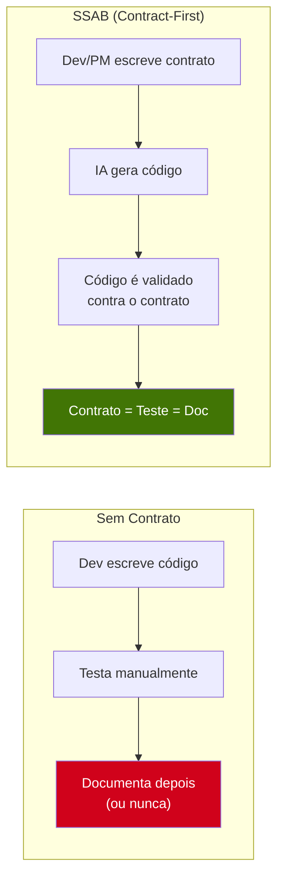
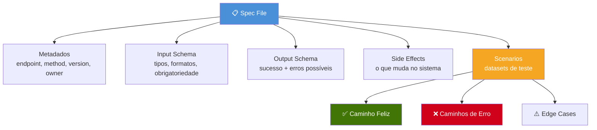
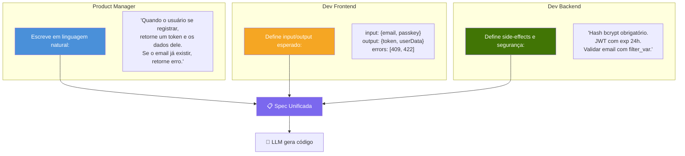
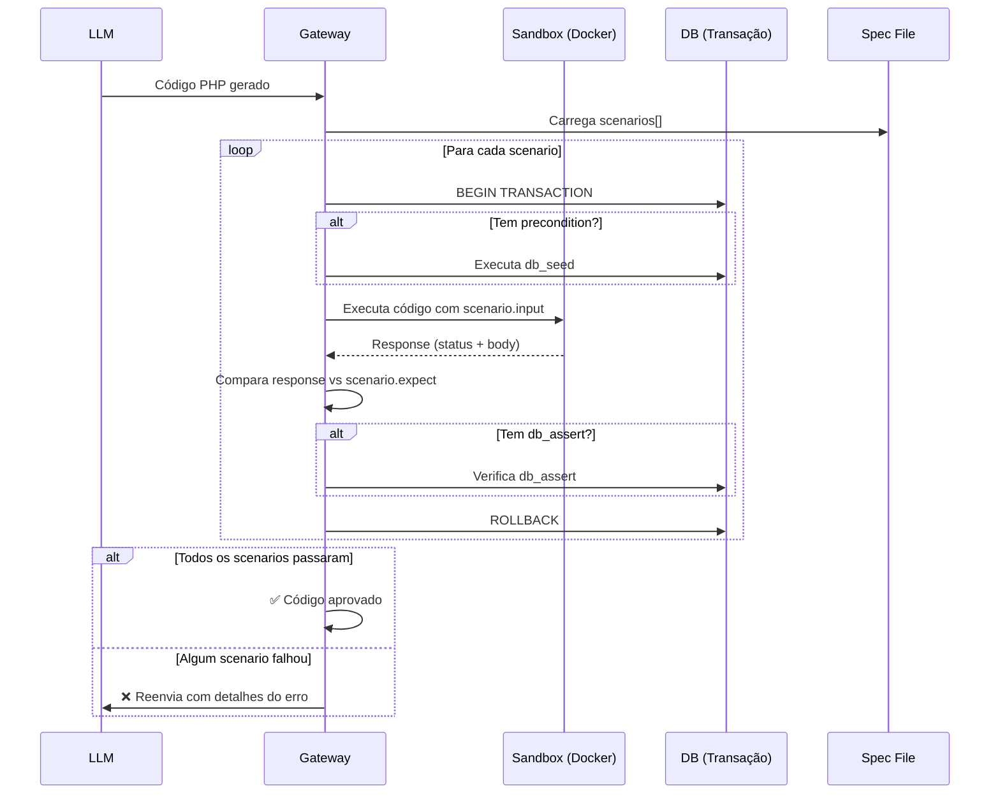
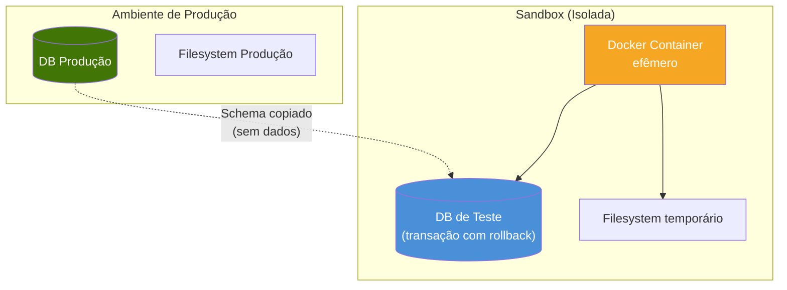
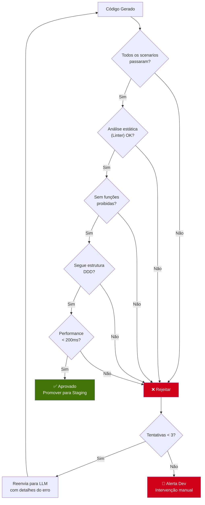

# 4. Contratos e Validação

## 4.1 Filosofia: Contract-First

No SSAB, **nenhum código é gerado sem um contrato prévio**. O contrato (Spec) é a única fonte de verdade sobre o que um endpoint deve fazer. Ele substitui a documentação tradicional: o teste **é** a documentação.



---

## 4.2 Estrutura de uma Spec

Cada endpoint tem um arquivo de especificação em JSON (ou YAML) na pasta `specs/`.

### Exemplo Completo: `specs/post_user.json`

```json
{
  "endpoint": "/user",
  "method": "POST",
  "version": "1.0",
  "description": "Criação de novo usuário no sistema",
  "owner": "time-produto",

  "input": {
    "content_type": "application/json",
    "schema": {
      "email": { "type": "string", "format": "email", "required": true },
      "passkey": { "type": "string", "min_length": 8, "required": true },
      "name": { "type": "string", "required": false }
    }
  },

  "output": {
    "success": {
      "status": 201,
      "schema": {
        "token": { "type": "string", "format": "jwt" },
        "userData": {
          "type": "object",
          "properties": {
            "id": { "type": "string", "format": "uuid" },
            "email": { "type": "string" },
            "created_at": { "type": "string", "format": "datetime" }
          }
        }
      }
    },
    "errors": [
      { "condition": "Email já existe", "status": 409, "body": { "error": "USER_ALREADY_EXISTS" } },
      { "condition": "Email inválido", "status": 422, "body": { "error": "INVALID_EMAIL" } },
      { "condition": "Senha muito curta", "status": 422, "body": { "error": "WEAK_PASSKEY" } }
    ]
  },

  "side_effects": [
    "Criar registro na tabela 'users'",
    "Hash do passkey usando bcrypt antes de salvar",
    "Gerar JWT token com expiração de 24h"
  ],

  "scenarios": [
    {
      "name": "Caminho Feliz - Criar Usuário",
      "input": { "email": "jon@doe.com", "passkey": "securePass123" },
      "expect": {
        "status": 201,
        "body_contains": ["token", "userData"],
        "body_match": {
          "userData.email": "jon@doe.com"
        }
      },
      "db_assert": {
        "table": "users",
        "where": { "email": "jon@doe.com" },
        "exists": true
      }
    },
    {
      "name": "Erro - Email Duplicado",
      "precondition": {
        "db_seed": { "table": "users", "data": { "email": "existing@email.com", "password_hash": "xxx" } }
      },
      "input": { "email": "existing@email.com", "passkey": "securePass123" },
      "expect": {
        "status": 409,
        "body_match": { "error": "USER_ALREADY_EXISTS" }
      }
    },
    {
      "name": "Erro - Email Inválido",
      "input": { "email": "not-an-email", "passkey": "securePass123" },
      "expect": {
        "status": 422,
        "body_match": { "error": "INVALID_EMAIL" }
      }
    },
    {
      "name": "Erro - Senha Curta",
      "input": { "email": "new@email.com", "passkey": "123" },
      "expect": {
        "status": 422,
        "body_match": { "error": "WEAK_PASSKEY" }
      }
    }
  ]
}
```

### Anatomia da Spec



---

## 4.3 Quem Escreve os Contratos?

O SSAB democratiza a definição de funcionalidades. Diferentes perfis contribuem de formas diferentes:



| Quem | O que define | Exemplo |
|------|-------------|---------|
| **PM** | Regra de negócio em linguagem natural | "Se for primeira compra, desconto de 20%" |
| **Dev Frontend** | Schema de input/output (o contrato da API) | `{email: string, passkey: string}` → `{token: string}` |
| **Dev Backend** | Side-effects, constraints de segurança | "Bcrypt com cost 12, JWT RS256" |

---

## 4.4 O Processo de Validação (Sandbox)

Quando a LLM gera código, ele **não vai direto para produção**. Ele passa por uma sandbox isolada que o executa contra todos os cenários da Spec.



### Isolamento da Sandbox



**Garantias da Sandbox:**
- O código gerado **nunca** toca dados reais durante validação
- Cada cenário roda em uma transação com `ROLLBACK` automático
- O container é destruído após a validação
- Funções perigosas (`eval`, `exec`, `system`) são bloqueadas no nível do PHP (via `disable_functions`)

---

## 4.5 Critérios de Aprovação

O código gerado pela LLM precisa passar em **todos** os critérios abaixo para ser promovido:



| # | Critério | Verificação | Automático? |
|---|----------|-------------|-------------|
| 1 | **Conformidade funcional** | Output do código = expect da Spec | Sim |
| 2 | **Side-effects corretos** | db_assert verifica mudanças no banco | Sim |
| 3 | **Análise estática** | PHPStan / Psalm level 5+ | Sim |
| 4 | **Segurança** | Nenhuma função proibida, SQL parametrizado | Sim |
| 5 | **Estrutura DDD** | Verifica existência de Controller/Service/Repository | Sim |
| 6 | **Performance** | Execução do cenário < 200ms | Sim |
| 7 | **Code Review humano** | Dev aprova o PR | Não |

---

## 4.6 Versionamento de Specs

As Specs evoluem junto com o produto. Quando a regra de negócio muda, o Dev/PM atualiza a Spec, e o sistema detecta a mudança:

```mermaid
stateDiagram-v2
    [*] --> V1: PM cria spec v1
    V1 --> Hot: IA gera + valida + PR aprovado
    Hot --> V2: PM atualiza regra de negócio
    V2 --> Cold: Spec hash mudou → invalida código
    Cold --> Hot: IA regenera com nova spec

    note right of V2: Exemplo: desconto muda de 10% para 15%
```

**Fluxo de atualização:**

1. PM edita `specs/post_order.json` — muda regra de desconto
2. O hash da Spec muda no Redis
3. Na próxima request, o Gateway detecta o mismatch
4. O código existente é **invalidado**
5. A LLM regenera com a nova Spec
6. Novo ciclo de validação + PR

> Isso garante que o código **sempre** reflete a regra de negócio mais recente, sem intervenção manual do Dev Backend.
