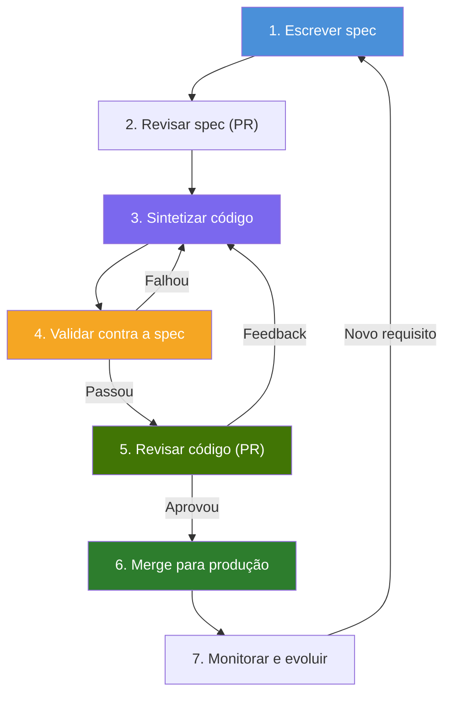
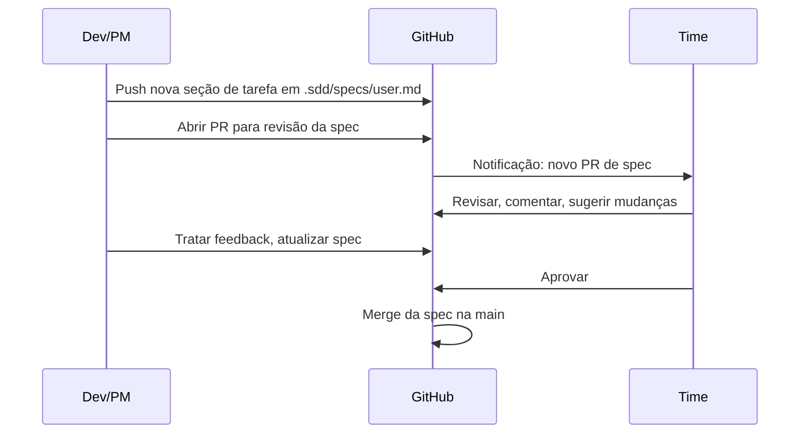
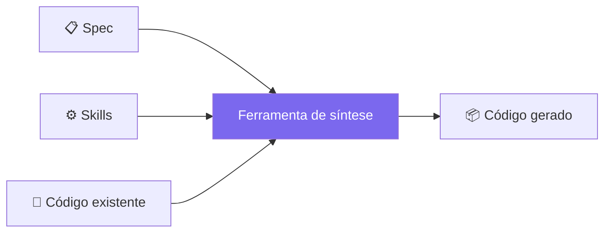
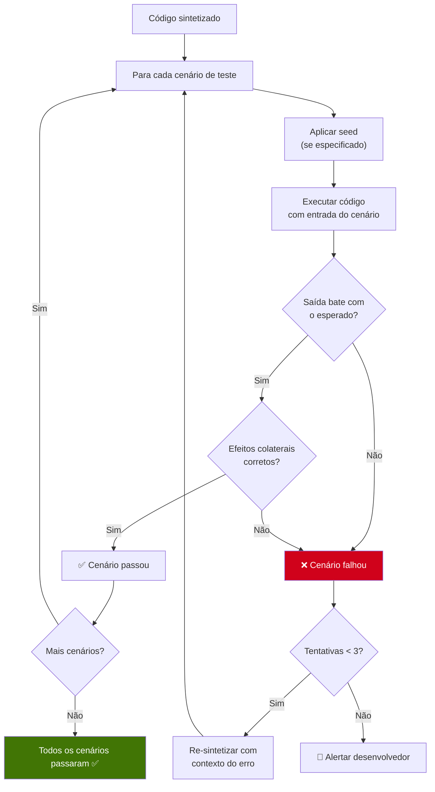
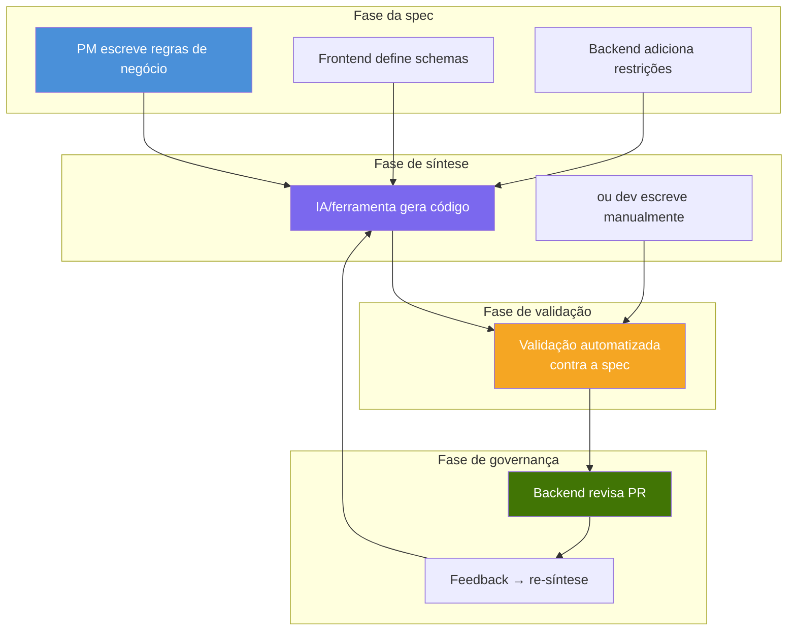
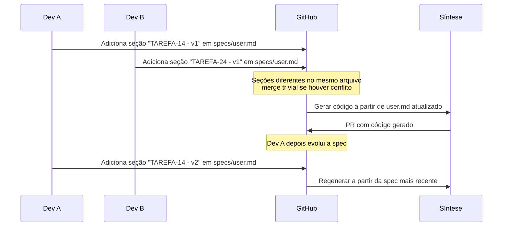

# 4. Fluxo de trabalho

## 4.1 Ciclo de desenvolvimento SDD



---

## 4.2 Passo a passo

### Passo 1 — Escrever a spec

**Quem:** PM, dev frontend, dev backend ou qualquer pessoa do time.

**O quê:** Adicionar uma nova seção de tarefa no arquivo de spec do domínio em `.sdd/specs/<domínio>.md` definindo:
- O que o endpoint deve fazer
- O que recebe e o que devolve
- Quais erros são possíveis
- Quais cenários de teste validar

**Como:** Abrir o editor (ou o editor do GitHub no navegador), escrever a spec, commitar e dar push.

### Passo 2 — Revisar a spec

**Quem:** O time (via Pull Request).

**O quê:** A spec é revisada como qualquer mudança de código. O time verifica:
- As regras de negócio estão corretas?
- Casos extremos estão cobertos?
- O schema de entrada/saída é o que o frontend espera?
- Requisitos de segurança estão especificados?



### Passo 3 — Sintetizar código

**Quem:** Ferramenta de IA (Cursor, pipeline de CI/CD ou motor próprio) ou desenvolvedor humano.

**O quê:** Código é gerado seguindo:
- A spec (o que construir)
- As skills (como construir)
- O código existente (contexto)



**Com Cursor:** O dev abre o Cursor, referencia a spec e pede para gerar o código. O Cursor segue as regras do projeto (que espelham as skills do SDD).

**Com CI/CD:** Uma GitHub Action detecta a nova spec, chama um LLM com spec + skills como contexto e gera o código automaticamente.

**Manualmente:** O dev lê a spec e escreve o código à mão, seguindo as skills.

### Passo 4 — Validar contra a spec

**Quem:** Pipeline automatizado ou testes manuais.

**O quê:** O código sintetizado é executado contra os cenários de teste da spec:



### Passo 5 — Revisar código

**Quem:** Dev backend ou tech lead.

**O quê:** O código sintetizado é revisado em PR, como código escrito por humano:
- Segue as skills/arquitetura?
- A lógica está correta?
- Há riscos de segurança?
- O código é legível e sustentável?

Se o revisor deixa feedback, o código é re-sintetizado com esse feedback como contexto adicional.

### Passo 6 — Merge para produção

**Quem:** Revisor aprova, CI/CD faz deploy.

**O quê:** Merge e deploy padrão. O código está em produção, indistinguível de código escrito manualmente.

### Passo 7 — Monitorar e evoluir

**Quem:** Time.

**O quê:**
- Se aparece bug em produção, o cenário que falhou entra na spec
- Se surge novo requisito, cria-se nova spec (ou atualização)
- Se a mesma correção de review se repete em vários PRs, cria-se uma nova skill

---

## 4.3 Papéis e responsabilidades



---

## 4.4 Concorrência — Várias Specs ao Mesmo Tempo

Quando vários devs adicionam tarefas à mesma spec de domínio, cada um adiciona uma **seção separada** no mesmo arquivo. Se dois devs editam seções diferentes, o conflito de merge é trivial — assim como editar funções diferentes no mesmo arquivo de código:



Cada tarefa é uma seção (`## TAREFA-14 - v1`), não um arquivo separado. O arquivo de spec cresce naturalmente com o domínio, preservando histórico completo e contexto compartilhado (ex: regras de auth do domínio no topo).

---

## 4.5 Estrutura do projeto

```
my-project/
├── cmd/                        ← entrada do app (gerido por humanos)
├── internal/                   ← código da app (sintetizado + humano)
│   ├── user/
│   │   ├── handler.go
│   │   ├── service.go
│   │   ├── repository.go
│   │   └── entity.go
│   └── order/
│       ├── handler.go
│       ├── service.go
│       └── ...
├── .sdd/                       ← configuração SDD
│   ├── specs/                  ← specs (fonte da verdade)
│   │   ├── user.md             ← todos os endpoints e tarefas de /user
│   │   └── order.md            ← todos os endpoints e tarefas de /order
│   ├── skills/                 ← regras arquiteturais
│   │   ├── go-ddd.md
│   │   ├── security.md
│   │   └── error-handling.md
│   └── config.yaml             ← configuração do projeto
├── tests/                      ← testes (gerados a partir dos cenários da spec)
├── go.mod
└── .github/
    └── workflows/              ← CI/CD (automação opcional)
```

### O que o SDD pode alterar vs o que não pode

| Caminho | SDD pode modificar? | Motivo |
|---------|---------------------|--------|
| `internal/` | Sim | Código sintetizado mora aqui |
| `tests/` | Sim | Testes gerados a partir dos cenários da spec |
| `.sdd/specs/` | Nunca | Entrada humana, fonte da verdade |
| `.sdd/skills/` | Só sugestão | Pode propor novas skills via PR |
| `.sdd/config.yaml` | Nunca | Configuração do projeto |
| `cmd/` | Nunca | Entrada do app, gerida por humanos |
| `.github/` | Nunca | Definições de pipeline, geridas por humanos |
