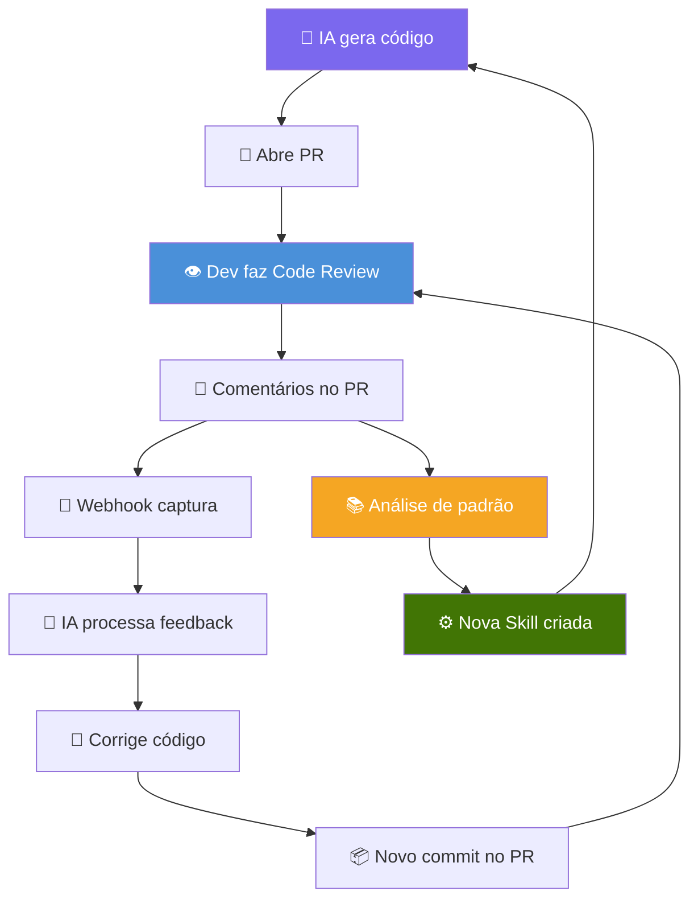
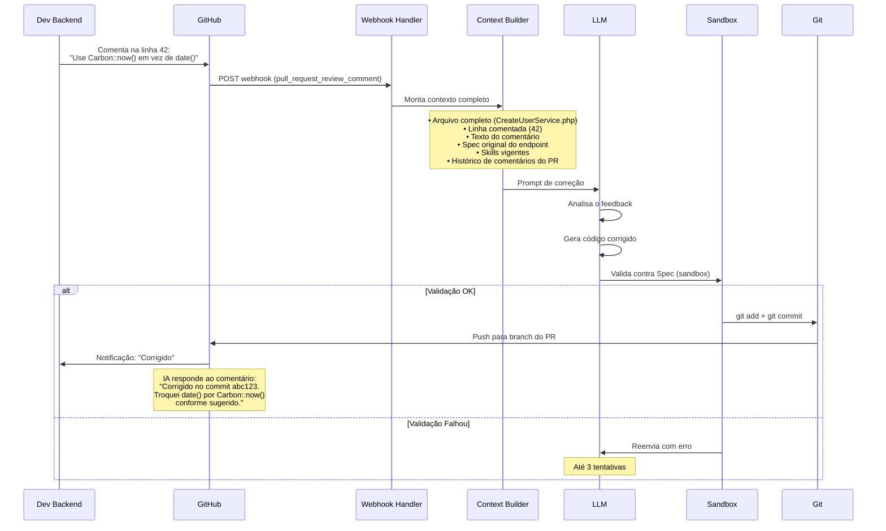
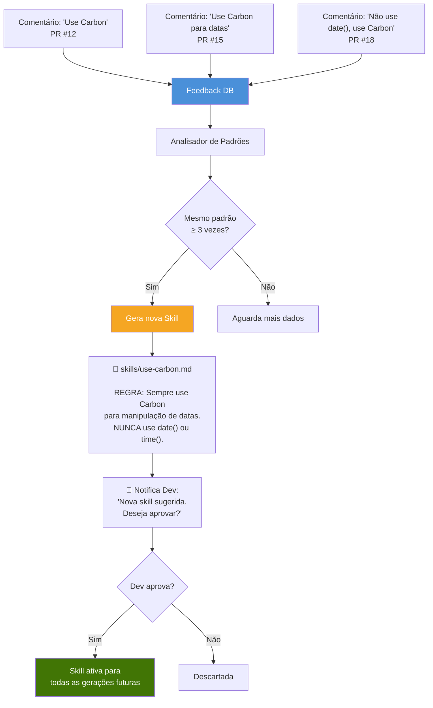
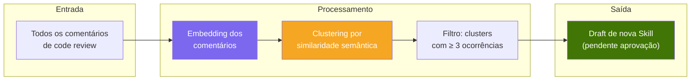
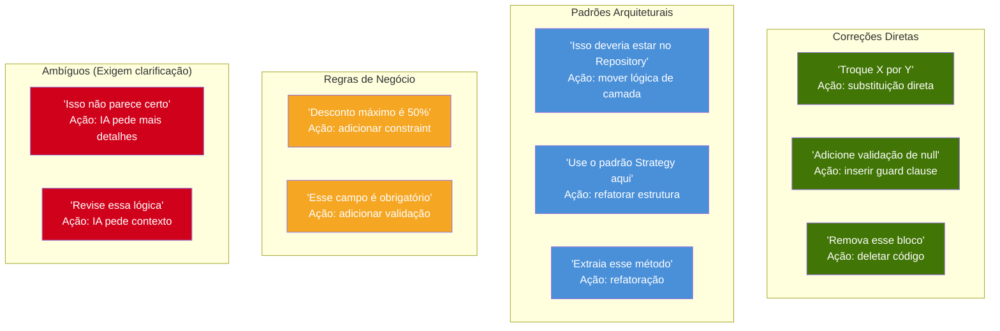
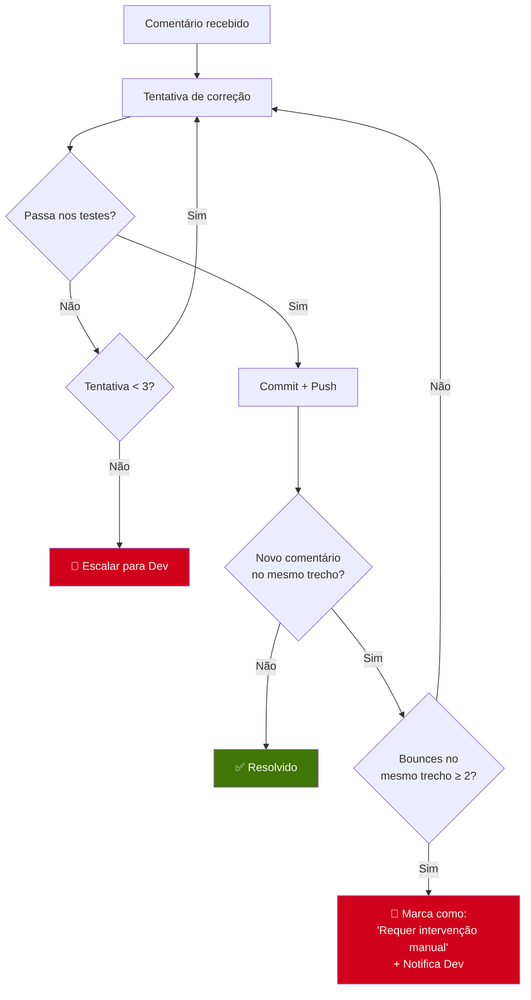
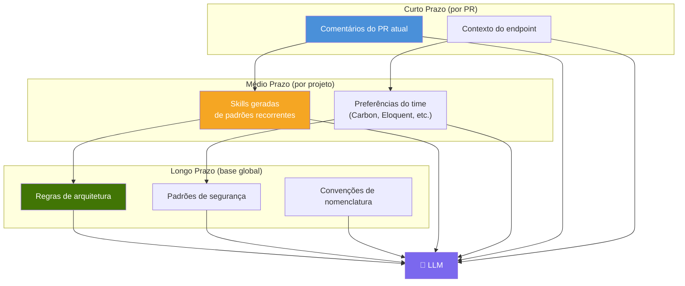
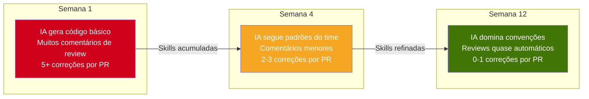

# 5. Feedback Loop — O Ciclo de Aprendizado

## 5.1 Visão Geral

O Feedback Loop é o mecanismo que transforma o SSAB de um simples gerador de código em um **sistema que evolui**. Comentários de code review feitos por humanos retroalimentam a LLM, que corrige o código automaticamente e — mais importante — **aprende padrões recorrentes** para não repetir os mesmos erros.



---

## 5.2 O Ciclo de Correção (Short Loop)

O ciclo curto acontece **dentro de um único PR**. O Dev comenta, a IA corrige, o Dev re-avalia.



### Estrutura do Prompt de Correção

A IA recebe um prompt estruturado para processar cada comentário:

```
## Contexto de Correção

### Arquivo
CreateUserService.php (linha 42)

### Comentário do Reviewer
"Use Carbon::now() em vez de date(). Padrão do projeto é sempre usar Carbon."

### Código Atual (trecho)
```php
$user->created_at = date('Y-m-d H:i:s');
```

### Spec Original
(spec completa do endpoint)

### Skills Vigentes
(lista de skills/rules)

### Instrução
Corrija o código conforme o feedback do reviewer.
Mantenha a estrutura DDD. Rode os testes da Spec.
Se a correção exigir uma nova dependência, declare-a.
```

---

## 5.3 O Ciclo de Aprendizado (Long Loop)

O ciclo longo analisa **padrões recorrentes** nos comentários de code review. Quando um tipo de correção se repete, o sistema cria automaticamente uma nova Skill para prevenir o erro no futuro.



### Como o Analisador de Padrões Funciona



O sistema usa **embeddings** dos comentários para agrupar feedbacks semanticamente similares. Não importa se o Dev escreveu "use Carbon", "não use date()" ou "datas devem usar Carbon" — o clustering agrupa todos como o mesmo padrão.

---

## 5.4 Tipos de Feedback Processáveis



| Tipo | Ação da IA | Confiança |
|------|-----------|-----------|
| **Substituição direta** | Troca automática + re-teste | Alta |
| **Adição de validação** | Insere guard clause + novo cenário de teste | Alta |
| **Mudança de camada** | Refatora seguindo DDD + re-teste | Média |
| **Refatoração de padrão** | Reescreve usando o padrão sugerido | Média |
| **Constraint de negócio** | Adiciona regra + atualiza Spec | Média |
| **Ambíguo** | Responde no PR pedindo clarificação | N/A |

---

## 5.5 Proteção Contra Loop Infinito

Um risco real é a IA entrar em **loop de correções**: o Dev comenta, a IA corrige de um jeito que gera outro problema, o Dev comenta novamente...



**Regras de proteção:**

| Regra | Limite | Ação |
|-------|--------|------|
| Tentativas de correção por comentário | 3 | Escala para Dev |
| Bounces no mesmo trecho de código | 2 | Marca como manual |
| Commits automáticos por PR | 10 | Congela PR + alerta |
| Tempo total de correção por PR | 1 hora | Congela PR + alerta |

---

## 5.6 Memória Persistente

O Feedback Loop alimenta uma **base de conhecimento persistente** que melhora a qualidade do código gerado ao longo do tempo.



### Evolução da Qualidade ao Longo do Tempo



> Com o tempo, a IA se torna um reflexo das preferências e padrões do time. Cada comentário de code review é uma micro-lição que melhora todas as gerações futuras.
