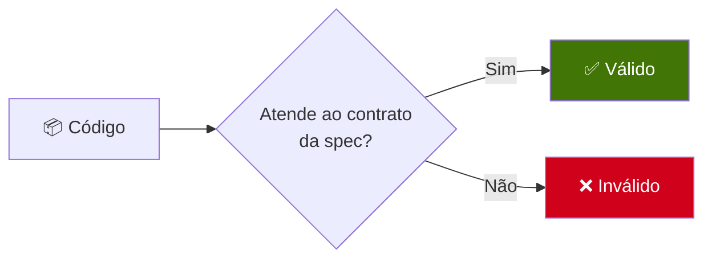
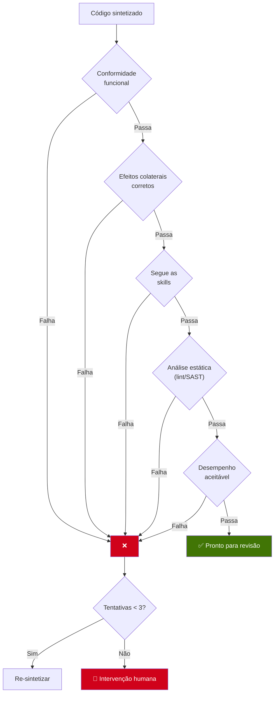
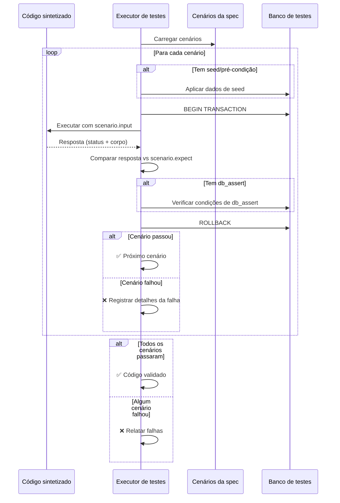
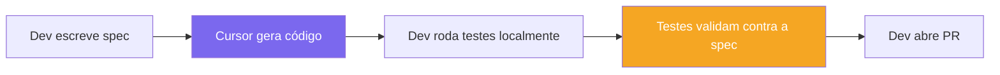
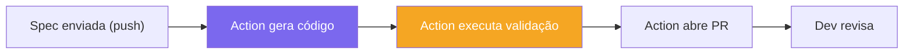
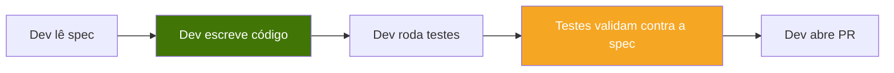
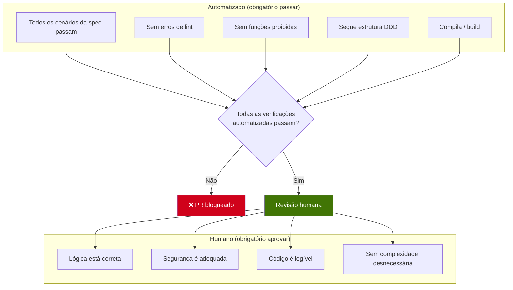
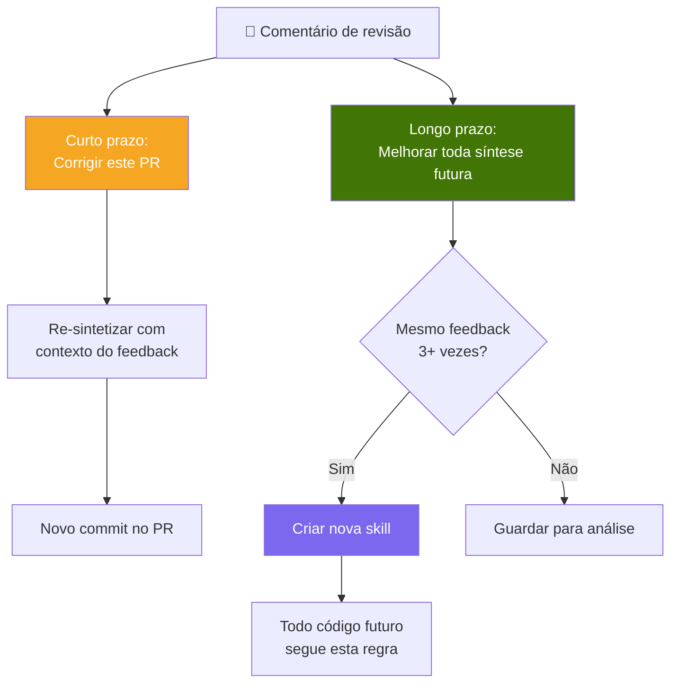

# 5. Validação

## 5.1 O contrato

No SDD, a spec é um **contrato**. O código não está "pronto" quando compila — está pronto quando **passa em todos os cenários de teste definidos na spec**.

Essa é a diferença fundamental em relação ao desenvolvimento tradicional: os critérios de aceite são **formalizados e executáveis**, não implícitos ou verbais.

---

## 5.2 O que é validado

| # | Verificação | Método | Automatizado? |
|---|-------------|--------|---------------|
| 1 | **Conformidade funcional** | Executar o código com o input da spec, comparar a saída | Sim |
| 2 | **Efeitos colaterais** | Verificar se mudanças em banco/estado batem com a spec | Sim |
| 3 | **Conformidade com skills** | Verificar se o código segue regras arquiteturais | Sim (lint + checagem de estrutura) |
| 4 | **Análise estática** | Rodar linter, SAST, type checker | Sim |
| 5 | **Desempenho** | Tempo de execução dentro do intervalo aceitável | Sim |
| 6 | **Revisão humana** | Desenvolvedor revisa qualidade do código, lógica, segurança | Não |

---

## 5.3 Processo de validação

### Garantias principais

- **Isolamento**: Cada cenário roda em uma transação de banco que é revertida depois. Os testes nunca se contaminam.
- **Dados de seed**: Cenários podem definir pré-condições (por exemplo, "já existe um usuário com este e-mail") configuradas antes da execução.
- **Asserções de DB**: Além de checar a resposta, a validação pode verificar se as mudanças corretas foram feitas no banco.
- **Determinístico**: Mesma spec + mesmo código = mesmo resultado, sempre.

---

## 5.4 Validação em contextos diferentes

### Com Cursor (desenvolvimento local)

O desenvolvedor sintetiza o código localmente com o Cursor e, em seguida, roda a validação:

### Com CI/CD (pipeline automatizado)

Um GitHub Action gera código e valida automaticamente:

### Desenvolvimento manual

Um desenvolvedor escreve o código à mão e valida contra a spec:

Nos três casos, o **passo de validação é o mesmo**: executar os cenários de teste da spec contra o código. O método de síntese não importa — o que importa é o código estar em conformidade com o contrato.

---

## 5.5 Critérios de aprovação

Para o código sair de "sintetizado" para "pronto para produção", ele precisa passar em:

---

## 5.6 O ciclo de feedback

Quando um revisor humano dá feedback, isso gera valor em dois níveis:

Ou seja, cada comentário de code review tem **valor permanente**. Não corrige só um PR — pode evitar o mesmo erro em toda síntese futura.
