# 6. Análise Comparativa

## 6.1 SSAB vs Backend Tradicional

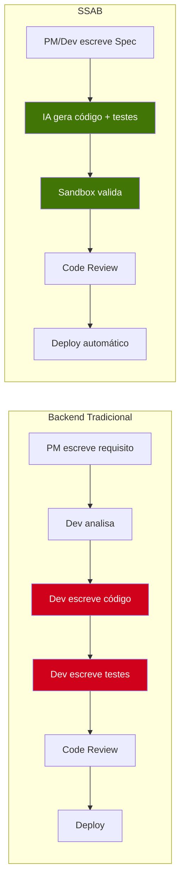

| Aspecto | Backend Tradicional | SSAB |
|---------|-------------------|------|
| **Quem escreve código** | Dev Backend | LLM |
| **Quem escreve testes** | Dev Backend | LLM (com base na Spec) |
| **Quem define regras** | Dev + PM (reuniões) | PM/Dev via Spec file |
| **Tempo para 1 CRUD** | 1-5 dias | 2-26 horas |
| **Latência em produção** | ~15ms | ~15ms (após promoção) |
| **Determinismo** | 100% | 100% (após promoção) |
| **Documentação** | Frequentemente desatualizada | Spec = teste = doc (sempre atual) |
| **Escalabilidade do time** | Linear (mais devs = mais código) | Exponencial (IA atende todos os endpoints) |

---

## 6.2 SSAB vs IA-Wrappers

Muitos sistemas usam LLMs como "motor de execução" em cada request. O SSAB se diferencia radicalmente:

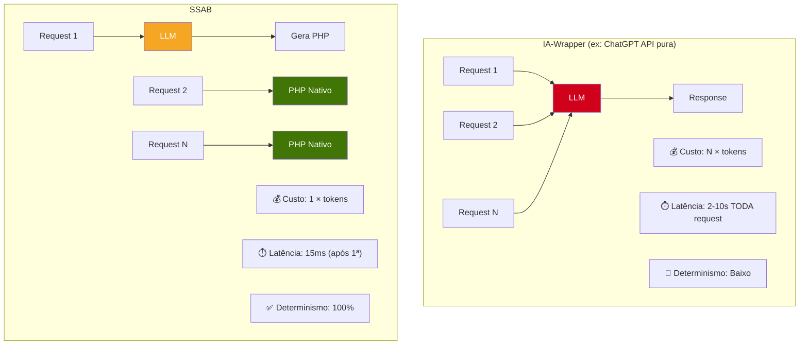

| Métrica | IA-Wrapper | SSAB |
|---------|-----------|------|
| **Custo por request** | $0.01-0.10 (tokens) | $0.00 (após promoção) |
| **Custo total (1M requests)** | $10.000-100.000 | ~$5-50 (apenas 1ª geração) |
| **Latência** | 2-10s (toda request) | 15ms (após promoção) |
| **Disponibilidade** | Depende da API da LLM | Independente (PHP nativo) |
| **Determinismo** | Probabilístico | Determinístico (código estático) |
| **Vendor Lock-in** | Total | Apenas na fase de geração |

---

## 6.3 Pontos Positivos (Vantagens)

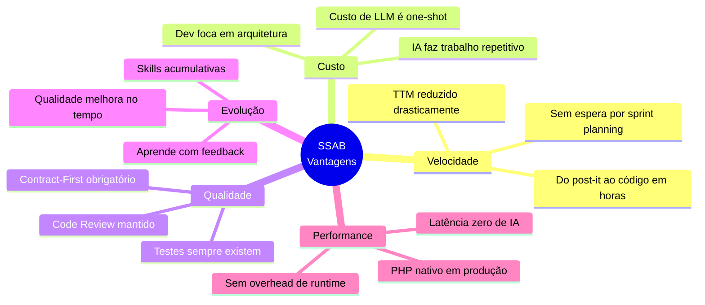

### Detalhamento

#### 1. Velocidade de Entrega (Time-to-Market)

```mermaid
gantt
    title Comparação: CRUD de Usuário
    dateFormat HH:mm
    axisFormat %H:%M

    section Tradicional
    PM define requisito        :t1, 00:00, 2h
    Dev analisa e planeja      :t2, after t1, 2h
    Dev escreve código         :t3, after t2, 4h
    Dev escreve testes         :t4, after t3, 2h
    Code Review                :t5, after t4, 3h
    Correções pós-review       :t6, after t5, 2h
    Deploy                     :t7, after t6, 1h

    section SSAB
    PM/Dev escreve Spec        :s1, 00:00, 1h
    IA gera código + testes    :s2, after s1, 15min
    Sandbox valida             :s3, after s2, 5min
    Rollout 10%                :s4, after s3, 2h
    Code Review                :s5, after s4, 2h
    Merge + 100%               :s6, after s5, 30min
```

- **Tradicional:** ~16 horas de trabalho humano
- **SSAB:** ~5,5 horas (sendo ~5h de espera, não de trabalho ativo)

#### 2. Redução de Trabalho Repetitivo

O Dev Backend deixa de escrever o 100º CRUD e passa a focar em:
- Arquitetura e design de sistema
- Segurança e performance
- Skills e regras para a IA
- Code Review (curadoria)

#### 3. Documentação Executável

No SSAB, a documentação **nunca** fica desatualizada porque o teste **é** a documentação. Se a Spec muda, o código é regenerado para refletir a mudança.

#### 4. Evolução Orgânica

Cada comentário de code review torna a IA melhor. Na semana 1, a IA gera código medíocre. Na semana 12, ela gera código que reflete todas as preferências e padrões do time.

#### 5. Performance Final

Ao contrário de soluções que mantêm a LLM no fluxo de execução, o SSAB resulta em **PHP nativo puro** em produção. A performance final é idêntica à de código escrito manualmente.

---

## 6.4 Pontos Negativos (Riscos e Desafios)

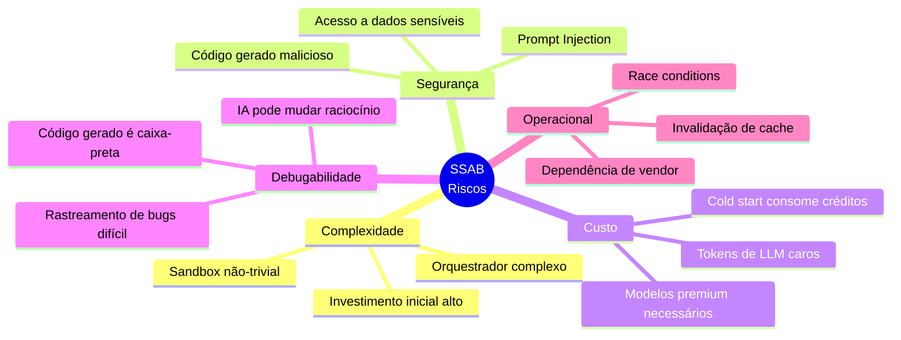

### Detalhamento

#### 1. Complexidade Inicial

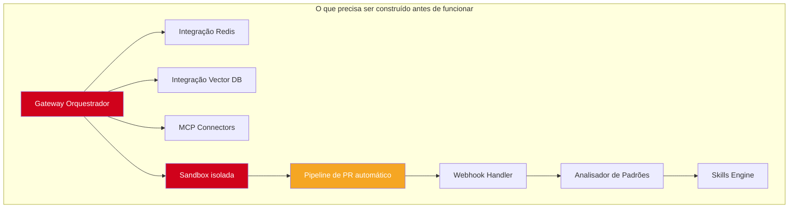

**Estimativa de esforço para montar a plataforma:** 4-8 semanas de um engenheiro sênior.

#### 2. Segurança (Prompt Injection)

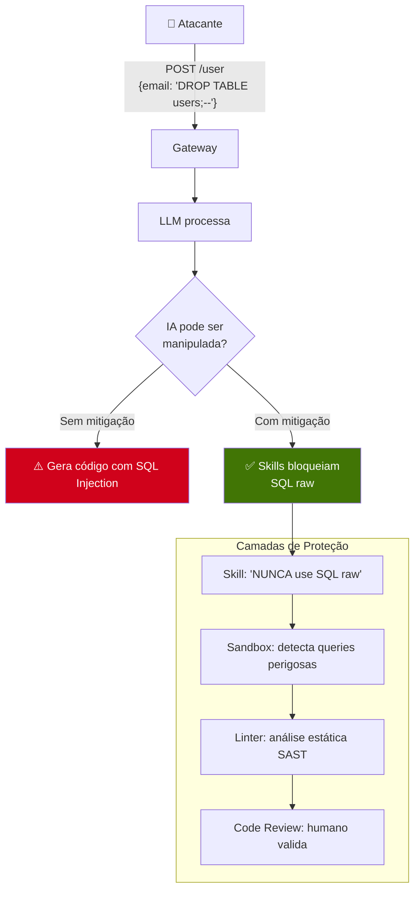

**Mitigações:**
- Skills proíbem funções perigosas (`eval`, `exec`, SQL concatenado)
- Sandbox executa em container isolado com permissões mínimas
- Análise estática (PHPStan/Psalm) antes de qualquer promoção
- Code Review humano obrigatório antes do merge

#### 3. Custo de API

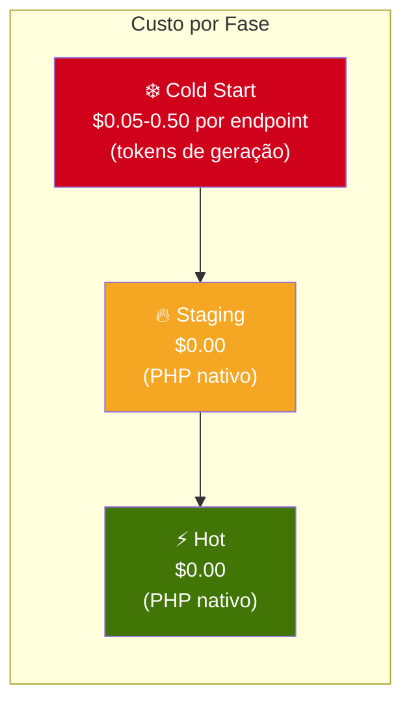

| Cenário | Custo estimado por endpoint | Total (100 endpoints) |
|---------|---------------------------|----------------------|
| Geração simples (CRUD) | $0.05-0.10 | $5-10 |
| Geração complexa (regras) | $0.20-0.50 | $20-50 |
| Correções via feedback (média 3) | $0.15-0.30 | $15-30 |
| **Total estimado** | | **$40-90** |

> Comparação: o salário de 1 mês de um Dev Backend Pleno cobre o custo de geração de **milhares** de endpoints.

#### 4. Debugabilidade

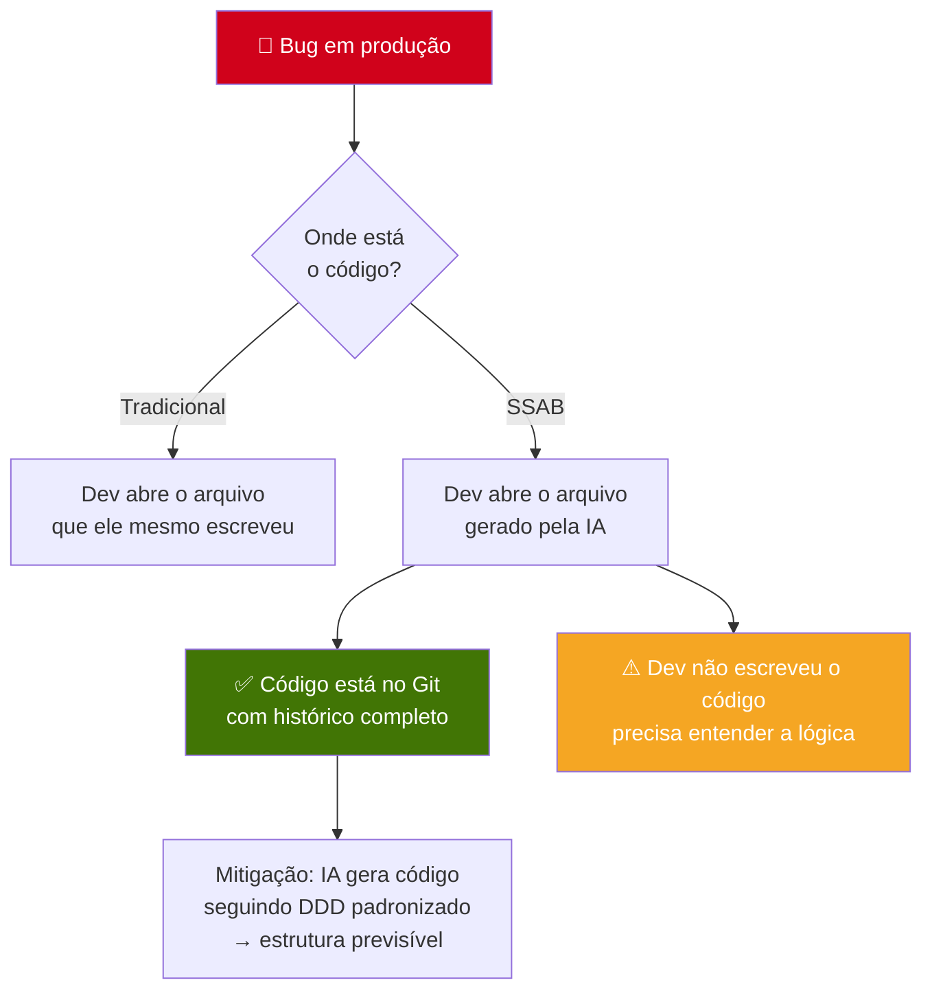

#### 5. Race Conditions

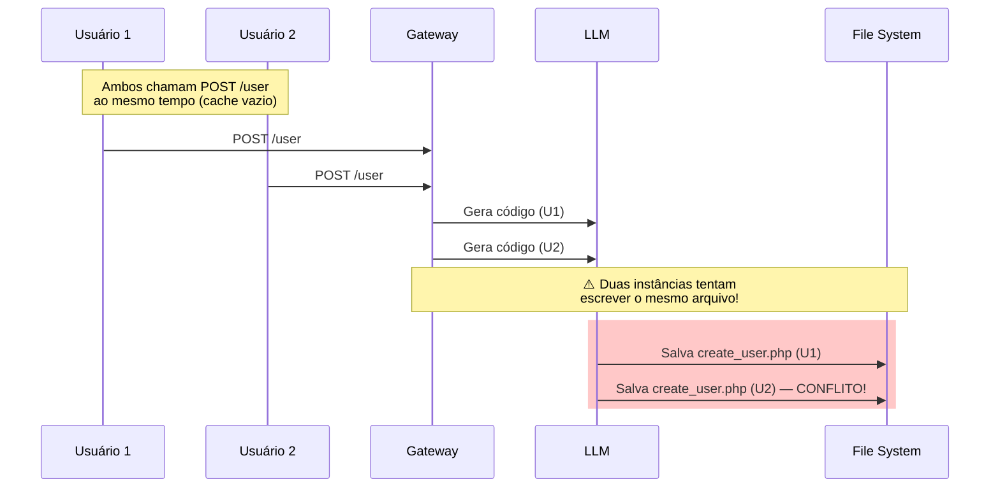

**Mitigação: Mutex no Redis**

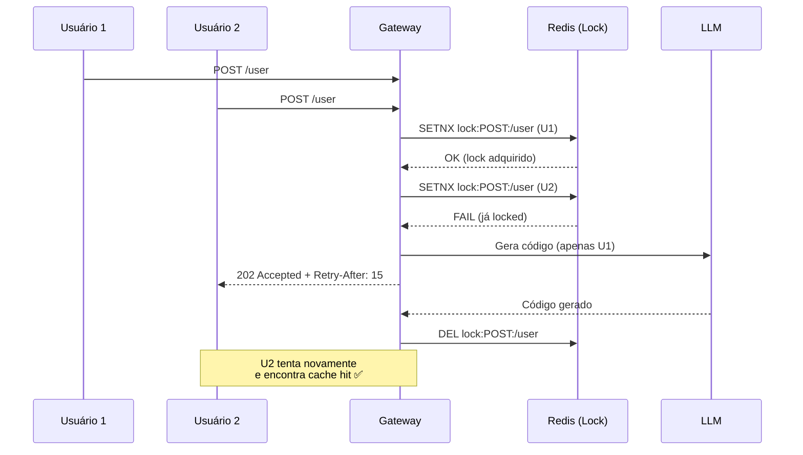

---

## 6.5 Matriz de Decisão: Quando Usar?

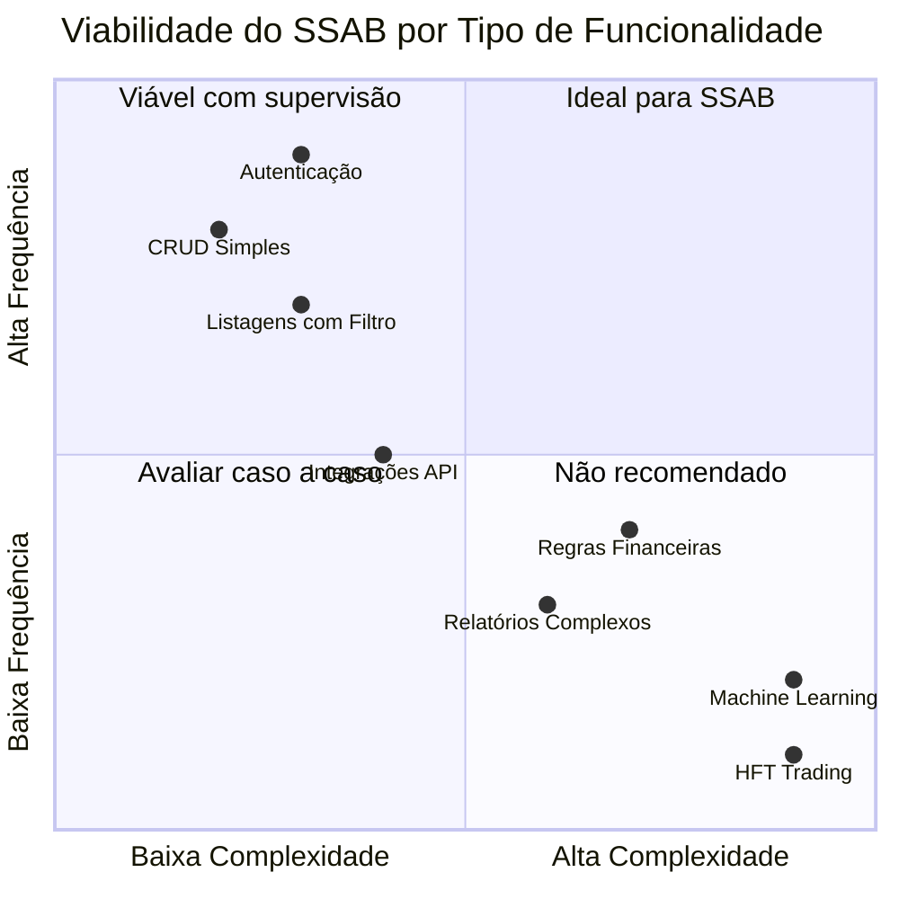

| Cenário | Viabilidade | Justificativa |
|---------|-------------|---------------|
| **CRUDs Simples** | 🟢 Alta | A IA domina padrões de persistência e validação |
| **Autenticação (JWT, OAuth)** | 🟢 Alta | Padrão bem documentado, Skills claras |
| **Listagens com filtro/paginação** | 🟢 Alta | Padrão repetitivo ideal para IA |
| **Integrações de API Externas** | 🟢 Alta | MCP facilita leitura de docs externas |
| **Regras Financeiras Críticas** | 🟡 Média | Exige 100% cobertura de testes + revisão rigorosa |
| **Relatórios Complexos** | 🟡 Média | Queries complexas exigem otimização manual |
| **Machine Learning Pipelines** | 🔴 Baixa | Lógica muito específica, difícil de especificar via Spec |
| **Lógica de Alta Performance (HFT)** | 🔴 Baixa | IA pode gerar código ineficiente |

---

## 6.6 Resumo Visual

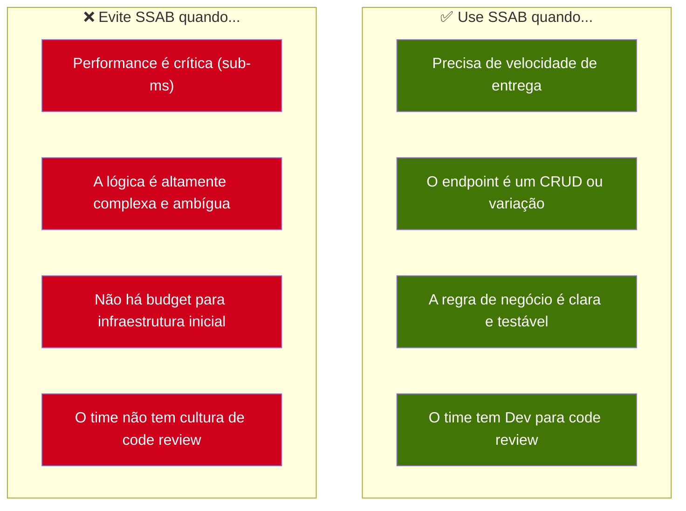
