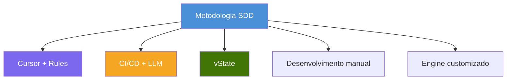
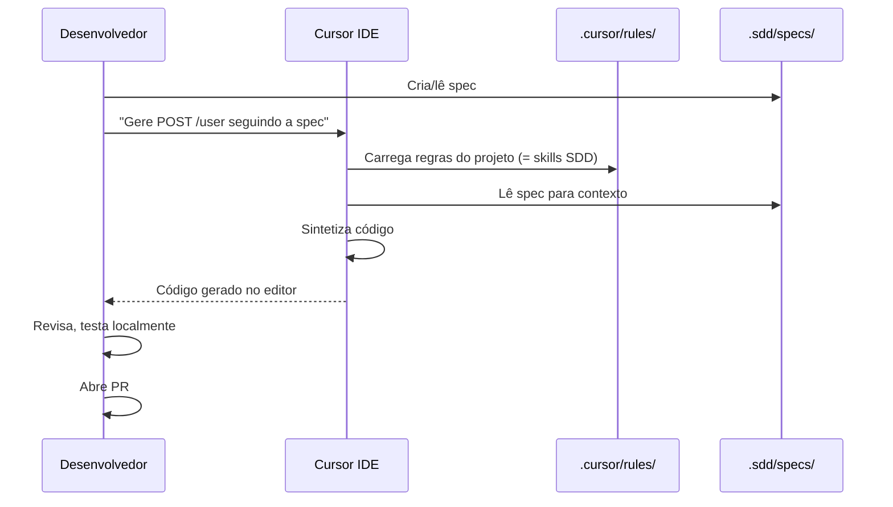
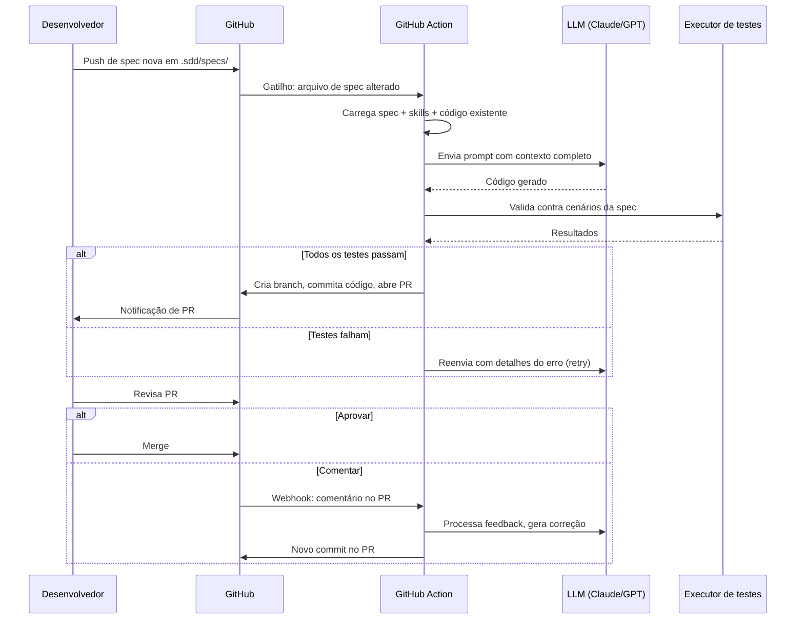
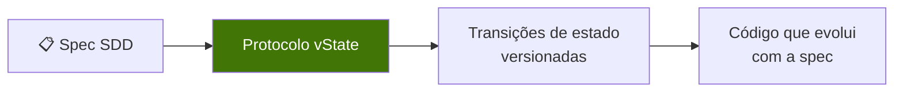
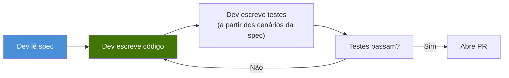
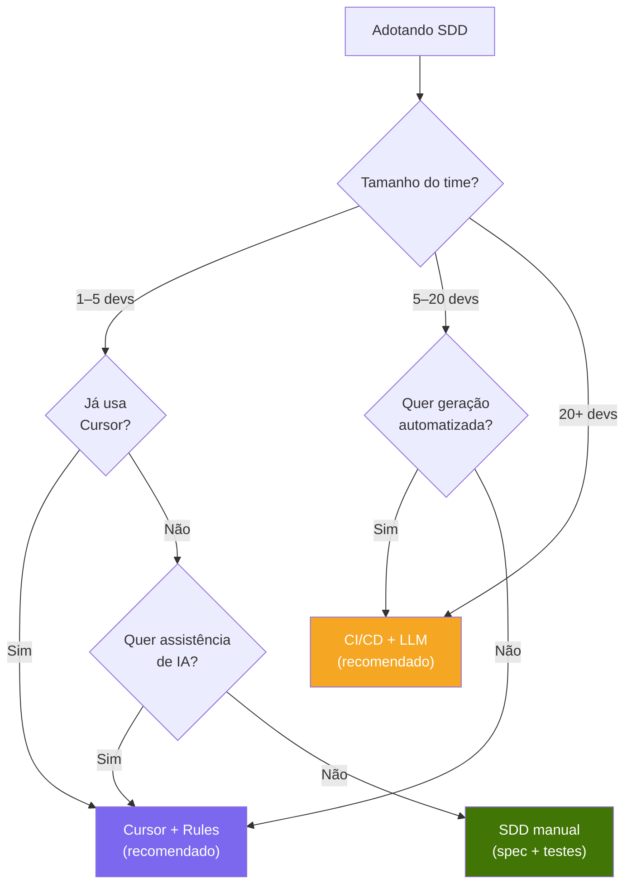

# 6. Implementações

O SDD é uma metodologia, não uma ferramenta. Pode ser implementado com ferramentas diferentes conforme o tamanho do time, as necessidades e a infraestrutura existente.



---

## 6.1 Cursor + Rules (recomendado para a maioria dos times)

A implementação mais simples e prática. As skills do SDD viram regras do Cursor, e o desenvolvedor usa o Cursor para sintetizar código com a spec como contexto.



### Configuração

1. Escreva suas skills SDD em `.sdd/skills/`
2. Copie ou faça symlink para `.cursor/rules/`
3. Escreva specs em `.sdd/specs/`
4. Ao desenvolver, referencie a spec no chat do Cursor
5. O Cursor gera código seguindo as regras

### Quando usar

- Desenvolvedores solo ou times pequenos (2–10)
- Times que já usam Cursor
- Quando você quer os benefícios do SDD sem overhead de infraestrutura
- Começando com SDD pela primeira vez

### Prós e contras

| Prós | Contras |
|------|---------|
| Custo zero de infraestrutura | O dev precisa referenciar specs manualmente |
| Configuração imediata (minutos) | Sem pipeline de validação automatizado |
| O desenvolvedor mantém o controle | Sem geração automática de PR |
| Aproveita o que já existe | Depende especificamente do Cursor |

---

## 6.2 Pipeline CI/CD + LLM

Abordagem mais automatizada em que GitHub Actions (ou similar) detectam specs novas e disparam síntese de código via API de LLM.



### Configuração

1. Configure a chave da API do LLM nos GitHub Secrets
2. Crie workflows de GitHub Action:
   - `sdd-generate.yml` — dispara em mudanças na spec
   - `sdd-review.yml` — dispara em comentários no PR
   - `sdd-validate.yml` — roda em todo PR
3. Escreva specs e skills como de costume

### Exemplo de GitHub Action

```yaml
name: SDD Generate
on:
  push:
    paths:
      - '.sdd/specs/**'

jobs:
  generate:
    runs-on: ubuntu-latest
    steps:
      - uses: actions/checkout@v4

      - name: Detect changed specs
        id: specs
        run: |
          echo "files=$(git diff --name-only HEAD~1 -- .sdd/specs/)" >> $GITHUB_OUTPUT

      - name: Generate code from spec
        env:
          LLM_API_KEY: ${{ secrets.LLM_API_KEY }}
        run: |
          # Read spec + skills, call LLM, save generated code
          # Validate against spec scenarios
          # If valid, commit and create PR

      - name: Create PR
        env:
          GH_TOKEN: ${{ secrets.GITHUB_TOKEN }}
        run: |
          gh pr create --title "[SDD] Generated code for ${{ steps.specs.outputs.files }}" \
                       --body "Auto-generated from spec. Please review."
```

### Quando usar

- Times médios a grandes (10+)
- Quando você quer geração de código totalmente automatizada
- Quando PMs precisam disparar geração sem usar IDE
- Quando você quer validação automatizada no CI

### Prós e contras

| Prós | Contras |
|------|---------|
| Síntese totalmente automatizada | Exige configuração de infraestrutura |
| PMs podem disparar geração | Custos de API do LLM |
| Validação automatizada | Pipeline mais complexa de manter |
| Saída consistente | Depurar problemas no pipeline |

---

## 6.3 vState

[vState](https://vstate.dogether.com.br/) é um protocolo de estado versionado que aplica princípios de SDD à gestão de estado e à evolução do código.



O vState usa os conceitos centrais do SDD:
- Specs definem o estado esperado e as transições
- O código é gerado/evolui com base em specs versionadas
- A validação garante que o código bate com a spec em cada versão

### Quando usar

- Quando gestão de estado e versionamento são centrais na aplicação
- Quando você precisa de rastreamento formal de transições de estado
- Quando quer SDD além de apenas endpoints de API

---

## 6.4 Desenvolvimento manual (SDD sem IA)

O SDD funciona mesmo sem IA. Um desenvolvedor lê a spec e escreve código à mão. A spec ainda oferece:

- Requisitos claros (sem ambiguidade)
- Cenários de teste embutidos (sem testes faltando)
- Documentação viva (nunca desatualizada)



### Quando usar

- Times que ainda não estão prontos para ferramentas de IA
- Ambientes altamente regulados onde código gerado por IA não é permitido
- Lógica de negócio complexa em que a implementação manual é preferida
- Como passo intermediário antes de adotar SDD assistido por IA

---

## 6.5 Escolhendo uma implementação



| Implementação | Tempo de setup | Custo recorrente | Nível de automação | Melhor para |
|---------------|----------------|------------------|--------------------|-------------|
| **Cursor + Rules** | Minutos | Assinatura Cursor | Baixo (dirigido pelo dev) | Times pequenos, começando |
| **CI/CD + LLM** | Dias–semanas | Custos de API LLM | Alto (automatizado) | Times médio–grande, escala |
| **vState** | Horas | Varia | Médio | Apps com muito estado |
| **Manual** | Minutos | Nenhum | Nenhum | Regulado, lógica complexa |
