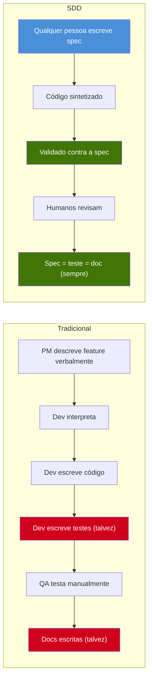
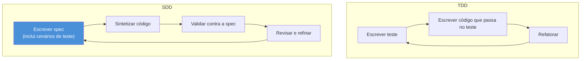
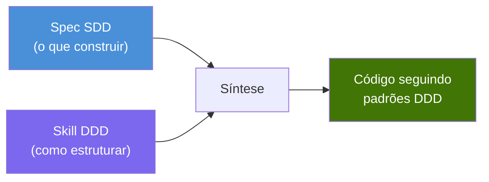
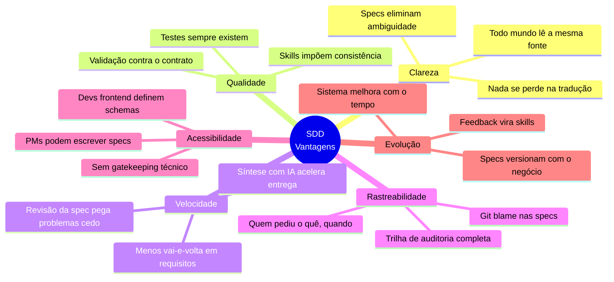
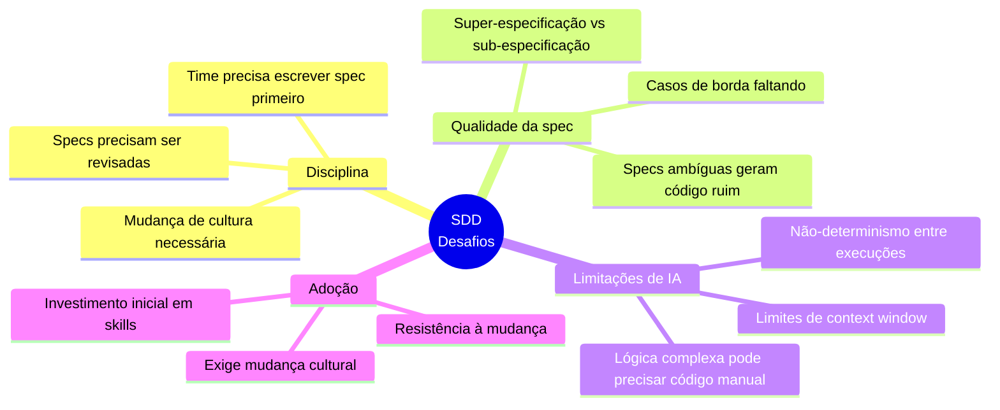
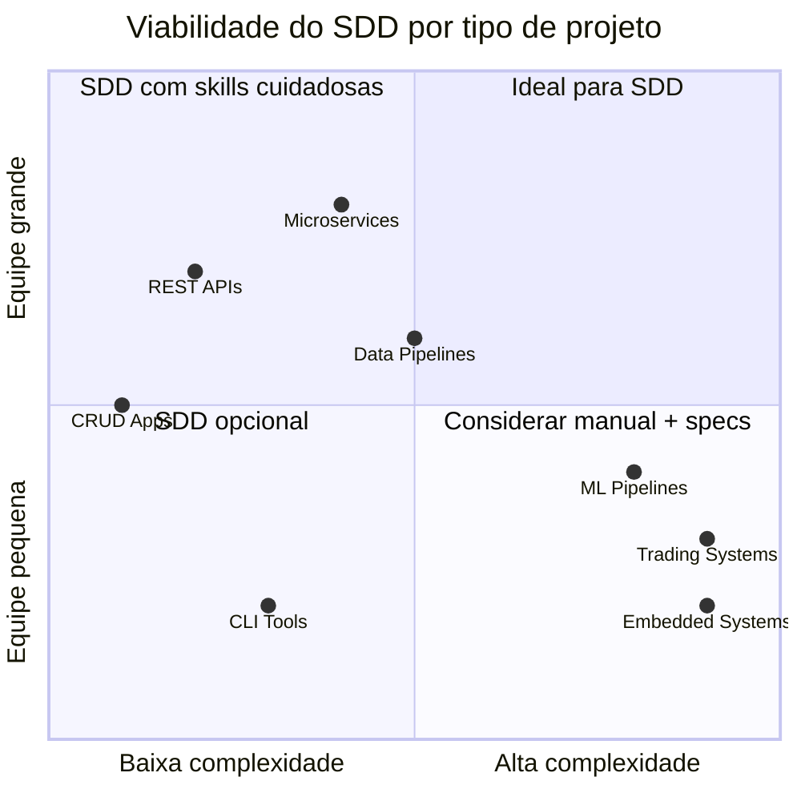
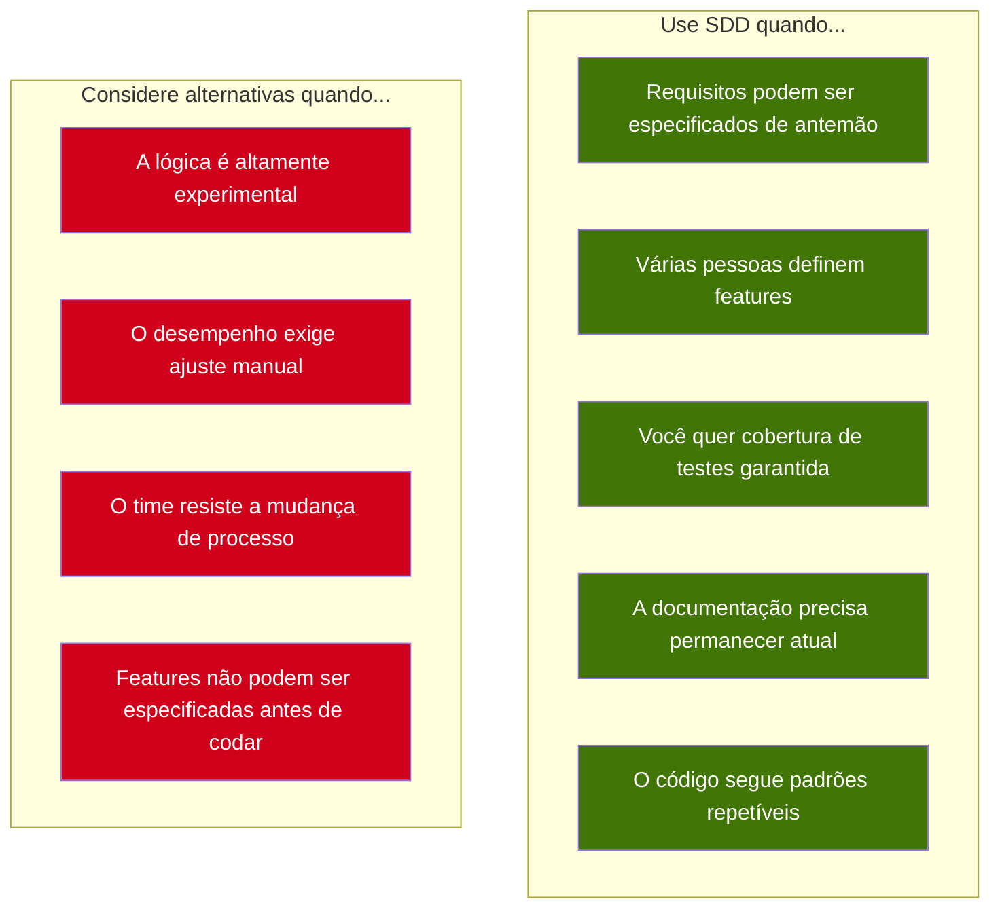

# 7. Análise comparativa

## 7.1 SDD vs desenvolvimento tradicional



| Aspecto | Tradicional | SDD |
|---------|-------------|-----|
| **Requisitos** | Verbais, tickets no Jira, reuniões | Arquivo de spec no repositório |
| **Testes** | Escritos depois do código (ou nunca) | Definidos antes do código (na spec) |
| **Documentação** | Doc separada (geralmente desatualizada) | A spec É a documentação |
| **Consistência** | Depende do desenvolvedor | Imposta pelas skills |
| **Rastreabilidade** | "Quem decidiu isso?" → histórico no Slack | "Quem decidiu isso?" → git blame na spec |
| **Onboarding** | "Lê o código" | "Lê as specs" |

---

## 7.2 SDD vs TDD

SDD e TDD são complementares, não concorrentes. O SDD **engloba** o TDD:



| Aspecto | TDD | SDD |
|---------|-----|-----|
| **Primeiro artefato** | Teste unitário | Spec (contém testes e mais) |
| **Escopo do primeiro artefato** | Uma função/método | Feature/endpoint inteiro |
| **Quem escreve** | Desenvolvedor | Qualquer pessoa (PM, dev, frontend) |
| **Valor como documentação** | Baixo (testes são técnicos) | Alto (specs são legíveis) |
| **O que orienta** | Implementação do código | Código, testes, docs, validação |

**Diferença-chave:** No TDD, o teste é puramente técnico — só desenvolvedores leem. No SDD, a spec é legível para todo o time. Um PM pode olhar uma spec e verificar se a regra de negócio está definida corretamente.

---

## 7.3 SDD vs BDD

BDD (Behavior-Driven Development) usa sintaxe Gherkin para descrever comportamento:

```gherkin
Given a user with email "existing@email.com" exists
When I POST /user with email "existing@email.com"
Then I should receive status 409
And the response should contain "USER_ALREADY_EXISTS"
```

O SDD chega ao mesmo resultado com menos cerimônia:

```markdown
### Error — Duplicate Email
**Seed:** insert user with email "existing@email.com"
**Input:** { "email": "existing@email.com", "passkey": "securePass123" }
**Expect:** status 409, body { "error": "USER_ALREADY_EXISTS" }
```

| Aspecto | BDD | SDD |
|---------|-----|-----|
| **Formato** | Gherkin (Given/When/Then) | Markdown (linguagem natural) |
| **Ferramentas** | Cucumber, SpecFlow, etc. | Nenhuma (Markdown é universal) |
| **Curva de aprendizado** | Sintaxe Gherkin | Nenhuma (é só Markdown) |
| **Escopo** | Cenários de comportamento | Definição completa da feature (input, saída, erros, efeitos colaterais, testes) |
| **Quem lê** | QA, desenvolvedores | Todo mundo |

---

## 7.4 SDD vs DDD

DDD (Domain-Driven Design) foca em modelar o domínio. O SDD não substitui o DDD — ele usa DDD por meio de skills:



Um time pode usar SDD com skills DDD: a spec define o que o endpoint faz, e a skill DDD garante que o código siga padrões domain-driven (entidades, serviços, repositórios).

---

## 7.5 Vantagens do SDD



### 1. Specs eliminam ambiguidade

No desenvolvimento tradicional, requisitos ficam em tickets do Jira, Slack, atas de reunião e na cabeça das pessoas. No SDD, o requisito é um arquivo no repositório — versionado, revisável e executável.

### 2. Testes sempre existem

No SDD, não dá para ter código sem testes. A spec define cenários de teste antes de existir código. Isso é mais forte que TDD porque os cenários fazem parte do requisito, não são pensados depois.

### 3. Documentação viva

A spec está sempre atualizada porque o código é validado contra ela. Se a spec muda, o código tem que mudar. Se o código não bate com a spec, a validação falha. A documentação não pode ficar defasada.

### 4. Acessível a quem não é engenheiro

Um Product Manager pode escrever: "Quando o usuário se registrar, devolver um token. Se o e-mail já existir, devolver erro." Isso é uma spec válida. Não precisa de conhecimento técnico para definir o que o software deve fazer.

### 5. Adoção progressiva

O SDD não exige uma virada big-bang. Um time pode começar:
1. Escrevendo specs só para features novas
2. Usando skills como documentação de padrões de código
3. Adicionando automação de validação aos poucos

---

## 7.6 Riscos e desafios



### 1. Disciplina necessária

O SDD só funciona se o time se comprometer a escrever a spec **antes** do código. Se os desenvolvedores pulam a spec e codificam direto, a metodologia desmorona. Isso é desafio cultural, não técnico.

### 2. Qualidade da spec importa

Spec ruim gera código ruim. Se a spec for ambígua, incompleta ou incorreta, o código sintetizado também será. A revisão da spec (passo 2 do fluxo) é crítica.

### 3. IA não é mágica

A síntese de código com IA funciona bem para padrões bem definidos (CRUDs, validações, integrações). Lógica de negócio complexa, código crítico de desempenho ou algoritmos novos ainda podem exigir desenvolvimento manual. O SDD aceita isso — o desenvolvedor sempre pode escrever à mão seguindo a spec.

### 4. Investimento inicial

Escrever o primeiro conjunto de skills leva tempo. O time precisa codificar decisões arquiteturais, regras de segurança e convenções. É um investimento único que se paga ao longo do projeto.

---

## 7.7 Matriz de decisão: quando usar SDD



| Cenário | Viabilidade SDD | Observações |
|---------|-----------------|-------------|
| **REST APIs** | ✅ Alta | Caso ideal — input/output bem definidos |
| **Microserviços** | ✅ Alta | Cada serviço tem specs claras |
| **Apps CRUD** | ✅ Alta | Padrões repetitivos, ótimos para síntese |
| **Data pipelines** | ✅ Alta | Transformações claras de entrada/saída |
| **Regras de negócio complexas** | ⚠️ Média | Specs precisam ser muito detalhadas |
| **Trading / HFT** | ❌ Baixa | Crítico em desempenho, exige código afinado à mão |
| **ML pipelines** | ❌ Baixa | Experimental, difícil especificar de antemão |
| **Sistemas embarcados** | ❌ Baixa | Específicos de hardware, difícil sintetizar |

---

## 7.8 Resumo



> *"TDD diz: escreva o teste primeiro. BDD diz: escreva o comportamento primeiro. DDD diz: modele o domínio primeiro. SDD diz: escreva a spec primeiro — e deixe o resto seguir."*
