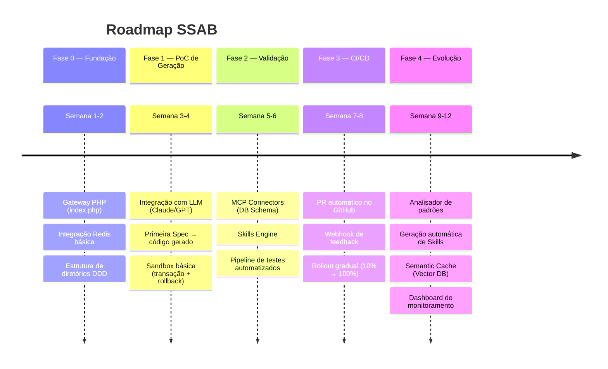
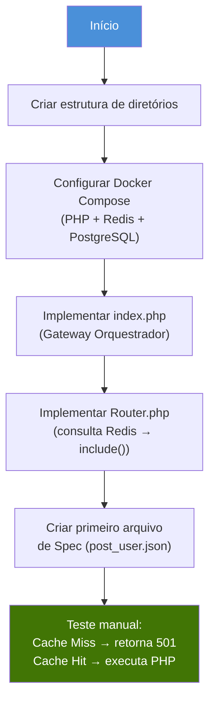
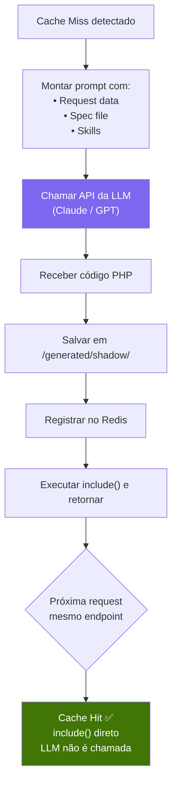
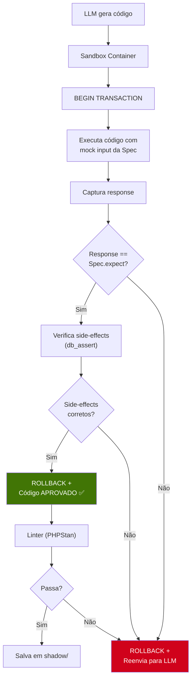
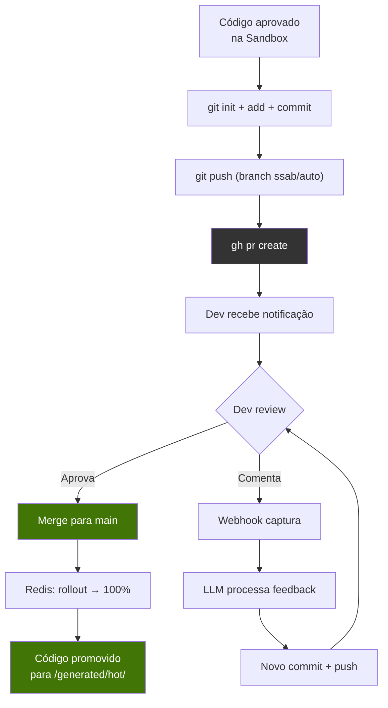
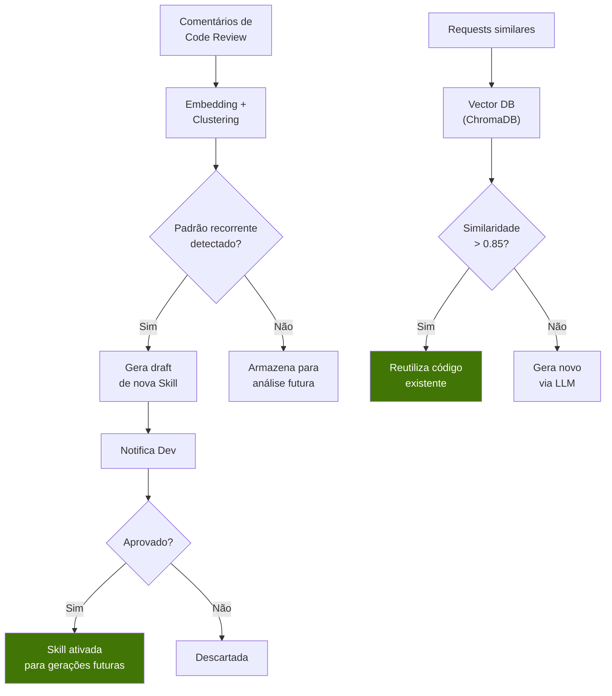
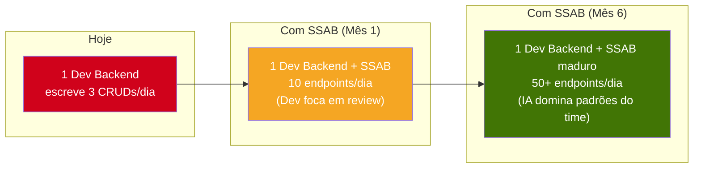
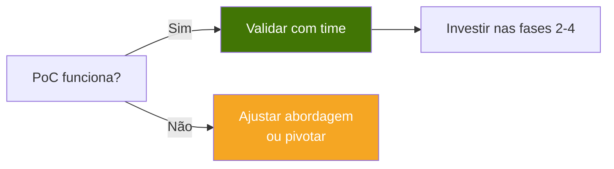

# 7. Próximos Passos — Roadmap de Implementação

## 7.1 Fases do Projeto

O SSAB deve ser construído de forma incremental. Cada fase entrega valor independente e valida a viabilidade da próxima.

---

## 7.2 Fase 0 — Fundação (Semanas 1-2)

O objetivo é criar o esqueleto da aplicação: o Gateway que recebe requests e consulta o Redis.

### Entregáveis

| Entregável | Descrição |
|-----------|-----------|
| `docker-compose.yml` | PHP 8.3 + Redis 7 + PostgreSQL 16 |
| `src/Gateway/index.php` | Ponto de entrada único |
| `src/Gateway/Router.php` | Consulta Redis, decide include() ou erro |
| `specs/post_user.json` | Primeira Spec de exemplo |
| `skills/ddd-structure.md` | Skill base de DDD |

### Critério de Sucesso
- Request `POST /user` chega ao Gateway
- Gateway consulta Redis → Cache Miss → retorna HTTP 501 "Not Yet Synthesized"
- Manualmente inserir rota no Redis → Cache Hit → `include()` executa PHP → retorna JSON

---

## 7.3 Fase 1 — PoC de Geração (Semanas 3-4)

Conectar a LLM ao Gateway. A primeira geração de código end-to-end.

### Entregáveis

| Entregável | Descrição |
|-----------|-----------|
| `src/Infrastructure/LLM/LLMClient.php` | Client para API da LLM |
| `src/Infrastructure/LLM/PromptBuilder.php` | Monta prompt com Spec + Skills |
| `src/Gateway/CodeGenerator.php` | Orquestra geração + salvamento |
| Primeiro código gerado pela IA | `generated/shadow/create_user.php` |

### Critério de Sucesso
- Request `POST /user` → Cache Miss → LLM gera PHP → Código salvo → Response 201
- Segunda request `POST /user` → Cache Hit → PHP nativo executa → Response 201 (sem LLM)
- Latência 1ª request: <15s | Latência 2ª request: <50ms

---

## 7.4 Fase 2 — Validação (Semanas 5-6)

Adicionar sandbox, MCP e testes automatizados. O código gerado passa a ser **validado antes de servir tráfego**.

### Entregáveis

| Entregável | Descrição |
|-----------|-----------|
| `src/Infrastructure/Sandbox/Runner.php` | Executa código em transação isolada |
| `src/Infrastructure/Sandbox/Validator.php` | Compara output vs Spec |
| `src/Infrastructure/MCP/DatabaseConnector.php` | Expõe schema do DB para a LLM |
| `skills/security-rules.md` | Regras de segurança obrigatórias |
| Pipeline de validação completo | Spec → LLM → Sandbox → Aprovação |

### Critério de Sucesso
- Código gerado que **passa** nos testes da Spec é salvo
- Código gerado que **falha** é reenviado para a LLM (até 3 tentativas)
- Após 3 falhas, alerta é enviado ao Dev
- MCP fornece schema do banco correto para a LLM

---

## 7.5 Fase 3 — CI/CD Automatizado (Semanas 7-8)

Integração com GitHub para PRs automáticos e feedback loop.

### Entregáveis

| Entregável | Descrição |
|-----------|-----------|
| `src/Infrastructure/Git/AutoCommitter.php` | Commit + push automático |
| `src/Infrastructure/Git/PRCreator.php` | Cria PR via GitHub API |
| `src/Infrastructure/Webhooks/ReviewHandler.php` | Processa comentários de PR |
| `src/Infrastructure/Webhooks/FeedbackProcessor.php` | Monta prompt de correção |
| GitHub Actions workflow | Validação automática do PR |

### Critério de Sucesso
- Código gerado aparece como PR no GitHub
- Dev comenta no PR → IA corrige e commita automaticamente
- Dev aprova PR → Redis atualiza rota → tráfego 100% para código nativo

---

## 7.6 Fase 4 — Evolução (Semanas 9-12)

O sistema se torna autônomo: aprende com feedback, sugere Skills, e otimiza o cache.

### Entregáveis

| Entregável | Descrição |
|-----------|-----------|
| `src/Infrastructure/Learning/PatternAnalyzer.php` | Detecta padrões em feedback |
| `src/Infrastructure/Learning/SkillGenerator.php` | Gera drafts de novas Skills |
| `src/Infrastructure/Cache/SemanticCache.php` | Integração com Vector DB |
| Dashboard de monitoramento | Status de endpoints, erros, Skills |

### Critério de Sucesso
- Sistema sugere nova Skill após detectar 3+ comentários similares
- Semantic Cache evita chamadas desnecessárias à LLM
- Dashboard mostra: endpoints Cold/Staging/Hot, taxa de aprovação, Skills ativas

---

## 7.7 Visão de Longo Prazo

---

## 7.8 Checklist de PoC (Mínimo Viável)

Para validar a ideia com o mínimo esforço, o PoC precisa demonstrar:

- [ ] **Gateway recebe request** e consulta Redis
- [ ] **Cache Miss** aciona chamada à LLM
- [ ] **LLM gera código PHP** seguindo DDD (Service + Repository)
- [ ] **Código é salvo** em disco e registrado no Redis
- [ ] **Cache Hit** executa `include()` do PHP gerado (sem LLM)
- [ ] **Spec com mocks** valida o código antes de salvar
- [ ] **Demonstração de latência**: 1ª request ~10s, 2ª request ~15ms

---

> *"A melhor forma de prever o futuro é construí-lo."* — Alan Kay
