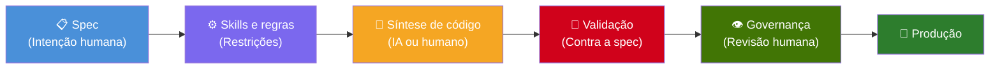

# SDD — Spec-Driven Development

**[Read in English / Leia em Ingles](../../README.md)**

> **Escreva a spec. O código vem depois.**

**Spec-Driven Development (SDD)** é uma metodologia de desenvolvimento de software em que a **spec vem primeiro** — antes de qualquer linha de código, escrita à mão ou por IA. A spec define o que o software deve fazer, o que recebe, o que devolve e como deve se comportar. Tudo o mais — código, testes, documentação — deriva dela.



---

## O que é SDD?

O SDD convive com TDD, BDD e DDD como paradigma de desenvolvimento:

| Paradigma | Princípio central |
|-----------|-------------------|
| **TDD** — Test-Driven Development | Escrever o teste primeiro, depois o código |
| **BDD** — Behavior-Driven Development | Escrever o comportamento primeiro, depois o código |
| **DDD** — Domain-Driven Design | Modelar o domínio primeiro, depois o código |
| **SDD** — Spec-Driven Development | Escrever a spec primeiro, depois tudo o mais |

No SDD, a **spec é a única fonte da verdade**. Ela é, ao mesmo tempo, requisito, contrato de teste e documentação. Não fica desatualizada porque o código é validado contra ela.

---

## Princípios centrais

1. **Spec primeiro** — Não existe código sem spec. A spec define intenção, entradas, saídas, erros e efeitos colaterais.
2. **Governança humana** — A IA sintetiza código, mas humanos definem restrições (skills/regras) e aprovam o resultado.
3. **Validação contra o contrato** — Código gerado ou escrito é validado pelos cenários de teste da spec.
4. **Independente de ferramenta** — O SDD funciona com qualquer ferramenta de síntese: Cursor, Copilot, motores próprios, pipelines de CI/CD ou um desenvolvedor lendo a spec.
5. **Evoluível** — As specs são versionadas. Quando a spec muda, o código evolui para acompanhar.

---

## Documentação

| # | Documento | Descrição |
|---|-----------|-----------|
| 1 | [Visão geral](01-visao-geral.md) | O problema, o conceito, princípios e glossário |
| 2 | [A spec](02-a-spec.md) | Formato, estrutura, anatomia e exemplos |
| 3 | [Skills e regras](03-skills-e-regras.md) | Restrições arquiteturais que regem a síntese de código |
| 4 | [Fluxo de trabalho](04-fluxo-de-trabalho.md) | Como um time adota SDD, papéis e processos |
| 5 | [Validação](05-validacao.md) | Testes contra contratos, sandbox, critérios de aprovação |
| 6 | [Implementações](06-implementacoes.md) | Cursor + Rules, pipelines de CI/CD, vState, motores próprios |
| 7 | [Análise comparativa](07-analise-comparativa.md) | SDD vs TDD vs BDD, prós, contras e matriz de decisão |

---

## Exemplo rápido

No SDD, uma spec é um arquivo Markdown que qualquer pessoa do time pode escrever:

```markdown
# POST /user

## Auth
None

## Description
Creates a new user in the system.

## Input
- email (string, required, email format)
- passkey (string, required, min 8 chars)

## Output (201)
- token (string, JWT)
- userData
  - id (uuid)
  - email (string)
  - created_at (datetime)

## Errors
- 409: Email already exists → USER_ALREADY_EXISTS
- 422: Invalid email → INVALID_EMAIL
- 422: Weak password → WEAK_PASSKEY

## Test Scenarios

### Happy Path
**Input:** { "email": "jon@doe.com", "passkey": "securePass123" }
**Expect:** status 201, body contains token and userData
**DB:** users table has record with email jon@doe.com

### Duplicate Email
**Seed:** insert user with email existing@email.com
**Input:** { "email": "existing@email.com", "passkey": "securePass123" }
**Expect:** status 409, body { "error": "USER_ALREADY_EXISTS" }
```

A partir dessa spec, o código é sintetizado (por IA ou humano), validado contra os cenários de teste e revisado por alguém antes de ir para produção.

---

## Implementações

O SDD é uma metodologia, não uma ferramenta. Pode ser implementado com:

- **[vState](https://vstate.dogether.com.br/)** — Protocolo de estado versionado que aplica princípios do SDD
- **Cursor + Rules** — Cursor IDE com regras que referenciam specs
- **GitHub Actions + LLM** — Pipelines de CI/CD que geram código a partir de specs
- **Qualquer ferramenta de código com IA** — A spec é a entrada universal

---

> *"O TDD diz: escreva o teste primeiro. O SDD diz: escreva a spec primeiro — o teste, a doc e o contrato são a mesma coisa."*
