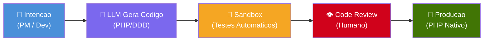

# SSAB — Self-Synthesizing Adaptive Backend

**[Read in English / Leia em Ingles](../../README.md)**

> **O backend que se escreve sozinho.**

O SSAB e uma arquitetura de backend onde o codigo de producao nao e escrito manualmente para cada funcionalidade, mas **gerado Just-In-Time por uma LLM**, validado por contratos tecnicos (mocks/testes) e progressivamente promovido ate rodar como **PHP nativo puro** — sem latencia de IA em producao final.

---

## Indice da Documentacao

| # | Documento | Descricao |
|---|-----------|-----------|
| 1 | [Visao Geral](01-visao-geral.md) | Conceito, motivacao, glossario e principios fundamentais |
| 2 | [Ciclo de Vida do Codigo](02-ciclo-de-vida.md) | O Funil de Promocao: Cold → Staging → Hot |
| 3 | [Arquitetura Tecnica](03-arquitetura-tecnica.md) | Componentes, fluxo de dados e infraestrutura |
| 4 | [Contratos e Validacao](04-contratos-e-validacao.md) | Specs, mocks, sandbox e TDD autonomo |
| 5 | [Feedback Loop](05-feedback-loop.md) | Code review → IA → correcao automatica |
| 6 | [Analise Comparativa](06-analise-comparativa.md) | Pros, contras, riscos e matriz de decisao |
| 7 | [Proximos Passos](07-proximos-passos.md) | Roadmap, PoC e fases de implementacao |

---

## Principio Central

```mermaid
graph TB
    subgraph "Backend Tradicional"
        T1["Dev escreve codigo"] --> T2["Deploy"] --> T3["Producao"]
    end

    subgraph "SSAB"
        S1["PM/Dev define intencao"] --> S2["IA gera codigo DDD"]
        S2 --> S3["Validacao automatica"]
        S3 --> S4["Code Review humano"]
        S4 --> S5["Promocao para producao"]
        S5 --> S6["IA sai do fluxo"]
    end

    style T1 fill:#ccc,color:#333
    style T2 fill:#ccc,color:#333
    style T3 fill:#ccc,color:#333
    style S1 fill:#4A90D9,color:#fff
    style S2 fill:#7B68EE,color:#fff
    style S3 fill:#F5A623,color:#fff
    style S4 fill:#D0021B,color:#fff
    style S5 fill:#417505,color:#fff
    style S6 fill:#2D7D2D,color:#fff
```

> *"O codigo deixa de ser um artefato estatico e passa a ser uma resposta dinamica a necessidade do negocio, validada pela precisao da engenharia humana."*
